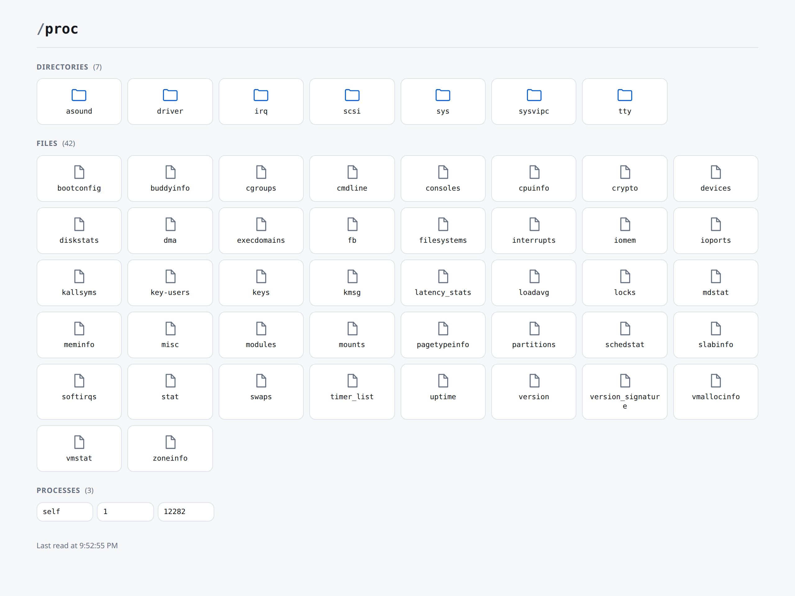

# procfs-wla

React + TypeScript web UI for reading files off a host through a backend. One
page per file, each fetched from the file's own path under `/0/api/file` — so
`/proc/cpuinfo` is read from `<base-url>/0/api/file/cpuinfo`, and so on. A page
names the file the way the machine does; only the request swaps the prefix,
which is what lets the app be served under `/proc` without fighting the data
for it:

<picture>
  <source media="(prefers-color-scheme: dark)" srcset="docs/main-page-dark.png">
  
</picture>

The page the base path lands on, against the `desktop` machine of the test
server: `/proc` itself, a tile per entry, each linked at the name the directory
gives it. It is shown here in whichever colour scheme you are reading in,
because the app is — every page takes its colours from the reader's own setting
rather than from a switch of its own.

| Page                 | Reads                 | Shows                                                  |
| -------------------- | --------------------- | ------------------------------------------------------ |
| `index.html`         | `/proc` itself        | what is in the directory, each entry linked to its page |
| `cpuinfo.html`       | `/proc/cpuinfo`       | topology summary and a card per CPU                    |
| `mounts.html`        | `/proc/mounts`        | mount table with types, options and read-only flags    |
| `diskstats.html`     | `/proc/diskstats`     | per-device I/O counters, bytes read and written        |
| `version.html`       | `/proc/version`       | kernel release, build and toolchain                    |
| `stat.html`          | `/proc/stat`          | CPU time since boot, context switches, uptime          |
| `crypto.html`        | `/proc/crypto`        | registered crypto algorithms and their drivers         |
| `devices.html`       | `/proc/devices`       | character and block majors, and what claims them       |
| `cmdline.html`       | `/proc/cmdline`       | the kernel parameters the machine booted with          |
| `slabinfo.html`      | `/proc/slabinfo`      | slab caches by the memory the allocator holds          |
| `interrupts.html`    | `/proc/interrupts`    | interrupts per CPU, per line, and what claimed each    |
| `modules.html`       | `/proc/modules`       | loaded modules, their dependencies and taint           |
| `schedstat.html`     | `/proc/schedstat`     | run-queue latency per CPU, and the domain topology     |
| `partitions.html`    | `/proc/partitions`    | block devices and their partitions, by size            |
| `bootconfig.html`    | `/proc/bootconfig`    | the initrd's boot config, as a tree of keys            |
| `buddyinfo.html`     | `/proc/buddyinfo`     | free memory by block order, and how fragmented         |
| `cgroups.html`       | `/proc/cgroups`       | cgroup controllers, their hierarchies and version      |
| `consoles.html`      | `/proc/consoles`      | registered consoles, and which one is /dev/console     |
| `dma.html`           | `/proc/dma`           | ISA DMA channels, allocated and free                   |
| `execdomains.html`   | `/proc/execdomains`   | exec domains and the personalities each claims         |
| `fb.html`            | `/proc/fb`            | registered framebuffers, and what put each there       |
| `filesystems.html`   | `/proc/filesystems`   | the types the kernel can mount, and what backs them    |
| `iomem.html`         | `/proc/iomem`         | the physical address map, as a tree of ranges          |
| `ioports.html`       | `/proc/ioports`       | claimed I/O ports, and how much space is left          |
| `kallsyms.html`      | `/proc/kallsyms`      | kernel symbols, their types and which module           |
| `keys.html`          | `/proc/keys`          | keys in the keyring, decoding flags and permissions    |
| `key-users.html`     | `/proc/key-users`     | key quotas per user, and how close each one is         |
| `latency_stats.html` | `/proc/latency_stats` | where the kernel waited, and for how long              |
| `loadavg.html`       | `/proc/loadavg`       | the three load averages, and which way they point      |
| `locks.html`         | `/proc/locks`         | file locks, their ranges and who waits behind them     |
| `mdstat.html`        | `/proc/mdstat`        | software RAID arrays, their members and rebuilds       |
| `meminfo.html`       | `/proc/meminfo`       | memory in use, cached and available, field by field    |
| `misc.html`          | `/proc/misc`          | misc character devices, and where each minor came from |
| `pagetypeinfo.html`  | `/proc/pagetypeinfo`  | free memory by migrate type, and how fragmented    |
| `softirqs.html`      | `/proc/softirqs`      | deferred interrupt work per vector, and which CPU ran it |
| `swaps.html`         | `/proc/swaps`         | swap areas, how full each is and the order they fill    |
| `timer_list.html`    | `/proc/timer_list`    | pending hrtimers per CPU, their slack and the tick devices |
| `uptime.html`        | `/proc/uptime`        | how long the machine has been up, and what its idle total implies |
| `version_signature.html` | `/proc/version_signature` | the upstream release `uname -r` hides, on Ubuntu kernels |
| `vmallocinfo.html`   | `/proc/vmallocinfo`   | kernel virtual mappings, and which caller asked for each |
| `vmstat.html`        | `/proc/vmstat`        | memory levels and counters since boot, told apart      |
| `zoneinfo.html`      | `/proc/zoneinfo`      | each memory zone against its watermarks, and what it really has |
| `uid_time_in_state.html` | `/proc/uid_time_in_state` | CPU time per uid at each clock frequency, split back into the clusters the header ran together |
| `gpu_load.html`      | `/proc/gpu_load`      | how long the GPU and each context holding it have been active, and why the device line is not their total |
| `gpu_memory.html`    | `/proc/gpu_memory`    | the pages the GPU is holding and which process each is for, counted in pages the file never sizes |
| `uid_io/stats` | `/proc/uid_io/stats` | what each uid has read and written, at the calls and at the block layer, foreground and background apart |
| `tty/drivers` | `/proc/tty/drivers` | the registered tty drivers, and the four rows that are not drivers |
| `tty/ldiscs` | `/proc/tty/ldiscs` | the line disciplines registered, out of the numbers the ABI allocates |
| `irq/default_smp_affinity` | `/proc/irq/default_smp_affinity` | the CPU mask a *new* interrupt starts with, and what it does not decide |
| `driver/rtc` | `/proc/driver/rtc` | the hardware clock as the chip is holding it, and how far that is from now |
| `sysvipc/shm` | `/proc/sysvipc/shm` | the shared memory segments of one IPC namespace, and which of them nothing will ever free |
| `sysvipc/sem` | `/proc/sysvipc/sem` | the semaphore sets beside them, how big each is, and which have never been used |
| `sysvipc/msg` | `/proc/sysvipc/msg` | the message queues, what is sitting on each of them, and who stopped reading |
| `asound/version` | `/proc/asound/version` | the one line ALSA prints about itself, which on any modern kernel is the kernel release |
| `asound/timers` | `/proc/asound/timers` | every timer ALSA has registered, the kernel tick among them, and the period of each stream that is up |
| `asound/pcm` | `/proc/asound/pcm` | the PCM devices the machine's cards registered, and how many streams each will carry at once |
| `asound/modules` | `/proc/asound/modules` | which module registered each card, which is not the list of ALSA modules loaded |
| `asound/devices` | `/proc/asound/devices` | every character device ALSA registered, and the `/dev/snd` node each minor is |
| `asound/cards` | `/proc/asound/cards` | the cards themselves, two lines each: the id that names one and the three fields that do not |
| `sys/user/<limit>` (twelve files, one page) | `/proc/sys/user/max_*` | the `ucount` ceilings — what any one user may hold of each namespace, of inotify instances and watches, and of fanotify groups and marks |
| `sys/user/index.html` | `/proc/sys/user` itself | the directory the twelve are in: what each of them bounds and what fails at its ceiling, with anything else in there listed as usual |
| `sys/vm/index.html` | `/proc/sys/vm` itself | the memory manager's control panel, grouped by mechanism — writeback, overcommit, reclaim, huge pages, the OOM killer — with what each knob sets and what it is set in |
| `sys/vm/<parameter>` (fifty files, one page) | `/proc/sys/vm/*` | one knob: what it is set to in the unit it is counted in, what that value means where the values are a set, and the 0 that means the other spelling of a paired threshold is in force |
| `scsi/scsi` | `/proc/scsi/scsi` | every device the SCSI midlayer attached, three lines each, and the disks that are not among them |
| `scsi/device_info` | `/proc/scsi/device_info` | the midlayer's blacklist: which devices need working around, and what the kernel does differently for each |
| `scsi/sg/version` | `/proc/scsi/sg/version` | the generic SCSI driver's one line: the same version twice over, and a date that is the driver's own |
| `scsi/sg/devices` | `/proc/scsi/sg/devices` | nine bare numbers a line, the node named by the line's position, and the column that is a constant |
| `scsi/sg/device_strs` | `/proc/scsi/sg/device_strs` | the names of those same devices, in fixed columns — and what an unscanned one prints instead |
| `scsi/sg/device_hdr` | `/proc/scsi/sg/device_hdr` | nine words that are the header of a *different* file, and what each of them is not saying |
| `scsi/sg/def_reserved_size` | `/proc/scsi/sg/def_reserved_size` | the buffer the *next* open of a `/dev/sg*` gets, and the four ways that number can have got there |
| `scsi/sg/debug` | `/proc/scsi/sg/debug` | who is *using* the generic driver: a block per device something has open, and the requests in flight on it |
| `scsi/sg/allow_dio` | `/proc/scsi/sg/allow_dio` | whether direct I/O is permitted at all — a gate rather than a switch, and one that refuses silently |
| `<pid>/maps` | `/proc/<pid>/maps` | every region of one process's address space, and nothing at all about memory |
| `<pid>/smaps` | `/proc/<pid>/smaps` | what one process's memory really costs, mapping by mapping |
| `<pid>/limits` | `/proc/<pid>/limits` | the resource limits one process runs under, and which it could raise itself |
| `<pid>/cmdline` | `/proc/<pid>/cmdline` | one process's argument vector, with the NULs between the arguments made visible |
| `<pid>/environ` | `/proc/<pid>/environ` | the environment one process was started with, and which of its values are credentials |
| `<pid>/coredump_filter` | `/proc/<pid>/coredump_filter` | which of one process's mappings would be written into its core file, as nine bits |
| `<pid>/io` | `/proc/<pid>/io` | what one process has read and written, counted twice at two different layers |
| `<pid>/time_in_state` | `/proc/<pid>/time_in_state` | how long one task has run at each clock frequency, a policy at a time |
| `<pid>/syscall` | `/proc/<pid>/syscall` | where one process is right now: the call it is in, and what its six registers hold |
| `<pid>/schedstat` | `/proc/<pid>/schedstat` | what the scheduler gave one task and what it made it wait for — not `schedstat` above |
| `<pid>/statm` | `/proc/<pid>/statm` | a process's memory in seven counts of pages, two of which the kernel froze at zero |
| `<pid>/stat` | `/proc/<pid>/stat` | one process's accounting line, all 52 fields, in the units they are really in |
| `<pid>/comm` | `/proc/<pid>/comm` | one thread's name, what it can hide, and what a kernel thread's encodes |
| `<pid>/uid_map` | `/proc/<pid>/uid_map` | how one process's user namespace lines its ids up with the ids outside it |
| `<pid>/setgroups` | `/proc/<pid>/setgroups` | whether `setgroups()` may be called in this namespace — one of three conditions it needs |
| `<pid>/gid_map` | `/proc/<pid>/gid_map` | the same for groups, and the `setgroups` bargain an unprivileged writer had to make |
| `<pid>/stack` | `/proc/<pid>/stack` | one task's kernel stack, frame by frame, with the brackets the kernel froze at zero |
| `<pid>/wchan` | `/proc/<pid>/wchan` | the kernel function one process is asleep in, and what that wait really is |
| `<pid>/status` | `/proc/<pid>/status` | one process readably: its ids, signal masks and capabilities, all decoded |
| `<pid>/autogroup` | `/proc/<pid>/autogroup` | the scheduling group one process shares with its whole session, and what its nice is worth |
| `<pid>/auxv` | `/proc/<pid>/auxv` | what the kernel told the C library at exec — the one entry here that is not text |
| `<pid>/cgroup` | `/proc/<pid>/cgroup` | where one process sits on every cgroup hierarchy, and whose point of view that is |
| `<pid>/net/arp` | `/proc/<pid>/net/arp` | the IPv4 neighbours of the network namespace one process is in |
| `<pid>/net/connector` | `/proc/<pid>/net/connector` | what is registered on the connector bus, which only the initial network namespace has |
| `<pid>/net/dev` | `/proc/<pid>/net/dev` | every interface in one network namespace, and what the sixteen counters really say |

## Running

```sh
npm install
npm run dev
```

- UI: http://localhost:5173/ — the base path lands on `index.html`, the
  listing of `/proc`; `cpuinfo.html`, `mounts.html`, `diskstats.html`,
  `version.html`, `stat.html`, `crypto.html`,
  `devices.html`, `cmdline.html`, `slabinfo.html`, `interrupts.html`,
  `modules.html`, `schedstat.html`, `partitions.html`, `bootconfig.html`,
  `buddyinfo.html`, `cgroups.html`, `consoles.html`, `dma.html` and
  `execdomains.html`, `fb.html`, `filesystems.html`, `iomem.html`,
  `ioports.html`, `kallsyms.html`, `keys.html`, `key-users.html` and
  `latency_stats.html`, `loadavg.html`, `locks.html`, `mdstat.html` and
  `meminfo.html`, `misc.html`, `pagetypeinfo.html`, `softirqs.html`,
  `swaps.html`, `timer_list.html`, `uptime.html`, `version_signature.html` and
  `vmallocinfo.html`, `vmstat.html`, `zoneinfo.html`, `uid_time_in_state.html`,
  `gpu_load.html`, `gpu_memory.html`, `uid_io/stats`, `tty/drivers`,
  `tty/ldiscs`, `irq/default_smp_affinity`, `driver/rtc`, `sysvipc/shm`,
  `sysvipc/sem`, `sysvipc/msg`, `asound/version`, `asound/timers`,
  `asound/pcm`, `asound/modules`, `asound/devices`, `asound/cards`,
  `scsi/scsi`, `scsi/device_info`, `scsi/sg/version`, `scsi/sg/devices`,
  `scsi/sg/device_strs`, `scsi/sg/device_hdr`, `scsi/sg/def_reserved_size`,
  `scsi/sg/debug` and `scsi/sg/allow_dio` are the other pages,
  and `sys/user/<limit>` — twelve files, one page, which reads whichever of
  them its URL names, `sys/user/max_ipc_namespaces` among them —
  and `<pid>/maps`, `<pid>/smaps`, `<pid>/limits`, `<pid>/cmdline`, `<pid>/environ`,
  `<pid>/coredump_filter`, `<pid>/io`, `<pid>/time_in_state`, `<pid>/syscall`,
  `<pid>/schedstat`, `<pid>/statm`, `<pid>/stat`, `<pid>/comm`, `<pid>/uid_map`, `<pid>/gid_map`,
  `<pid>/setgroups`,
  `<pid>/stack`, `<pid>/wchan`,
  `<pid>/status`, `<pid>/autogroup`, `<pid>/auxv`, `<pid>/cgroup`,
  `<pid>/net/arp`, `<pid>/net/connector` and `<pid>/net/dev` read files
  belonging to one process —
  `12282/smaps` reads `/proc/12282/smaps`, and `pid/smaps.html`, the document
  itself, reads `/proc/self/smaps`
- Admin: http://localhost:5173/0/admin.html — machine switcher, debug mode only.
  Six buttons: the five captured machines, and `host`, which reads the real
  `/proc` off the computer the test server runs on instead of a capture
- Mock filesystem server: http://localhost:3001 — serves one captured `/proc`
  at a time: `GET /0/api/dir/<path>` lists a directory and `GET /0/api/file/<path>`
  returns a file, both out of whichever of the five machines it is currently
  set to — `desktop`, `server`, `container`, `raspberry-pi` or `vm`, with the
  real `/proc` of this computer offered beside them as `host`

`npm run dev` starts both. Vite proxies the served routes to the mock server, so
the app runs with an empty base URL. To point it at a real backend
instead, set `VITE_API_BASE_URL` (see `.env.example`):

```sh
VITE_API_BASE_URL=https://host.example.com npm run dev:client
```

## Serving under a sub-path

By default the app expects to live at the domain root. To deploy it under a
prefix — say `https://host/proc/` — pass `--base-url`:

```sh
npm run build --base-url=/proc
```

Assets are then referenced as `/proc/cpuinfo-<hash>.js`. The same flag works on
`dev` and `preview`:

```sh
npm run dev --base-url=/proc      # http://localhost:5173/proc/cpuinfo.html
npm run preview --base-url=/proc  # http://localhost:4173/proc/cpuinfo.html
```

Three equivalent spellings, in priority order:

| Form                                  | Notes                                              |
| ------------------------------------- | -------------------------------------------------- |
| `npm run build -- --base-url=/proc`   | also `-- --base-url /proc`                          |
| `npm run build --base-url=/proc`      | npm passes it as `npm_config_base_url`              |
| `APP_BASE_URL=/proc npm run build`    | environment variable, e.g. for CI                   |

The value is normalized ( `proc`, `/proc`, `/proc/` all become `/proc/` ) and an
absolute URL works too, for serving assets off a CDN:
`--base-url=https://cdn.example.com/proc`. Resolution lives in
[`config/base-url.ts`](config/base-url.ts); `scripts/vite.ts` is a thin runner
that translates the flag into Vite's own `--base`, which its CLI would otherwise
reject as unknown.

This sets where the *app* is served from, which is independent of where the
*backend* is; set `VITE_API_BASE_URL` if the files are served from somewhere
else. The data lives under its own prefix, so `--base-url=/proc` is no longer a
collision: the pages are `/proc/cpuinfo.html`, the assets
`/proc/0/cpuinfo-<hash>.js` and the data `/proc/0/api/file/cpuinfo`. Dev and
preview proxy only the exact served routes, and a real server routes
`<base-url>/0/api/*` to the backend and everything else to the static build.

### Everything that is not a `/proc` entry lives under `0/`

Below the base, a URL is read as the `/proc` entry it spells — so anything the
app needs a URL for that is *not* an entry has to sit somewhere `/proc` can
never reach. That place is `0/`:

```
<base-url>/0/cpuinfo-<hash>.js    a file a page loads
<base-url>/0/favicon.svg          the icon every page links
<base-url>/0/common-<hash>.css    the stylesheet every page links
<base-url>/0/api/file/cpuinfo     the bytes of /proc/cpuinfo
<base-url>/0/api/dir/             what is in /proc
<base-url>/0/admin.html           the fixture switcher, debug builds only
```

`0` is provably free rather than merely unused. The top level of procfs is its
static entries plus one directory per running process, and pid 0 is the idle
task — it has no directory, and never will. So no URL is ambiguous: `/0/…` is
the app's, everything else names an entry.

Nothing else the app owns needs a name outside it, so nothing else has one:
every page here is named for the `/proc` entry it reads, and the three kinds of
URL above are the whole of the rest.

`ASSET_DIR` and the two routes are all defined in
[`src/api/paths.ts`](src/api/paths.ts), which keeps them one decision rather
than several that have to agree. The consequence for anything dispatching on
`/0/`: **match the API routes first**, then hand the rest to whatever serves the
built files. `fileForAssetUrl` in [`config/document.ts`](config/document.ts) and
`getInternalRequest` in [`WebProcfsExecutor.c`](WebProcfsExecutor.c) are the two
that do, and both say so where they do it.

### The URL is the path

Where a page is served and what it reads are one fact rather than two that have
to agree. Below the base, a page's URL *is* the `/proc` entry it reads, and no
page has a say in it:

```
<base-url>/devices        reads  <base-url>/0/api/file/devices
<base-url>/12282/smaps    reads  <base-url>/0/api/file/12282/smaps
<base-url>/pid/smaps      reads  <base-url>/0/api/file/pid/smaps
<base-url>/self/status    reads  <base-url>/0/api/file/self/status
```

The third is the URL `pid/smaps.html` is published at, and it is read like any
other — `pid` there is a path segment, not a placeholder being noticed.
Nothing is taken from a query string. `resolvePath` in
[`src/pages.ts`](src/pages.ts) is the whole rule, and `ProcPage` is its only
caller.

Exactly one URL names no path: the base itself, which the servers send on to a
document rather than 404ing. There a page reads the path it declares in
`PAGES`, a placeholder filled by its fallback — `/proc/self/smaps`.

**Which files exist is the backend's answer to give.** A URL naming a process
that is not there is asked for, and the 404 is what the page shows; the app
does not decide up front that no such process could be meant. What it does
decide is what it is prepared to *ask* for, and that is `isReadablePath` —
everything under `/proc`, no empty segments, no `.` or `..`, not endless. It is
and a URL outside it is refused rather than sent.

That leaves a routing requirement for whatever serves the build: a URL naming a
process has to be **rewritten**, not redirected, or the process is thrown away,
to the one document behind it. The dev and preview servers do this in
`documentForUrl` ([`config/document.ts`](config/document.ts)), and the same rule
is published for any other server in `manifest.json`, where such a page's `url`
is the pattern `/proc/{pid}/smaps` rather than a single URL.

The twelve `ucount` limits are the same arrangement one directory over — one
document, which reads the limit its URL names — but they ask nothing of a
server, because the twelve names are known when the build is made. So
`manifest.json` publishes them as **twelve ordinary URLs naming the one file**,
`/proc/sys/user/max_cgroup_namespaces` through `/proc/sys/user/max_uts_namespaces`,
with no pattern to apply and no rule to implement. A name that is not one of the
twelve is not in the manifest at all, so it falls through to what any other
unlisted `/proc` path does: the listing page for a directory, the raw page for a
file, and a 404 for nothing.

## Debug mode

Debug mode adds `admin.html`, which is six buttons: the five captured machines
the test server can be, and `host` beside them — the choice that reads the real
`/proc` off this computer rather than a capture of another one. It is **on by default while
developing and off for a build**, so the admin page never ships unless asked
for:

```sh
npm run dev                  # admin.html served at /0/admin.html
npm run dev --debug=false    # dev without it — /0/admin.html 404s
npm run build                # dist/ has no admin.html at all
npm run build --debug        # dist/ includes admin.html
APP_DEBUG=1 npm run build    # same, for CI
```

The dev server says where it is, in Vite's own banner:

```
[client] [procfs] debug mode ON — admin.html included
[client]
[client]   VITE v7.3.6  ready in 270 ms
[client]
[client]   ➜  Local:   http://localhost:5173/
[client]   ➜  Admin:   http://localhost:5173/0/admin
[client]   ➜  Network: use --host to expose
```

That line is [`config/banner.ts`](config/banner.ts), and it is there because
this is the one page nothing links to: every other page is reached from the
listing at the base, and the admin page is typed in, because it is not a `/proc`
entry and has no place among them. It is printed on the **dev server alone and
in debug mode alone** — a `dist/` built without `--debug` has no admin page in
it, so the preview server showing that URL would be advertising a 404. The line
goes in by watching Vite's banner go past rather than by rebuilding it, which is
also where its colours come from: coloured when the `Local` line above it is,
plain when it is not, since Vite has already decided whether this output takes
colour. The URL carries the base, so `--base-url=/procfs` prints
`http://localhost:5173/procfs/0/admin`.

Its heading is **the path it is served at** — `/proc/0/admin` — spelt as a
trail like every other page's, with `proc` leading back to the listing of
`/proc`. Only that first step is a place: `0` is a directory of this build
rather than of `/proc` (see `ASSET_DIR`), so nothing lists it and it is not a
link. The page is entered directly rather than reached, which is exactly why the
way out of it is worth as much as the way out of a file — see `adminCrumbs` in
[`src/pages.ts`](src/pages.ts) and `AdminPath` in
[`src/components/ProcPath.tsx`](src/components/ProcPath.tsx).

It is served at `/0/admin.html`, under the app's own directory rather than
beside the pages named for `/proc` entries: the admin page is not one, and a
URL of `/admin` would claim the entry `/proc/admin` if a kernel ever grew one.
The **file** is `dist/admin.html`, at the top of the output like every other
document — URL and file differ here exactly as they do for every asset, and
`fileForAssetUrl` maps this one back with no case of its own.

With debug off the page is not an entry point, so it is absent from `dist/` and
from `manifest.json`, and the dev and preview servers 404 it rather than serving
the file that sits in `src/pages/`. `isAdminRequest` in
[`config/document.ts`](config/document.ts) refuses **every** spelling that
reaches it — `/0/admin.html`, the bare `/admin.html`, and both without the
extension, since a static server finds `admin.html` for a URL that leaves it off
the same way it serves every page at `/cpuinfo`.

Pressing a button there `PUT`s it to the test server, which serves that machine
for every request from then on — reload a page to see it. The choice covers the
whole of `/proc` and lives on the server, not in the page, which is why the
pages need no fixture control of their own. See
[Reading the real filesystem](#reading-the-real-filesystem) for the one choice
that is not a capture. Resolution lives in
[`config/debug.ts`](config/debug.ts); note that npm turns `--debug=false` into
an empty `npm_config_debug`, which is why an empty value there reads as off.

## Project layout

Each page is a document and the script that mounts it, kept together in
`src/pages/`:

```
src/
  pages/                 one document + mount script per page — Vite's root
    cpuinfo.html    main.tsx
    mounts.html     mounts.tsx
    diskstats.html  diskstats.tsx
    version.html    version.tsx
    stat.html       stat.tsx
    crypto.html     crypto.tsx
    devices.html    devices.tsx
    cmdline.html    cmdline.tsx
    slabinfo.html   slabinfo.tsx
    interrupts.html interrupts.tsx
    modules.html    modules.tsx
    schedstat.html  schedstat.tsx
    partitions.html partitions.tsx
    bootconfig.html bootconfig.tsx
    buddyinfo.html  buddyinfo.tsx
    cgroups.html    cgroups.tsx
    consoles.html   consoles.tsx
    dma.html        dma.tsx
    execdomains.html execdomains.tsx
    fb.html         fb.tsx
    filesystems.html filesystems.tsx
    iomem.html      iomem.tsx
    ioports.html    ioports.tsx
    kallsyms.html   kallsyms.tsx
    keys.html       keys.tsx
    key-users.html  key-users.tsx
    latency_stats.html latency_stats.tsx
    loadavg.html    loadavg.tsx
    locks.html      locks.tsx
    mdstat.html     mdstat.tsx
    meminfo.html    meminfo.tsx
    misc.html       misc.tsx
    pagetypeinfo.html pagetypeinfo.tsx
    softirqs.html   softirqs.tsx
    swaps.html      swaps.tsx
    timer_list.html timer_list.tsx
    uptime.html     uptime.tsx
    version_signature.html version_signature.tsx
    vmallocinfo.html vmallocinfo.tsx
    vmstat.html     vmstat.tsx
    zoneinfo.html   zoneinfo.tsx
    uid_time_in_state.html uid_time_in_state.tsx
    gpu_load.html   gpu_load.tsx
    gpu_memory.html gpu_memory.tsx
    uid_io/
      stats.html    stats.tsx
    dir.html        dir.tsx          (any directory with no page of its own)
    file.html       file.tsx         (any file with no parser here)
    tty/
      drivers.html  drivers.tsx      (files in a directory of /proc, not at its top)
      ldiscs.html   ldiscs.tsx
    irq/
      default_smp_affinity.html      default_smp_affinity.tsx
    driver/
      rtc.html      rtc.tsx
    sysvipc/
      shm.html      shm.tsx          (the three IPC objects, one page each)
      sem.html      sem.tsx
      msg.html      msg.tsx
    asound/
      version.html  version.tsx      (not version.html above: ALSA's line, not
                                      the kernel's banner)
      timers.html   timers.tsx       (nor timer_list.html above: ALSA's timers,
                                      not the kernel's hrtimers)
      pcm.html      pcm.tsx          (the devices those timers belong to)
      modules.html  modules.tsx      (nor modules.html above: one line per
                                      card, not per module)
      devices.html  devices.tsx      (nor devices.html above: character
                                      devices, not major numbers)
      cards.html    cards.tsx        (the one file here whose record is two
                                      lines)
    scsi/
      scsi.html     scsi.tsx         (the one file of that directory that is
                                      not a driver's own)
      device_info.html device_info.tsx  (and the one beside it whose contents
                                      are the kernel's rather than the
                                      machine's)
      sg/
        version.html version.tsx    (the generic driver's own corner of that
                                      directory, two below /proc)
        devices.html devices.tsx    (and what that driver has, in nine numbers
                                      a line)
        device_strs.html device_strs.tsx  (the names of those same devices,
                                      joined to them only by position)
        device_hdr.html device_hdr.tsx  (and the names of the columns those
                                      numbers go under, which is a file)
        def_reserved_size.html def_reserved_size.tsx  (the one entry of that
                                      directory that is a setting)
        debug.html    debug.tsx      (and the only one of them that is nested,
                                      being about who holds what)
        allow_dio.html allow_dio.tsx (and the other setting, which permits
                                      rather than does)
    sys/
      vm/
        index.html    index.tsx      (the memory manager's control panel, by
                                      mechanism rather than by name)
        parameter.html parameter.tsx (and one document behind every knob in it,
                                      which takes the name from its own URL)
      user/
        index.html    index.tsx      (the directory itself: one of the two
                                      listings below /proc with a page)
        limit.html    limit.tsx      (twelve sysctls: settings, not reports —
                                      one document for all of them, which takes
                                      the limit from its own URL the way
                                      pid/smaps.html takes the process)
    pid/
      maps.html     maps.tsx         (files belonging to one process)
      smaps.html    smaps.tsx        (the same mappings, costed)
      limits.html   limits.tsx
      cmdline.html  cmdline.tsx      (not cmdline.html above — see below)
      environ.html  environ.tsx      (what execve was handed beside it)
      coredump_filter.html          (what would be kept of its memory)
                    coredump_filter.tsx
      io.html       io.tsx           (what it has read and written, twice over)
      time_in_state.html            (an Android kernel's, like the uid file above)
                    time_in_state.tsx
      syscall.html  syscall.tsx
      schedstat.html                (not schedstat.html above — see below)
                    schedstat.tsx
      statm.html    statm.tsx        (not stat.html beside it — see below)
      stat.html     stat.tsx         (not stat.html above — see below)
      comm.html     comm.tsx
      uid_map.html  uid_map.tsx
      gid_map.html  gid_map.tsx      (the same file for groups — see below)
      setgroups.html                (the rule guarding that one)
                    setgroups.tsx
      stack.html    stack.tsx        (the chain wchan names one frame of)
      wchan.html    wchan.tsx
      status.html   status.tsx       (not stat.html above — see below)
      autogroup.html autogroup.tsx
      auxv.html     auxv.tsx         (the one file here that is not text)
      cgroup.html   cgroup.tsx       (not cgroups.html above — see below)
      net/
        arp.html    arp.tsx          (a directory of a process's own directory)
        connector.html connector.tsx
        dev.html    dev.tsx
    admin.html      admin.tsx        (debug mode only, served at /0/admin.html)
    favicon.svg                      (the one icon every page links)
    common.css                       (the one stylesheet, for the whole site)
    screenshot-light.png             (what manifest.json shows the app with;
    screenshot-dark.png               the README's own are in docs/)
  components/            the views the pages render
  lib/                   one parser per file, no React — and, where several
                         files share a fact, one module for that: `sysvipc.ts`
                         is the fields every IPC object has, `mounts.ts` the
                         escaping `mountinfo.ts` also needs, and
                         `sys-user-ucount.ts` the one mechanism all twelve of
                         `/proc/sys/user` are
  hooks/, api/           reading a file from the backend
  pages.ts               which host path each document reads
```

**Vite is rooted at `src/pages/`, not at the project.** It lays `dist/` out by
each document's path relative to the root, so rooting it there is what keeps
the build flat and the pages at `/cpuinfo.html` rather than
`/src/pages/cpuinfo.html`. Everything else Vite resolves against its root is
pointed back at the project explicitly in
[`vite.config.ts`](vite.config.ts) — `build.outDir`, `envDir` so `.env` keeps
being read, `publicDir`, and the Vitest `root`, since the tests live all over
the project.

That is also why the mount scripts sit beside their documents rather than in
`src/`: a `<script src>` is resolved by the browser against the document's
*URL*, not the filesystem, so only a sibling path resolves the same way in dev
as it does in a build. The scripts are a dozen lines each and import the real
app from `../`.

## Build output

The pages are named after what they show — `cpuinfo.html`, `mounts.html` — not
`index.html`, so a webhub serving several apps out of one directory keeps them
apart. `dist/` is a flat drop-in directory — JS and CSS sit beside the documents,
no `assets/` subfolder — plus a `manifest.json` describing it, in the same
format as the other webhub apps.

A page for a file that belongs to a *process* rather than to the machine is
nested — `pid/maps.html`, `pid/smaps.html`, `pid/limits.html`, `pid/cmdline.html`,
`pid/environ.html`, `pid/coredump_filter.html`, `pid/io.html`,
`pid/time_in_state.html`,
`pid/syscall.html`, `pid/schedstat.html`, `pid/statm.html`, `pid/stat.html`, `pid/comm.html`, `pid/uid_map.html`,
`pid/gid_map.html`, `pid/setgroups.html`,
`pid/stack.html`, `pid/wchan.html`, `pid/status.html`, `pid/autogroup.html`, `pid/auxv.html`,
`pid/cgroup.html`, and `pid/net/arp.html`,
`pid/net/connector.html` and `pid/net/dev.html` two deep — because Vite lays the build out by each document's path relative to its root. **Its script goes with it**, into the
same `pid/` directory: `assetsDir` is the directory of the document being
built, which is `''` for all but those. So a page and the script it loads stay
together whether they are at the top or a level down, and the drop-in property
holds either way. The stylesheet is the exception, and deliberately so: there is
one for the whole site, at the top of the output — see below. What *did* have to change is the manifest walker,
which listed only the top level and would have left that page out of
`manifest.json` entirely — built, served, and invisible to whatever reads the
manifest to find it.

`scripts/build.ts` builds one page per pass and names it in `APP_ENTRY`, which
is what lets each pass know where its assets belong; the dev server, which
builds nothing, has no such answer and does not need one.

### One stylesheet for the whole site

`src/pages/common.css` is all of it: the colour tokens, the shell a page sits
in, the path at its top, the cards, tables, chips and notices the views are
assembled from, and then — under a heading each — the rules that belong to one
page alone, which is most of them, since most of what a page shows is a table
shaped like nothing else here.

**It is emitted once per build**, as `dist/common-<hash>.css`, and every
document links it at `<base>/0/common-<hash>.css`. One file for sixty-nine pages:
a reader fetches it on whichever page they open first and every page after that
is already styled. The hash is of the bytes as written, minified and all, so a
new build cannot be met with a cached old stylesheet.

This is the one place the build deliberately stops being per-page. A page's
script is duplicated on purpose, so that serving one page needs nothing from
another — but a stylesheet that is the same on every page gains nothing from
being written out sixty-nine times.

Getting there needs [`config/stylesheet.ts`](config/stylesheet.ts) rather than
an import or a plain `<link>`, and it is worth saying why both fail. An
**import** is folded into the importing page's bundle, which is exactly the
duplication being avoided. A **`<link>` written into the document by hand**
fails the same way for a less obvious reason: Vite reads a stylesheet a
document links as part of that document's CSS entry and folds it in just as an
import would. So the file is emitted under a name of its own with `emitFile`,
and the link is written into each document afterwards, in `transformIndexHtml`.
Stepping outside Vite's CSS pipeline that way means nothing minifies the file on
the way out, so the plugin does that too, with the same esbuild Vite would have
used.

In dev nothing is built and nothing is renamed, so the same plugin links
`common.css` straight out of `src/pages/`. It asks for it as `common.css?direct`
— without that the dev server answers with a JavaScript module, which is the
shape an `import` of a stylesheet takes so that editing one can be hot-replaced,
and which a browser will not apply to a `<link>`.

**Every page loads one script of its own, and the one stylesheet they all
share:**

```
dist/
  common-<hash>.css                       (the one stylesheet, linked by every page)
  cpuinfo.html     -> cpuinfo-<hash>.js
  mounts.html      -> mounts-<hash>.js
  diskstats.html   -> diskstats-<hash>.js
  version.html     -> version-<hash>.js
  stat.html        -> stat-<hash>.js
  crypto.html      -> crypto-<hash>.js
  devices.html     -> devices-<hash>.js
  cmdline.html     -> cmdline-<hash>.js
  slabinfo.html    -> slabinfo-<hash>.js
  interrupts.html  -> interrupts-<hash>.js
  modules.html     -> modules-<hash>.js
  schedstat.html   -> schedstat-<hash>.js
  partitions.html  -> partitions-<hash>.js
  bootconfig.html  -> bootconfig-<hash>.js
  buddyinfo.html   -> buddyinfo-<hash>.js
  cgroups.html     -> cgroups-<hash>.js
  consoles.html    -> consoles-<hash>.js
  dma.html         -> dma-<hash>.js
  execdomains.html -> execdomains-<hash>.js
  fb.html          -> fb-<hash>.js
  filesystems.html -> filesystems-<hash>.js
  iomem.html       -> iomem-<hash>.js
  ioports.html     -> ioports-<hash>.js
  kallsyms.html    -> kallsyms-<hash>.js
  keys.html        -> keys-<hash>.js
  key-users.html   -> key-users-<hash>.js
  latency_stats.html -> latency_stats-<hash>.js
  loadavg.html     -> loadavg-<hash>.js
  locks.html       -> locks-<hash>.js
  mdstat.html      -> mdstat-<hash>.js
  meminfo.html     -> meminfo-<hash>.js
  misc.html        -> misc-<hash>.js
  pagetypeinfo.html -> pagetypeinfo-<hash>.js
  softirqs.html    -> softirqs-<hash>.js
  swaps.html       -> swaps-<hash>.js
  timer_list.html  -> timer_list-<hash>.js
  uptime.html      -> uptime-<hash>.js
  version_signature.html -> version_signature-<hash>.js
  vmallocinfo.html -> vmallocinfo-<hash>.js
  vmstat.html      -> vmstat-<hash>.js
  zoneinfo.html    -> zoneinfo-<hash>.js
  uid_time_in_state.html -> uid_time_in_state-<hash>.js
  gpu_load.html    -> gpu_load-<hash>.js
  gpu_memory.html  -> gpu_memory-<hash>.js
  uid_io/stats.html -> uid_io/stats-<hash>.js
  tty/drivers.html -> tty/drivers-<hash>.js
  tty/ldiscs.html  -> tty/ldiscs-<hash>.js
  irq/default_smp_affinity.html -> irq/default_smp_affinity-<hash>.js
  driver/rtc.html  -> driver/rtc-<hash>.js
  sysvipc/shm.html -> sysvipc/shm-<hash>.js
  sysvipc/sem.html -> sysvipc/sem-<hash>.js
  sysvipc/msg.html -> sysvipc/msg-<hash>.js
  asound/version.html -> asound/version-<hash>.js
  asound/timers.html -> asound/timers-<hash>.js
  asound/pcm.html  -> asound/pcm-<hash>.js
  asound/modules.html -> asound/modules-<hash>.js
  asound/devices.html -> asound/devices-<hash>.js
  asound/cards.html -> asound/cards-<hash>.js
  scsi/scsi.html   -> scsi/scsi-<hash>.js
  scsi/device_info.html -> scsi/device_info-<hash>.js
  scsi/sg/version.html -> scsi/sg/version-<hash>.js
  scsi/sg/devices.html -> scsi/sg/devices-<hash>.js
  scsi/sg/device_strs.html -> scsi/sg/device_strs-<hash>.js
  scsi/sg/device_hdr.html -> scsi/sg/device_hdr-<hash>.js
  scsi/sg/def_reserved_size.html -> scsi/sg/def_reserved_size-<hash>.js
  scsi/sg/debug.html -> scsi/sg/debug-<hash>.js
  scsi/sg/allow_dio.html -> scsi/sg/allow_dio-<hash>.js
  sys/user/limit.html -> sys/user/limit-<hash>.js  (one for the twelve limits)
  sys/user/index.html -> sys/user/index-<hash>.js  (the directory they are in)
  sys/vm/index.html -> sys/vm/index-<hash>.js      (and the vm knobs' directory)
  sys/vm/parameter.html -> sys/vm/parameter-<hash>.js  (one for the fifty knobs)
  pid/maps.html    -> pid/maps-<hash>.js
  pid/smaps.html   -> pid/smaps-<hash>.js
  pid/limits.html  -> pid/limits-<hash>.js
  pid/cmdline.html -> pid/cmdline-<hash>.js
  pid/environ.html -> pid/environ-<hash>.js
  pid/coredump_filter.html
                   -> pid/coredump_filter-<hash>.js
  pid/io.html      -> pid/io-<hash>.js
  pid/time_in_state.html
                   -> pid/time_in_state-<hash>.js
  pid/syscall.html -> pid/syscall-<hash>.js
  pid/schedstat.html
                   -> pid/schedstat-<hash>.js
  pid/statm.html   -> pid/statm-<hash>.js
  pid/stat.html    -> pid/stat-<hash>.js
  pid/comm.html    -> pid/comm-<hash>.js
  pid/uid_map.html -> pid/uid_map-<hash>.js
  pid/gid_map.html -> pid/gid_map-<hash>.js
  pid/setgroups.html
                   -> pid/setgroups-<hash>.js
  pid/stack.html   -> pid/stack-<hash>.js
  pid/wchan.html   -> pid/wchan-<hash>.js
  pid/status.html  -> pid/status-<hash>.js
  pid/autogroup.html -> pid/autogroup-<hash>.js
  pid/auxv.html    -> pid/auxv-<hash>.js
  pid/cgroup.html  -> pid/cgroup-<hash>.js
  pid/net/arp.html -> pid/net/arp-<hash>.js
  pid/net/connector.html -> pid/net/connector-<hash>.js
  pid/net/dev.html -> pid/net/dev-<hash>.js
  dir.html         -> dir-<hash>.js       (published at no URL)
  file.html        -> file-<hash>.js      (published at no URL)
  admin.html       -> admin-<hash>.js     (debug builds only)
  favicon.svg                             (one for the build, at /0/favicon.svg)
  screenshot-light.png                    (loaded by no page — see manifest.json)
  screenshot-dark.png
  manifest.json
```

A nested page names its entry root-relative — `src="/pid/smaps.tsx"` — where
the top-level ones use `./devices.tsx`. It has to: that document is also served
at `/12282/smaps`, and a relative URL would look for its script one directory
deeper than it is. The build rewrites either spelling to an absolute,
base-prefixed URL, so this only shows up in dev.

**The favicon follows the same rule, and the `0/` one.** Every document carries
`<link rel="icon" type="image/svg+xml" href="/favicon.svg">`, root-relative for
exactly the reason above — a page served at `/12282/net/dev` would otherwise
look for the icon three directories down. In dev that path resolves against
Vite's root, which is `src/pages/`, so the file sits there beside the documents.
In a build it is an asset like any other, which puts it under the app's own
directory — `/0/favicon.svg` — rather than at `/favicon.svg`, where it would be
claiming the URL of a `/proc` entry named `favicon.svg`. That is also why it is
not in `public/`: those files are copied to the output verbatim and served from
the root, which is the one place this app cannot put anything.

**It is the one asset with a fixed name, and the one emitted once.** Assets go
into `assetsDir`, which is the document's own directory, so the default naming
would put a hashed copy of the icon beside every page — nine of them, once at
the top and again in `pid/`, `pid/net/`, `tty/`, `irq/`, `driver/`,
`sysvipc/`, `asound/` and `sys/user/`. That is the right trade for
a page's own script, which stays beside it so that serving one page needs
nothing from another; it is the wrong one for a file every page shares byte for
byte — as the one stylesheet does too. So `assetFileNames` in [`vite.config.ts`](vite.config.ts)
names this one on its own, with no directory and no content hash: every pass
writes `dist/favicon.svg`, with the same bytes, and the build ends with one.
The URL is fixed too — `<base>/0/favicon.svg` — which is what a favicon wants,
since a browser goes looking for it on its own schedule rather than because a
page told it to. Everything else keeps Vite's own naming, which that option
spells out because supplying it at all replaces the default.

The icon is the path separator the whole app is named for, on a dark tile of
its own. It does not rely on `prefers-color-scheme` — support for that inside an
SVG favicon depends on which browser is asking — so it carries its own
background and reads the same against light and dark browser chrome.

Vite would normally build every entry in one Rollup pass and hoist the shared
code — React, the API client — into a `shared-<hash>.js` that each page then has
to load as well. [`scripts/build.ts`](scripts/build.ts) instead runs one pass per
page, with no other entry in it for Rollup to hoist into. That duplicates the
shared bytes between pages and makes the build slower, in exchange for pages
that are self-contained: serving one needs no knowledge of which chunks it
depends on.

`manifest.json` answers two different questions. **`entries` is what this build
*is***, for a host that lists the app beside others rather than serving it;
**`files` is what it is made of**, for whatever serves it.

The build is named twice over, because the two names are not substitutes and do
not answer for the same thing. **`name`** at the root is what the project calls
itself — the token a registry, a lockfile and this repository already know it
by — and it sits above the entries because one build is one project however many
apps it comes to advertise. **`title`**, inside an entry, is what to print in a
list of apps; it never moves, since a host may key on it and a changed one is a
different app to whatever was listing the old one, which is what leaves
**`version`** to say whether a build already listed is a new one.
**`description`** is the line under the title, and it is about the *app* rather
than about this file: it sits beside other apps' sentences in a host's list, so
how `files` is laid out is documented here instead of being rendered there as a
blurb.

**`name` and `version` are read from `package.json`** rather than written down
in the build: that is where the project's identity already is, and where
`npm version` changes it. Rename the project there and the next build's manifest
is renamed with it — nothing is told twice, and nothing can drift. A manifest
advertising a name or a version this build is not would be worse than one
advertising none, so a missing field fails the build rather than shipping.
`CMakeLists.txt` carries the same name and number for the C module beside the
app; the two are spelled separately because they are built separately, and only
this one reaches the manifest.

```json
{
  "name": "procfs-wla",
  "base": "/proc/",
  "entries": [
    {
      "title": "Inside /proc",
      "version": "1.0.0",
      "description": "A page per /proc entry, parsing what the kernel prints there.",
      "main": "/proc/",
      "icons": [
        { "url": "/proc/0/favicon.svg", "colorScheme": "light" },
        { "url": "/proc/0/favicon.svg", "colorScheme": "dark" }
      ],
      "screenshots": [
        { "url": "/proc/0/screenshot-light.png", "colorScheme": "light" },
        { "url": "/proc/0/screenshot-dark.png", "colorScheme": "dark" }
      ]
    }
  ],
  "files": [
    {
      "url": "/proc/cpuinfo",
      "file": "cpuinfo.html",
      "type": "text/html"
    },
    {
      "url": "/proc/mounts",
      "file": "mounts.html",
      "type": "text/html"
    },
    {
      "url": "/proc/{pid}/smaps",
      "file": "pid/smaps.html",
      "type": "text/html"
    },
    {
      "url": "/proc/sys/user/",
      "file": "sys/user/index.html",
      "type": "text/html"
    },
    {
      "url": "/proc/sys/user/max_cgroup_namespaces",
      "file": "sys/user/limit.html",
      "type": "text/html"
    },
    {
      "url": "/proc/sys/user/max_fanotify_groups",
      "file": "sys/user/limit.html",
      "type": "text/html"
    },
    {
      "url": "/proc/0/mounts-BUbYUHqm.js",
      "file": "mounts-BUbYUHqm.js",
      "type": "text/javascript"
    }
  ]
}
```

**The whole build is one app, so there is one entry.** The pages are its parts,
not sixty-two apps in a directory: they read one machine's `/proc` and link to
each other, and a host offering the reader `/proc/timer_list` on its own would
be offering a page out of the middle of something.

- `title` — what it is called in a host's list of apps. It names the directory
  the whole of it is about without being that directory: a bare `/proc` among
  other apps' names reads as a path rather than as a name. Unlike every URL
  here it does not follow `--base-url`, and it stays put across builds, since a
  host keying on it would read a changed title as a different app.
- `description` — the line explaining the file, which sits here rather than at
  the top level because it is what the *app* is, not what the JSON is.
- `main` — where to open it: the base itself, which is the listing of `/proc`
  and where a request naming no page already lands.
- `icons` and `screenshots` — an image and the colour scheme it is for. The
  icon is **one file offered under both**, because an SVG favicon cannot rely on
  `prefers-color-scheme` and so carries its own background; the screenshots are
  genuinely two, because a page takes its colours from the reader's setting and
  one shot would show half of them a window they will never see.

  Both are taken from the `files` list rather than written down a second time,
  so an entry cannot advertise a URL this build does not answer. The
  screenshots are the only files in `dist/` that no page loads —
  [`scripts/build.ts`](scripts/build.ts) copies them in after the last pass,
  since nothing links them for Rollup to find.

And each entry of `files`:

- `url` — the public URL, i.e. `base` + `file`, so it already reflects
  `--base-url`. Vite's own `build.manifest` records no URLs. A page is served
  without its extension — `/proc/cpuinfo`, not `/proc/cpuinfo.html` — so the
  viewer's paths read like the `/proc` entries they mirror. `admin.html` is the
  exception twice over: it keeps its extension and is published under `0/`, at
  `/proc/0/admin.html`, because it is entered directly rather than reached as
  one of those paths.

  A URL holding `{pid}` is a **pattern**, and there are eighteen of them: the
  pages for a file belonging to a process. Such a page reads the file its own
  URL names, so one document answers for every process — route anything matching
  the pattern, with `{pid}` standing for exactly one path segment, to that
  `file`. `/proc/12282/smaps` and `/proc/self/smaps` are both `pid/smaps.html`,
  which then reads `/proc/12282/smaps` or `/proc/self/smaps` out of the URL it
  was served at. A server that routes the pattern literally serves those
  eighteen pages at a URL nobody asks for, and the pages they are for at none.

  **Several URLs may name the same `file`**, which is the other way a page
  answers for more than one path: `sys/user/limit.html` appears twelve times,
  once per `ucount` limit. There is no pattern to apply there — the names are
  known when the build is made, so they are written out — and a server needs no
  rule for it beyond the map it already has.
- `file` — the file in `dist/`, content-hashed. The hash changes on every
  content change, so a server injecting tags or preloads should read filenames
  from here rather than hard-coding them.
- `type` — the content type to serve it as. A `text/html` file is a document a
  page request can be served; everything else is the one script or stylesheet a
  document pulls in.

`writeManifest` in [`config/manifest.ts`](config/manifest.ts) writes it after
the last page is built, listing `dist/` as it is on disk — no single Rollup pass
knows about all the pages, so the directory is what knows.  `manifest.json` does
not list itself.

## Scripts

| Command             | Purpose                                       |
| ------------------- | --------------------------------------------- |
| `npm run dev`       | Mock server + Vite dev server (debug on)      |
| `npm run dev:client`| Vite only                                     |
| `npm run dev:server`| Mock server only                              |
| `npm run preview`   | Serve the built `dist/`, proxying `/0/api/file` |
| `npm test`          | Vitest (parsers, UI, server, build config)    |
| `npm run typecheck` | `tsc -b`                                      |
| `npm run build`     | Typecheck + one bundle per page + manifest    |

All Vite-backed scripts accept `--base-url` and `--debug`; other arguments pass
through to Vite unchanged (`npm run preview -- --port 4300`).

## The pages

Every page shares [`src/components/ProcPage.tsx`](src/components/ProcPage.tsx),
which reads the file from the backend and offers two
views: **Parsed**, and **Raw** — the file exactly as the server returned it.
One page reads its file as *bytes* rather than as text and shares the same
shell through `ProcBinaryPage` — see below.

### The path at the top is the way back up

The heading of every page is the path it is reading, and it doubles as the
trail out of it. `/proc/sys/debug/exception-trace` reads as four steps: `proc`,
`sys` and `debug` are the directories above this file and each lists itself
when clicked, while `exception-trace` is where the reader is standing and is
not a link — there is nowhere for it to go.

```
/ proc / sys / debug / exception-trace
    │      │      │      └── where you are: plain text, aria-current="page"
    │      │      └───────── lists /proc/sys/debug
    │      └──────────────── lists /proc/sys
    └─────────────────────── lists /proc, which is the base itself
```

**A separator is part of neither step it sits between**, so it is drawn between
them rather than folded into one: a link here is a directory's name and nothing
else, which is what it would be anywhere else on the page. The slashes are
dimmed so the names carry the path and the punctuation stays out of the way.

The heading still reads as the path, separators and all, because the path is
what the page is about: a heading that spelt it differently from the file it
names would be a second thing to reconcile. Every step above the last is a
directory, and every directory already has a page — the listing that any
directory with no page of its own lands on — so the trail needs nothing new
behind it.
[`crumbsFor`](src/pages.ts) works out where each step goes and
[`ProcPath`](src/components/ProcPath.tsx) draws it; the same heading is used by
the file pages, the listing page and the raw page.

The links are **absolute from the base**, for the reason the admin page's are:
a page can be at any depth — `/12282/status` is two segments down — so a
relative link would climb from wherever the reader happens to be rather than
from the root. A directory keeps the trailing slash the listing links it with.

**Served below the root, one more step comes first: `home`.** Deployed at
`/proc/` this app is one of several the server hosts, and no step of a path
under `/proc` leads back out to it — the first crumb is `proc`, and that goes
to the app's own base. So the heading offers the one step the trail cannot
have, ahead of the path and pointing at `/`:

```
home  / proc / 1033 / autogroup
 │
 └── the top of this server, above this app — only when the base is not /
```

At the root there is nothing above to go to: the server's home *is* the base,
which is where `proc` already points, and a second link to the same place would
be a step that goes nowhere new — so nothing is drawn.
[`serverHome`](src/pages.ts) is that rule, and it reads the base the way
everything else here does, through `basePath`: an absolute base
(`https://cdn.example.com/procfs/`) says where the *assets* come from, and only
its path says whether the pages are below the root of the origin serving them.

It is **not a step of the path**, so it sits outside the `code` element that
holds one — the heading still reads as the path, separators and all. It is set
in the path's own monospace at the path's own size, so the two sit on the line
as one thing, and it is **drawn as a button**: the surface, border and radius
the controls in this header already use, dimmed until it is hovered. A step of
the path is a bare name, as a link is anywhere else on the page; a border is
what says this one is not that.

**`/proc/cpuinfo`** shows a topology summary (logical CPUs, physical cores,
sockets, peak clock), a machine block where the file has one, and a card per CPU
with its fields, known bugs and feature flags. Parsing lives in
[`src/lib/cpuinfo.ts`](src/lib/cpuinfo.ts) and is deliberately
architecture-agnostic: `/proc/cpuinfo` has no fixed schema, so the parser keeps
every `key : value` field it finds, splits blocks on blank lines, treats a block
without a `processor` field as machine info (ARM boards append one), and only
special-cases lookups for display — `model name` / `uarch` / `cpu` for the
model, `flags` / `Features` / `isa` for the feature list.

**`/proc/mounts`** shows counts (mounts, filesystem types, read-only, root fs), a
type breakdown, and a table of mount point, device, type and options, with
kernel pseudo-filesystems dimmed and hideable.
[`src/lib/mounts.ts`](src/lib/mounts.ts) splits the six fields and undoes the
kernel's octal escaping, so `/mnt/My\040Passport` displays as `/mnt/My
Passport`.

**`/proc/diskstats`** shows totals (devices, bytes read and written, busiest
device, requests in flight) and a table of per-device counters, with partitions
indented under their disk and never-used devices dimmed and hideable.
[`src/lib/diskstats.ts`](src/lib/diskstats.ts) copes with all three lengths the
kernel emits — 14 fields, 18 with discards (4.18+), 20 with flushes (5.5+) —
reporting the counters a shorter file omits as absent rather than zero, and
converts the 512-byte sector counts to bytes. Totals cover whole disks only,
since partitions repeat their disk's I/O.

**`/proc/version`** shows the kernel release, its series and flavour, the
preemption model it was built with, and a table of the build: number, builder,
date and toolchain. [`src/lib/version.ts`](src/lib/version.ts) picks the banner
apart by counting brackets rather than matching a pattern, since a compiler
names its own distribution in parentheses — `(Ubuntu 13.2.0-23ubuntu4)` — and
only the groups directly after the release belong to the banner: a Debian
kernel ends its line with `Debian 6.1.76-1 (2024-02-01)` instead of a date.
Fields older or vendor kernels leave out are reported absent rather than
guessed.

**`/proc/stat`** shows how every CPU has spent its time since boot — a stacked
bar per core, split into user, system, iowait, steal and the rest — plus
uptime, context switches, processes created and the run queue.
[`src/lib/stat.ts`](src/lib/stat.ts) handles the CPU line growing over kernel
versions (`iowait`/`irq`/`softirq` in 2.5, `steal` and `guest` in 2.6.11,
`guest_nice` in 2.6.33), reporting the columns a shorter file omits as absent
rather than zero. Guest time is deliberately left out of the totals: the kernel
counts it inside `user` and `nice` as well, so adding it again would make a
CPU's states total more than the time that actually passed. Everything here is
cumulative since boot, so the percentages are uptime averages, not a live
sample — reading twice and subtracting is what a monitor would do.

**`/proc/crypto`** lists every algorithm registered with the kernel's crypto
API, with its driver, type, priority, module and self-test result, and the size
fields that type carries. The thing to understand about this file is that one
*algorithm* can have several *implementations* — `aes` on an x86 machine is
registered both generically and as `aes-aesni` — and the kernel uses whichever
has the highest priority. [`src/lib/crypto.ts`](src/lib/crypto.ts) resolves
that, and the page marks the winner wherever there was a choice to make. A
driver that fails its self-test is called out at the top, since the kernel
still reports it as preferred if its priority is highest. Internal entries are
building blocks the API wires together itself, so they are dimmed and can be
hidden.

**`/proc/devices`** lists the character and block major numbers registered
with the kernel and the driver names claiming each. The mapping is
many-to-many in both directions, which is the thing to understand when reading
it: major 4 is shared by `/dev/vc/0`, `tty` and `ttyS`, while `sd` holds eight
majors at once to get past 256 minors. The page groups by major and points out
the drivers that hold several. Character and block majors are separate number
spaces, so the two sections are shown apart rather than merged.
[`src/lib/devices.ts`](src/lib/devices.ts) also flags the ranges the kernel
sets aside for local and experimental use (60–63, 120–127, 240–254), which is
where most dynamically allocated majors land.

**`/proc/cmdline`** shows the parameters the boot loader handed the kernel, as
a table with the notable ones — kernel image, root device, init, console —
pulled out at the top. [`src/lib/cmdline.ts`](src/lib/cmdline.ts) splits each
token on its **first** `=`, so `root=UUID=1b9f…` is the key `root` with the
value `UUID=1b9f…`; honours double quotes, since a value may hold spaces
(`dyndbg="module nvme +p"`); splits a dotted key into the module it configures
and the parameter name; and keeps anything after a bare `--` apart, as those
go to init rather than the kernel. A parameter may be given twice — the kernel
acts on the last for most of them — so earlier ones are struck through. The
page also points out parameters that switch off a protection (`mitigations=off`,
`nokaslr`, `selinux=0`, an `init=` that is a shell); that is a hint for reading
the line, not a verdict, since every one is a reasonable thing to set while
debugging.

**`/proc/slabinfo`** shows the kernel's slab caches ranked by the memory the
allocator holds for each, with a bar per cache, how much of it the objects in
use account for, and the object and slab counts behind those figures.
[`src/lib/slabinfo.ts`](src/lib/slabinfo.ts) reads the two `:`-introduced
groups — `tunables` and `slabdata` — **by their label rather than by position**,
since a line may carry one, both or neither, and a cache's memory comes from
`num_slabs × pagesperslab` rather than from its objects: the difference between
that and `active_objs × objsize` is the allocator sitting on pages it has not
handed back. Caches holding real memory with most of their objects free are
called out. Note the file reports **pages, not bytes**, and says nothing about
the page size, so every byte figure assumes 4 KiB — on a 64K-page kernel they
would all be out by 16x. On a modern kernel this file is root-only, so an
unprivileged backend may see it empty; the page says so rather than showing
nothing.

**`/proc/interrupts`** shows a column per CPU and a row per interrupt source,
with each line's total, the controller that owns it, and the drivers that
claimed it. The tail after the counts is the awkward part, and
[`src/lib/interrupts.ts`](src/lib/interrupts.ts) handles all three shapes it
takes: x86 joins the hardware number to its trigger (`2-edge`) while ARM's GIC
separates them with a space (`30 Level`), so a fixed two-token split reads one
of them wrong; a lettered line such as `NMI` or `LOC` carries prose rather than
a chip and a device; and `ERR` and `MIS` carry **one count for the machine**,
not one per CPU, so they are neither padded out nor charged to CPU0 in the
per-CPU totals. Lines where nearly every interrupt landed on a single CPU are
marked, which is what makes IRQ affinity visible — an NVMe queue per core looks
quite different from a NIC spread across them.

**`/proc/modules`** — the file behind `lsmod` — lists each loaded module with
its size, reference count, dependencies, state and taint. The field most people
read backwards is the fourth: it names the modules that **depend on this one**,
not the ones it depends on, which is why `lsmod` heads that column *Used by*.
[`src/lib/modules.ts`](src/lib/modules.ts) inverts the whole table so the page
can show both directions, since the file states only one. Two other details it
gets right: a use count higher than the used-by list is normal — an open device
node or a mounted filesystem holds a reference without being a module — and an
address of all zeroes means `kptr_restrict` hid it from an unprivileged reader,
not that the module lives at zero. Taint letters are expanded to what they mean
(`P` proprietary, `O` out of tree, `E` unsigned, `F` force loaded, `C` staging),
and modules that taint the kernel or are mid-load are called out.

**`/proc/schedstat`** reports what the scheduler has been doing since boot. The
number it exists for is **run-queue latency**: how long a task waited before
getting the CPU, which the page derives per CPU as the queued total divided by
the timeslices run. Two things about the format matter.
[`src/lib/schedstat.ts`](src/lib/schedstat.ts) attaches each `domain` line to
the `cpu` line **above** it — the file is grouped, not flat — and reads the
domain's first field as a **hex CPU mask** rather than a count, which is what
makes the scheduling topology legible: `03` is a pair of SMT siblings, `ff` a
whole eight-CPU node. And because the field layout depends on the version the
file states, an older version's fields are left **unnamed** rather than read as
if they were version 15 — labelling them would put the right labels on the
wrong numbers, and the page says so instead. The 36 domain counters are
load-balancer internals that also shift between versions, so they are shown in
the raw view rather than interpreted. The file only exists when the kernel was
built with `CONFIG_SCHEDSTATS`.

**`/proc/partitions`** lists every block device the kernel knows, whole disks
and partitions flat side by side, with partitions indented under their disk and
the space a disk has left over shown as its own row. Two things to know.
**`#blocks` is in 1024-byte blocks, not the 512-byte sectors
`/proc/diskstats` counts in** — assuming sectors puts every size out by 2x. And
nothing in the file says which device is a partition of which, so
[`src/lib/partitions.ts`](src/lib/partitions.ts) applies the kernel's own
naming rule from `disk_name()`: a disk whose name ends in a digit separates its
partitions with a `p` (`nvme0n1` → `nvme0n1p2`), one that does not is followed
by the number directly (`sda` → `sda1`). Accepting either form for either kind
of disk reads `loop10` as partition 0 of `loop1`, which on a snap-heavy desktop
hides a dozen devices under another one — the same rule and the same reason
apply in [`src/lib/diskstats.ts`](src/lib/diskstats.ts). Note also that the
file does not say which device is built on which, so an md array or LVM volume
is listed alongside the disks it sits on and counted again in the total.

**`/proc/bootconfig`** shows the extended boot config an initrd can carry,
which the kernel prints back one key per line with its full dotted path. Unlike
`/proc/cmdline` this is a **tree** — the dots are structure, the flattened form
of nested blocks written in the initrd — so the page groups by top-level
section and shows the rest of each path beneath it. Two sections are special,
and it is the point of the file: `kernel.*` is appended to the kernel command
line and `init.*` is handed to init, while anything else waits for whichever
subsystem reads it, so the page labels each section with where it goes.
[`src/lib/bootconfig.ts`](src/lib/bootconfig.ts) scans the `"a", "b"` value
list rather than splitting on commas, since a comma inside the quotes belongs
to the value — `kernel.console = "ttyS0,115200n8"` is one value, not two. A key
may carry several values or none at all, and a bare key is a flag. The file is
empty on a machine that booted without a boot config, which is most of them —
the page says so rather than looking broken, and the `not-configured` fixture
is a genuinely zero-byte file so that state can be reached from the admin page.

**`/proc/buddyinfo`** shows how much memory the buddy allocator has free in
each zone, broken down by block order. The trap is that **a block of order N is
2^N pages**, so the columns are not comparable: one order-10 block is worth
1024 order-0 pages, and reading the row as a plain histogram gets the shape of
free memory backwards. [`src/lib/buddyinfo.ts`](src/lib/buddyinfo.ts) weights
each order by what it actually holds, which is what the bar on the page shows.
That weighting is the point of the file: the highest order still occupied is
the largest contiguous allocation a zone can satisfy without compaction, so a
machine can have gigabytes free and still fail a 64 KiB request — the page says
so when it sees it. How many columns there are depends on the kernel's
MAX_ORDER, so the count is read from the file rather than assumed at eleven.
Sizes assume a 4 KiB page, as the file counts pages and never states one.

**`/proc/cgroups`** lists every cgroup controller the kernel was built with,
its hierarchy, how many cgroups use it and whether it is enabled. The hierarchy
number is the part worth understanding, and **0 does not mean unused**: a
non-zero value is the id of a cgroup **v1** mount, and controllers sharing a
number are mounted together (`cpu` with `cpuacct` is the usual pairing), while
under **v2** every controller lives on the single unified hierarchy, which has
no number here — so a v2 machine reports 0 for all of them.
[`src/lib/cgroups.ts`](src/lib/cgroups.ts) tells those apart and labels the
machine unified, legacy or hybrid. It decides that from the **enabled**
controllers only: a disabled one sits on hierarchy 0 whatever the layout, so
counting it would make a v1 host look like v2. Controllers compiled in but
switched off — usually by `cgroup_disable=` — are called out, since they are
reported here but cannot be used.

**`/proc/consoles`** lists the registered consoles with the operations each
driver implements and the flags the kernel set on it. The question it answers
is which console is **preferred** — the `C` flag, `CON_CONSDEV` — because that
is what `/dev/console` refers to and where the kernel's own messages go. Several
consoles can be enabled at once, so "enabled" and "the console" are not the
same thing, and the page names the preferred one outright. The flags field is
the parsing trap: the kernel writes it as a **fixed six characters with a space
where a flag is unset**, so `EC p  ` is enabled, preferred and print-buffer —
[`src/lib/consoles.ts`](src/lib/consoles.ts) drops the spaces rather than
reading them as flags. A line simply ends after the flags when the console has
no device node, which is normal for an early boot console or netconsole; a boot
console still listed after startup is called out, since the kernel usually
hands over to a real driver and unregisters it.

**`/proc/dma`** lists the ISA DMA channels that are **allocated** — a free
channel is simply absent rather than listed as free, which is why an ordinary
machine shows a single line. The page draws all eight channels and marks the
rest free, saying plainly that those rows are inferred rather than read.
The eight are two cascaded 8237 controllers: 0–3 move 8 bits at a time, 4–7
move 16, and **channel 4 is the cascade** chaining the second to the first, so
it is always allocated and can never carry data — the page marks it not usable
and keeps it out of the count of channels doing work.
[`src/lib/dma.ts`](src/lib/dma.ts) only claims that layout when every channel
in the file fits 0–7; anything outside means a different controller, and the
eight-channel picture would be a fiction. On an architecture with no ISA DMA
the file reads `No DMA`, which is a statement rather than an empty list, so
that is shown as its own case — an empty file means a controller with nothing
allocated, which is a different thing again.

**`/proc/execdomains`** lists the registered **execution domains**: each claims
a range of personality numbers — the low byte of what `personality(2)` sets —
and gave processes running under them another system's signal numbering and
syscall behaviour, which is how the loadable ABI modules (linux-abi, iBCS2) ran
SVR4, SCO or Solaris binaries. A domain names the module that registered it, or
`[kernel]` when it is built in, and the page shows a range as a range rather
than as its first number. [`src/lib/execdomains.ts`](src/lib/execdomains.ts)
names a personality only when the kernel's own `PER_*` constants do; a domain
may claim a number they do not, and nothing is claimed about one that does.
Exec domains were **removed in Linux 4.1** and the file kept so that tools
reading it do not break, so any current kernel prints the single fixed line
`0-0 Linux [kernel]` — the page says so instead of presenting one row as a
finding, and says too that an older kernel with no ABI module loaded printed
exactly the same line, which is why this is read as a shape and not as a
version.

**`/proc/fb`** lists the registered framebuffer devices as a node and the
driver's `fix.id`. The number is the **node**, so it names `/dev/fb<n>` rather
than counting the lines — a gap is a framebuffer that was unregistered, which
is what happens when a real driver displaces the firmware one — and the page
shows the device path instead of making the reader do that arithmetic.
[`src/lib/fb.ts`](src/lib/fb.ts) sorts each one into what put it there, going
only on the name, which is all the file gives: the `drmfb` suffix is what DRM's
fbdev emulation writes, so it marks a modern DRM driver rather than a native
fbdev one; the generic firmware framebuffers are a known handful, named rather
than guessed at; anything else is a native fbdev driver, of which few remain. A
firmware framebuffer counts as firmware even when it is a DRM driver, since
painting into the buffer the firmware left running is the more useful of the
two facts — and a machine showing nothing else has had no driver take over its
hardware, which the page says. An empty file means no framebuffer was
registered at all: normal on a headless server, and not an error.

**`/proc/filesystems`** lists the types the kernel can mount **now** — built
in, or brought in by a module — which is neither what is mounted nor the whole
of what could be mounted, since a type missing here may still autoload its
module. Each line is a first field that is either `nodev` or empty, and a name.
`nodev` says only that no block device is needed, and that covers two different
things: the virtual filesystems the kernel makes up as it goes, and the network
ones fed by a server. The file does not separate them, so
[`src/lib/filesystems.ts`](src/lib/filesystems.ts) does it by name against a
known list, and the page shows the literal first field beside what it is taken
to mean rather than only the conclusion. The order is registration order, so
what the kernel started with comes first and a module loaded later sits at the
end — and it is the order `mount` works through when given no `-t`, skipping
the `nodev` entries, which the page shows as its own row of chips. The handful
the kernel registers for its own use — `bdev`, `sockfs`, `pipefs` — are marked,
since they are listed like anything else but cannot be mounted from userspace.

**`/proc/iomem`** is the physical address map: a range, and what claimed it.
Two things about the format carry most of the meaning. The indentation is
structure — two spaces per level, and an indented range is carved **out of**
the one above it, which is why the kernel image shows up inside a `System RAM`
range rather than beside it, and why [`src/lib/iomem.ts`](src/lib/iomem.ts)
adds up the top-level ranges only when it reports memory; counting the nested
ones would count the same bytes twice. And both bounds are **inclusive**, so
`00000000-00000fff` is 4 KiB rather than 4095 bytes. What is listed is address
space, not memory: most of it is firmware tables, a device's registers or
holes, and only `System RAM` is memory the kernel can hand out — persistent
memory sits here too and is not counted. A reader without `CAP_SYS_ADMIN` gets
every address replaced by zero rather than the file refused, so the map arrives
with its shape and its names and nothing else; the page says that is what it is
looking at and drops the sizes rather than working them out from zeroes.

**`/proc/ioports`** is the same map for I/O ports, printed by the same kernel
function — so the same two rules apply: the indentation is containment, and
both bounds are inclusive, which makes `0060-0060` one port rather than none.
What differs is the space. I/O ports are reached with `in` and `out` rather
than by a load or a store, and there are **65536 of them and no more**, so
[`src/lib/ioports.ts`](src/lib/ioports.ts) counts what is claimed against that
fixed budget — again from the top-level ranges only — and reports what is left,
which would be meaningless for the address space in `/proc/iomem`. Ranges are
counted in ports rather than sized in bytes, since one is usually a handful.
The ports below `0x0400` are the block the original PC laid out — the interrupt
controllers, the timer, the keyboard, the serial and parallel ports — and are
marked as such, a range straddling that line not counting. An empty file is
normal rather than an error: I/O ports are an x86 arrangement, and elsewhere
there is no such space to claim from. The unprivileged read is handled as it is
for `/proc/iomem`: zeroed addresses, and no counts taken from them.

Its parser is a separate module from `/proc/iomem`'s, following one parser per
file, even though the kernel prints both with `r_show` and the line format is
therefore identical.

**`/proc/kallsyms`** is every symbol in the running kernel, in address order,
which is how an address in a stack trace becomes a name. Two things are worth
saying about it. The address is **kept as the string the kernel wrote**:
`ffffffff81002000` is far past what a JavaScript number holds exactly, and
parsing it into one would quietly round it — nothing here needs arithmetic on
an address, so [`src/lib/kallsyms.ts`](src/lib/kallsyms.ts) does not do it. And
the case of the `nm` type letter **means two different things**: for the
kernel's own symbols upper case is global and lower case is static to one file,
while for a module's the kernel upper-cases the letter when the symbol is
exported with `EXPORT_SYMBOL` — so there it says whether another module can
link against it. The page is the one place that distinction is drawn, and it
claims nothing at all for a letter with no case, such as `?`. Under
`kptr_restrict` a reader without `CAP_SYSLOG` gets every address as zero while
the names, types and modules arrive intact, which the page says rather than
showing a kernel whose symbols all sit at zero. A real machine's file runs to
hundreds of thousands of lines; the fixtures are excerpts.

**`/proc/keys`** is the kernel keyring, and two of its fields are unreadable as
printed. The **permission mask** is four bytes — one each for a *possessor* of
the key, the owning user, the owning group and everyone else — and each byte
holds six rights: view, read, write, search, link and setattr. So `3f030000` is
everything for a possessor, view and read for the owner, and nothing for anyone
else; [`src/lib/keys.ts`](src/lib/keys.ts) splits it apart and the page writes
each byte the way `keyctl` does, `--alswrv` down to `--------`. Possession is
not ownership — a process possesses a key when it is reachable from one of its
own keyrings — which is why the first byte is usually the generous one. The
**flags** are positional rather than a set: seven characters, each either its
own letter or `-`, so the third position is `dead` whatever is in it and the
page reads them by position and names them. Two smaller things: the type is
printed through `%-9.9s`, so `asymmetric` arrives as `asymmetri` and a name of
exactly nine characters is marked as possibly cut short, which is all that can
honestly be said; and an empty file means the reader has View permission on
nothing, which is a fact about the reader rather than about the machine.

**`/proc/key-users`** is the quota side of the same subsystem, a line per uid
holding keys — and its three pairs are **not the same kind of thing**. The
first, `nkeys/nikeys`, is one set counted twice: keys held, and of those the
ones with a payload, so the gap is keys still being constructed or negatively
instantiated rather than any sort of limit. The other two are usage against a
limit, for keys and for payload bytes, and only keys flagged `Q` in
`/proc/keys` count towards them — which is why the quota count can be lower
than the keys held. The limits are printed **per line** because root gets its
own: 200 keys and 20000 bytes for an ordinary user against 1000000 and 25000000
for root on a stock kernel, and either is settable through
`/proc/sys/kernel/keys/`, so [`src/lib/key-users.ts`](src/lib/key-users.ts)
reads both from the line and assumes neither. The page draws each usage as a
share of the limit on that line, since 4 keys means nothing against a million
and rather more against 200, and says so when a user is within 20% of one —
a key past the quota fails with `EDQUOT` rather than evicting anything.

**`/proc/latency_stats`** is what latencytop records: a version header, then a
line per call path that waited, holding a count, a **total** and the
**longest single** wait, both in microseconds, followed by up to twelve frames
with the sleep itself first. The average is the total over the count, and the
file leaves that division to the reader even though it is the number that
separates the two kinds of problem — a small average beside a large worst case
is an occasional stall, where both being large is a machine that waits all the
time. [`src/lib/latency_stats.ts`](src/lib/latency_stats.ts) works it out, and
returns null rather than dividing when a record counts nothing. The page orders
the rows by total time; the file's own order is its internal table's and means
nothing, which is the one place these pages impose an order rather than keeping
the file's. Twelve frames is all the kernel keeps, so a path of exactly twelve
is marked as possibly going further. The header is printed whether or not
anything was recorded, so a file with only a header means either that
`kernel.latencytop` is off — it is off by default — or that nothing has waited
since the statistics were reset, which is what writing to the file does; the
two cannot be told apart, and the page says so rather than picking one.

**`/proc/loadavg`** is one line, and the interesting part is what it does not
say. On Linux the load average counts tasks in **uninterruptible sleep** as
well as those competing for a processor, which is not what the same number
means on other Unixes: a load of 8 may be eight things wanting a CPU, or one
running and seven blocked on a slow disk. The runnable count in the same line
is the nearest thing to a hint — it counts only what is on a run queue — so
[`src/lib/loadavg.ts`](src/lib/loadavg.ts) works out how far the one-minute
average stands above it and the page explains the gap when there is one,
hedged, because an average over a minute is being compared with a count taken
at an instant. The three figures are exponentially damped rather than means
over their windows, so the short one against the long one is the only direction
the file can give; `trendOf` reads it with a floor of 0.15 under a relative
tenth, which is a judgement about presentation — an idle machine drifting from
0.22 to 0.12 has not started falling. And what the file never says is how many
CPUs there are, which is the other half of whether a load is high at all, so
nothing here calls it high or low.

**`/proc/locks`** is every file lock the kernel holds, and three of its fields
read differently from how they look. The **device numbers are hex** —
`%02x:%02x` — while the inode printed beside them is decimal, so `fd:00` is
major 253 and `00:2f` is minor 47; [`src/lib/locks.ts`](src/lib/locks.ts)
decodes them and the page shows them decoded. The **byte range is inclusive at
both ends**, so `128 128` is one byte rather than none and `0 EOF` is the whole
file however it grows — `flock` locks always print that, since that call has no
ranges at all. And the second field is only sometimes advisory or mandatory:
for a lease it is the lease's state instead, `ACTIVE`, `BREAKING` or `BREAKER`,
so the page presents it as a state rather than as an enforcement. Mandatory
locking was removed in Linux 5.15, which leaves `ADVISORY` as all a current
kernel prints. Two more things worth knowing: a lock whose pid is `-1` is an
**OFD lock**, owned by an open file description rather than by any process, and
a line marked `->` is a process **queued behind** the lock above it rather than
a lock the machine holds — so the page counts those apart and keeps them out of
the held total.

**`/proc/mdstat`** is the odd one out in `/proc`: a record is **several lines**
rather than one, a header naming the array and its members followed by
continuation lines indented under it, so
[`src/lib/mdstat.ts`](src/lib/mdstat.ts) reads it as a small state machine and
the page draws a card per array instead of a table row. The health of an array
is the pair at the end of its blocks line — `[4/3]` is members expected over
members working, and `[UUU_]` is one character per position, `U` for up and `_`
for a hole. An array with a hole is running **degraded**: still serving data,
having spent the redundancy it was built with. The status field is the surer of
the two and is checked first. A member carries its position in brackets and its
state in parentheses, one letter each — `F` faulty, `S` spare, `W`
write-mostly, `J` journal, `R` replacement — and a failed member stays listed,
marked, until something removes it. When the kernel is working on an array the
word it uses matters: **recovery** is rebuilding a missing member, **resync** is
making existing members agree, and **check** only reads and compares without
changing anything, so the page names each rather than calling them all a
rebuild. The kernel runs one at a time, and a queued one prints
`resync=DELAYED` with no bar or percentage at all, which is parsed as progress
that has not started rather than skipped.

**`/proc/meminfo`** is a field per line, and its units are the trap. What the
kernel writes as `kB` is **KiB** — it shifts a page count into units of 1024
bytes and then labels it with the SI symbol for 1000 — so
[`src/lib/meminfo.ts`](src/lib/meminfo.ts) multiplies by 1024 and the page
shows real sizes with the line as printed beside them. A handful of fields
carry **no unit at all**: the `HugePages_*` ones are counts of pages, and
reading `HugePages_Total: 32768` as kB would be wrong by whatever
`Hugepagesize` is, so a field without a unit is never converted. Only
multiplied by that size does the count mean an amount of memory, which is what
the page does show. `MemAvailable` is the kernel's own estimate of what a new
program could take without swapping — not free memory, and not free plus cache,
since some of the cache cannot be given back — so it is read rather than
derived, and a kernel from before 3.14 simply has none, which the page says
instead of inventing one. What is *used* is arithmetic rather than a field:
total minus free minus buffers, cache and reclaimable slab, which is what
`free(1)` does. Which fields exist at all depends on the kernel and its
configuration, so anything the page has no note for is still listed with its
value converted.

**`/proc/misc`** is the shortest file here and still has something hidden in
it: the number is a **minor only**. Everything listed shares major 10 — that is
what the misc driver is for, giving a device too small to deserve a major of
its own a minor under a shared one — so `fuse` is character device `10:229`,
and this file never mentions the 10. It is in `/proc/devices`, against the name
`misc`, which is why [`src/lib/misc.ts`](src/lib/misc.ts) supplies it and the
page shows the pair. The minor says one more thing: below **64** it came out of
a pool the kernel hands out at registration, counting downwards from 63, so it
differs between machines and between boots; at 64 or above it is written into
`include/linux/miscdevice.h` and is the same everywhere. The page marks which
is which and says how much of the pool is left. Two smaller notes: the name is
the driver's own and udev usually — not always — makes `/dev/<name>` from it,
`device-mapper` turning up as `/dev/mapper/control`; and the order is the
kernel's list, newest registration first, rather than anything sorted.

**`/proc/pagetypeinfo`** is `/proc/buddyinfo` split by **migrate type**, in two
tables under a two-line header. The first is free blocks per order, so the
warning from that page applies unchanged — a block at order N is 2^N pages, and
reading a row as a histogram gets free memory backwards, which is why
[`src/lib/pagetypeinfo.ts`](src/lib/pagetypeinfo.ts) weights each order by what
a block there is worth. What the split adds is *why* the kernel sorts free
memory this way: movable memory is user pages it can relocate, unmovable is
kernel allocations that must stay put, and keeping the two in separate
pageblocks is what stops a machine fragmenting past the point where any large
allocation can be satisfied. The **second table** is how well that is going — a
count of whole pageblocks per type — and unmovable blocks growing at the
expense of movable ones is fragmentation that will not undo itself. The page
marks the orders at or above a pageblock and says when a zone has nothing
there, since that is the machine that cannot hand out a huge page however much
memory is free. The pageblock order and the number of orders both differ by
architecture, so both are read from the file; a kernel built with
`CONFIG_PAGE_OWNER` adds a third table, which the parser passes over. The two
tables are told apart by shape rather than by position: a free row names its
migrate type and a block row does not.

**`/proc/softirqs`** looks like a plainer `/proc/interrupts` — a column per CPU,
no tail to split — and the difference that matters is that its rows are a
**fixed list**, the kernel's own enum in its own order, rather than whatever
hardware the machine has. Every CPU has a count for every row, so a zero means
the vector has never run, not that it is missing, which is why
[`src/lib/softirqs.ts`](src/lib/softirqs.ts) can carry a note for each one.
`HRTIMER` reading zero is the ordinary case rather than a fault: it went unused
entirely between 4.2 and 4.15, and since 4.16 counts only the timers the kernel
is allowed to run late. `BLOCK_IOPOLL` is `IRQ_POLL` under the name it had
before 4.5, same vector and same position, so both spellings turn up. The
counts themselves are **handler runs, not units of work** — one run of `NET_RX`
can take up to `netdev_budget` packets, 300 by default — so the file says how
often the kernel came back to the work rather than how much of it there was.
What the per-CPU columns are worth reading for is *where* it lands: a softirq
runs on the CPU that raised it, in the exit path of the interrupt or in that
CPU's `ksoftirqd`, so a vector concentrated on one CPU is where the work
arrives and not a scheduling decision the kernel could revisit — a NIC with one
receive queue, and three idle CPUs that cannot help with it. The page says so
only for a vector carrying real work: tasklets land back on whichever CPU
raised them, so `TASKLET` pinned after fifty runs means nothing, and `NET_RX`
pinned at a third of the machine's softirq work means a great deal.

**`/proc/swaps`** is five columns wide and three of them mean something other
than they appear to. **Size and Used are KiB**, with no unit printed anywhere to
say so, and Size is a page short of the thing it describes — the first page
holds the swap header, which is why an 8 GiB swap file reports 8388604 rather
than 8388608, and why the page in
[`src/lib/swaps.ts`](src/lib/swaps.ts) says so rather than rounding it away.
**Used counts allocated slots, not pages that are only on disk**: a page read
back into memory keeps its slot until something frees the entry, so a machine
that swapped hard an hour ago and has been idle since still reads as using
swap, and the figure is not the same question as whether it is swapping *now*.
**Priority is used highest first**, and a negative one was the kernel's rather
than anyone's — it counts downwards as each area is swapped on, so a set of
negatives is really the order they were added. Two areas at the *same* priority
are used round-robin, which is the only way to stripe swap across two devices,
and near-identical Used figures are what that looks like from here; the page
groups the areas by priority and reads the fill order off it. The filename is
escaped exactly as `/proc/mounts` escapes its paths — space, tab, newline and
backslash as octal — so `/mnt/data/swap\040file` is a swap file with a space in
its name, and splitting the line on whitespace is safe precisely because of
that. Two smaller things: a `/dev/zram0` area is a `partition` to the kernel and
compressed RAM in fact, so swapping there costs CPU rather than I/O and the page
marks it; and the header with nothing under it is a machine with no swap, which
is ordinary on a container or a cloud image and is kept apart from a file that
is not this file at all.

**`/proc/timer_list`** is the only file here that is **root-only** — mode 0400,
because it prints kernel pointers — and under `kptr_restrict` even root gets
zeroes for every address, which leaves the callback names as all there is to go
on. That is why [`src/lib/timer_list.ts`](src/lib/timer_list.ts) carries a note
for the callbacks that turn up most: `tick_sched_timer` is the CPU's own
housekeeping, `hrtimer_wakeup` is a task asleep with a deadline,
`sched_cfs_period_timer` is a cgroup's CPU quota coming back round. Four things
in it read wrong at first glance. A timer's expiry is **a range**, not a moment:
the two figures are the earliest the kernel may fire it and its deadline, and
the gap is slack it can spend batching that wakeup with another rather than
waking the CPU twice — a task with 50 ms of slack is one the kernel has been
told it may be sloppy with. **`mode` means two different things inside one tick
device block**: the `Tick Device: mode:` line is how the tick runs, periodic or
oneshot, and the indented `mode:` further down is the clock event device's own
state, so 1 means *oneshot* on the first and *shut down* on the second. A
`next_event` of **9223372036854775807** is `KTIME_MAX` — not a time very far
off but nothing programmed at all, which is what a CPU in deep idle leaves
behind when it hands its wakeup to the broadcast device, and the broadcast
masks are which CPUs are relying on that. And **eight clock bases means four
clocks each with a hard and a soft one**, the soft halves running their
callbacks in the `HRTIMER` softirq; a kernel from before 4.16 prints four, so
the count is read rather than assumed. The numbers the file exists to expose
are `nr_hangs` and `max_hang_time`: a hang is the hrtimer interrupt finding its
next event already in the past because the callbacks it just ran overran, and
the page says so rather than leaving it in the stat block. One implementation
note: absolute nanoseconds pass `Number.MAX_SAFE_INTEGER` at about 104 days of
uptime, so the countdowns come from the deltas the kernel already printed
rather than from subtracting `now`.

**`/proc/uptime`** is two numbers and still gets misread, because the second
one is **not how long the machine was idle**: it is idle time summed across
every CPU, so on an eight-core machine it counts up to eight seconds per second
and routinely comes out larger than the uptime beside it. That sum is also what
makes the file say more than it appears to. A CPU cannot be idle for more than
a second per second, so `idle / uptime` is a **floor on the CPU count** — the
pairing this page was built against reads 5.64, and the machine it came off has
six cores. The count itself is not in the file, which is why
[`src/lib/uptime.ts`](src/lib/uptime.ts) stops at the floor and the page gives
a share per candidate count rather than inventing one. Three more things the
kernel does to these two figures. The uptime comes from **`CLOCK_BOOTTIME`**,
which counts time spent suspended, while the idle total stands still through
it — so a laptop that slept through the week comes back with *less* idle than
its uptime implies, and that is the one case where the ratio falls below one
without the machine having been busy. The idle sum is `CPUTIME_IDLE` over every
*possible* CPU rather than the online ones, and **iowait is not in it**, so
this file and `/proc/stat` need not agree. And under a **time namespace** the
uptime is offset to the container's own boot while the idle total remains the
host's, which the page can actually catch: the pair then implies a machine with
more CPUs than any that exists, and an implied count in the thousands is a
container rather than a supercomputer. Both figures are printed as
`%lu.%02lu`, so the hundredths are the format's limit and not the clock's.

**`/proc/version_signature`** exists because **`uname -r` does not answer the
question people ask it**, and it is the one file here that only some machines
have: Ubuntu ships it and nothing else does, so a backend that can read it is
telling you what the host runs. On the machine this page was written against
the line is `Ubuntu 7.0.0-28.28~24.04.1-generic 7.0.12`, while `uname -r` says
`7.0.0-28-generic`. Ubuntu freezes the last component of the base version at
the series' `.0` and never moves it, so the release in `uname -r` and in
`/proc/version` names the series and says nothing about how far through its
stable releases you are — the third field, **7.0.12**, is the tree the source
actually is, and it is the only thing here that answers "is the fix from 7.0.9
in this kernel?". The package version also carries **two numbers where it looks
like one**: in `-28.28`, the first is the ABI number, bumped only when the
kernel ABI changes, which is the part `uname -r` shows and the part module
packages pin to; the second is the upload number, bumped on every build and
shown nowhere in `uname -r`, so two machines that agree there can still be
running different builds. A `~24.04.1` suffix marks a **backport** — a newer
series built for an older release, which is what an HWE kernel is — and it does
not reach `uname -r` either. [`src/lib/version_signature.ts`](src/lib/version_signature.ts)
reconstructs what `uname -r` would print from the pieces, which is what makes
the gap visible rather than a claim. Two smaller notes: a four-digit ABI is a
cloud or board derivative numbering from 1000 upwards, separately from
`generic`'s, rather than a machine that has seen a thousand ABI breaks; and a
package version the parser cannot take apart still leaves the vendor and the
upstream release readable rather than throwing the line away.

**`/proc/vmallocinfo`** lists every range the kernel has mapped into its own
address space, and two of its columns are not what they look like. **The size
is one page larger than the allocation**: unless a caller asks for
`VM_NO_GUARD` the kernel reserves an unmapped guard page past the end, so an
entry reading `pages=1` measures 8192 bytes and `size` and `pages * PAGE_SIZE`
disagree by exactly one page. That is the guard rather than an accounting
error, and [`src/lib/vmallocinfo.ts`](src/lib/vmallocinfo.ts) totals what those
guards cost rather than hiding the discrepancy. **The caller is where the
mapping was asked for, not what holds it** — `%pS` prints a symbol plus offset,
and for a module's code the module name in brackets after it — which is what
makes this the file to read when kernel virtual space is leaking, so the page
adds each caller up rather than leaving a thousand lines to be eyeballed. An
`ioremap` line has no page count at all, because there is no RAM behind it: it
is a device's registers mapped where the kernel can reach them, and the `phys=`
beside it is the address to look up in `/proc/iomem`, which this app also has a
page for. `vpages` marks an allocation so large that its own array of page
pointers had to be vmalloc'd. Two implementation notes. Addresses here run past
`Number.MAX_SAFE_INTEGER` — a kernel pointer is a full 64 bits — so they are
kept as `bigint` and only the sizes are ordinary numbers. And the file is
root-only and prints its addresses with `%pK`, so under `kptr_restrict` every
range comes back zeroed: the parser detects that and the page drops its claims
about layout entirely rather than reporting gaps computed from zeroes, while
the sizes, callers and flags are still worth reading. What the page says about
layout is deliberately narrow for the same reason — the region carries on past
the last mapping and the file never says how far, so the span and the holes are
what the mappings cover rather than how full anything is.

**`/proc/vmstat`** is a couple of hundred `name value` lines with **two
different kinds of number mixed together**, and telling them apart is most of
reading it. Everything named `nr_*` is a **level** — what is true at the moment
you read it — and everything else is a **counter since boot** that only ever
goes up. Charting one as the other gets the machine backwards, which is why
[`src/lib/vmstat.ts`](src/lib/vmstat.ts) splits them and the page puts them in
separate tables; `workingset_nodes` is the one level not named `nr_*`. **The
units are not uniform either.** Most levels are pages, but `pgpgin` and
`pgpgout` are in **kilobytes** — which is why `vmstat -s` labels them "K paged
in" — and `nr_kernel_stack` is too, since the kernel counts it as
`NR_KERNEL_STACK_KB`, while `pswpin` and `pswpout` sitting right beside them
really are pages. Multiplying `pgpgin` by the page size overstates disk traffic
fourfold, so the page converts each field by its own unit rather than by one
rule. **Which fields exist depends on the kernel and its configuration**, so an
absent field is not a zero: a kernel built without transparent hugepages has no
`thp_*` whatsoever. That is why the reclaim figures are summed by prefix — a
3.x kernel counts scanning per zone, as `pgscan_kswapd_normal` and the rest,
where a modern one has a single `pgscan_kswapd`, and both should come out as
one number. One field has to be kept out of that sum by name:
`pgscan_direct_throttle` matches the prefix but counts times a process was made
to wait, not pages. What the page then reads off the counters is the pair worth
knowing — **reclaim efficiency**, pages recovered per page examined, and the
share of scanning that was **direct reclaim**, which is an allocation being
made to go and free memory itself before it can proceed, and is felt as a stall
rather than seen as load.

**`/proc/zoneinfo`** is the zone-by-zone version of everything above, and four
things in it read wrong at first glance. The **`per-node stats` block does not
belong to the zone it is printed under**: since 4.8 the reclaim lists live on
the node rather than the zone, so those figures are printed once per node —
beneath whichever zone comes first, which on most machines is the tiny `DMA`
one. Reading `nr_active_anon` there as the DMA zone's is out by orders of
magnitude, which is why
[`src/lib/zoneinfo.ts`](src/lib/zoneinfo.ts) returns them separately and the
page gives them their own card saying where they were printed. **`spanned`,
`present` and `managed` are three different numbers**: spanned is the whole
range of page frames including holes, present is what is physically there, and
managed is what the allocator was left with once firmware reservations and the
memory map itself came out — the difference between the last two is where the
RAM a machine seems to be missing actually went, so the page works both gaps
out and names them. **Free against `min`, `low` and `high` is the state of the
zone**: kswapd is woken when free falls below `low` and reclaims until `high`,
and below `min` an ordinary allocation has to stop and reclaim before it can
proceed — the fixture captured for this page happens to have caught `Normal`
between its low and high watermarks, with kswapd mid-pass. And **`protection:`
is the lowmem_reserve array rather than a total**: entry *i* is how many pages
this zone will refuse to an allocation that could have come from zone *i*
instead, which is why a zone showing free pages can still turn one down. Two
smaller notes: a zone can exist with nothing in it at all — `Movable` and
`Device` usually do — and a kernel from before 4.8 has no per-node block
whatsoever and says `all_unreclaimable` where a modern one says
`node_unreclaimable`, so neither the block nor the key names are assumed.

**`/proc/uid_time_in_state`** is the one file here that **an ordinary Linux does
not have**: it comes from `drivers/cpufreq/cpufreq_times.c`, which is compiled in
only under `CONFIG_CPU_FREQ_TIMES` — an Android kernel, in practice, since the
per-app battery accounting above it is what wanted it. One of the five machines
the test server can be carries a capture of it — `raspberry-pi`, as the board
whose kernel has the accounting patched in — and on the other four the page
reports the 404 the backend gives it, the way `driver/rtc` does on a board with
no clock. What it holds is a
**matrix**: a header of every frequency the machine can run at, in kHz, and a
line per uid with one clock-tick count against each of them. Three things in it
read wrong. **The header is not one machine-wide list of frequencies** — it is
each cpufreq policy's table printed one after another, since the kernel walks
the CPUs and prints a policy the first time it meets one, so a big.LITTLE phone
prints its little cluster's steps and then its big cluster's in a single row of
numbers with nothing marking the join. Summing a uid's line is still right;
averaging it is not, which is why
[`src/lib/uid_time_in_state.ts`](src/lib/uid_time_in_state.ts) splits the header
back apart on the one thing that gives the boundary away — a policy's table
ascends, so a step that does not climb is the next cluster starting — and the
page shows a bar and a mean frequency **per cluster**, an average across a
little core's steps and a big one's being a number about nothing. (The reading
is a reading rather than something the file states, and it fails in exactly one
case: two clusters of a single fixed frequency each, ascending across the pair.
A machine like that has nothing to say about frequency anyway.) **A line can be
shorter than the header**, and the missing columns are not zeroes: the kernel
prints as many counts as that uid's table had entries when it was allocated, so
a uid first seen before a policy came up has no columns for it at all — time
that was never accounted rather than time at zero, which the page marks as such
instead of filling in. And **the counts are clock ticks**, written with
`nsec_to_clock_t` like the times in `/proc/stat`, a hundredth of a second each
rather than the nanoseconds the kernel actually keeps. The uids are Android's
own layout — apps from 10000, their isolated processes from 90000, the platform
below that, and the whole arrangement multiplied by 100000 per Android user, so
1010045 is user 10's app 45 — and the page names them the way `ps` would, with
the number left as the number where no range fits, since a kernel can have this
file with no Android under it. What the file is usually opened for is the last
column of a cluster: power rises faster than clock does, so a uid spending a
quarter of its time at the top step is where a battery went, and the page says
so above the table — of a uid with at least a second of CPU behind it. A share
is a ratio, and a ratio of almost nothing is noise: a service uid with half a
second to its name can sit at 54% of the top step and mean nothing by it, so
without that floor the finding would be led by the smallest rows in the file
rather than by the one that ran the battery down.

**`/proc/gpu_load`** is the other file here a stock kernel does not have, and it
is not even a kernel option away: nothing in mainline creates it, and the
`mali0` on its first line is the Mali `kbase` driver's device — the same `mali0`
that `/dev/mali0` is. Three lines of shape and a row per context: the device and
its two durations, the line naming the columns, and then one line for each
**context**, which is what a process gets when it opens the device. Everything
in it is in **nanoseconds**, which the column names say and the device line does
not, and what the numbers are for is the ratio between them — active plus
inactive is the span that counter has been running rather than any wall clock,
so the share is the readable part and the raw figures are what the file says.
Three things read wrong. **The device line is not the total of the rows**: in
the capture served here the contexts add up to hours against the device's
fifteen minutes, because the two counters are kept separately and each starts
when the thing it belongs to does — so
[`src/lib/gpu_load.ts`](src/lib/gpu_load.ts) never checks one against the other,
and the page says so above the table where they disagree rather than letting a
reader discover it by adding up. **`tgid` and `pid` are not the same column
twice**: `tgid` is the process and `pid` is the *thread* inside it that opened
the device, so a row where they differ is a context belonging to a thread, and
two rows with the same `tgid` are one process holding two — which is why the
summary counts processes rather than rows. And **the row with all three ids at
zero is the driver's own**, not process 0; it usually has *no inactive time at
all*, which makes its share of the GPU 100% while nothing has been counted
against it, so the page draws that bar hatched and says as much rather than
showing a device apparently pegged by the kernel.

**`/proc/gpu_memory`** is the other half of what that driver publishes, and the
two are worth reading together: the load file is time and this one is memory,
with the same `mali0` on the first line and the same `TGID`/`PID` pair naming
who. A device line, a column header, and a row per process holding pages on the
GPU. **Everything in it is a count of pages, and the file never says how big one
is** — so the sizes on this page are that count at 4 KiB, which is what a Mali
driver allocates in, worked out by
[`src/lib/gpu_memory.ts`](src/lib/gpu_memory.ts) and marked as the derived
figure it is: a kernel built with 16K or 64K pages would make every size here
wrong by that factor while every count stayed right, which is why the count is
the column and the size sits under it in grey. The **device line is the total of
the rows here**, which is the opposite of the load file beside it: there the two
counters are kept separately and the rows add up past the device, and here they
are the same accounting seen twice — in the capture served, 4593 + 108 + 33459 +
2158 is exactly the 40318 pages `mali0` says it holds. Neither is assumed. The
sum is worked out and the page says what the difference is when there is one:
pages the driver holds for itself or a process gone since the counts were taken,
and, where the rows claim *more* than the device says it has, a file read while
allocations were moving — reported as the negative it is rather than clamped to
zero. `TGID` against `PID` reads as it does in the load file: the process, and
the thread inside it that opened the device, so two rows with the same `TGID`
are one process holding memory through two threads, which is why the summary
counts processes rather than rows.

**`/proc/uid_io/stats`** is the third file here an Android kernel adds and the
only one of the three in a directory of its own — `uid_sys_stats` puts it under
`/proc/uid_io`, so the document is under `uid_io/` to match, the URL being the
path as ever. No header, and eleven numbers a line. **They are not two groups of
five.** Four counters for the uid's foreground time, the same four for its
background time, and then the two `fsync` counts — one per state — pushed to the
end, away from the groups they belong to; a reader splitting the line down the
middle has every background counter shifted by one, which is the one thing this
file gets misread as, and why
[`src/lib/uid_io-stats.ts`](src/lib/uid_io-stats.ts) picks the last two columns
out of the tail rather than reading the line in order. Within a group the four
are the two pairs of `task_io_accounting`, and **the difference between the
pairs is the whole file**: `rchar` and `wchar` are bytes that went through
`read()` and `write()` whatever was behind them — a disk, the page cache, a
pipe, a tty, `/proc` itself — while `read_bytes` and `write_bytes` are what the
block layer actually moved, which is why they arrive in whole 512-byte sectors
and are usually much smaller. The gap means a different thing each way, and both
look like errors and are not. Bytes written that the disk has not seen are
**dirty pages waiting on writeback**, since a write is counted here when it
reaches the block layer rather than when the program made it — in the capture
served, root has written 1.5 GiB through the calls and 99 MiB of it has landed.
And `read_bytes` can be **larger** than `rchar`, because readahead fetches what
the program has not asked for and may never ask for: uid 992 in that same
capture asked for 24 KiB and had 92 KiB fetched for it, which is what a uid
opening a little of a lot of files looks like, so the page says so rather than
showing a negative and leaving it. Foreground and background are Android's
notion rather than the kernel's — userspace tells the driver which state a uid
is in — so a uid with nothing in its background columns has never been accounted
there rather than having been idle, which the page marks as its own thing.

**`/proc/tty/drivers`** is the one file here that is not at the top of `/proc`,
which changes nothing about how the page works — the URL is the path, so it is
served at `tty/drivers` and reads `/proc/tty/drivers`. What it lists is the
registered tty drivers, five columns wide: the driver's name, the device node
prefix it registers under, its major, the minors it claims, and its type. The
trap is that **the first four rows are not drivers**. `show_tty_driver` in
`drivers/tty/tty_io.c` prints `/dev/tty`, `/dev/console`, `/dev/ptmx` and
`/dev/vc/0` ahead of the list, hard-coded, because each is a node that
redirects to whichever terminal is current rather than a driver of its own —
so counting the lines counts four devices as drivers, and
[`src/lib/tty-drivers.ts`](src/lib/tty-drivers.ts) tells them apart by the one
thing no real driver name can be, a name starting with `/dev/`. The page counts
the two separately and dims the four. The **minor column is a range only when
the driver claims more than one**, printed as `first-last` and as a bare number
otherwise, and either way it is what the driver *reserved* rather than what
exists: `/dev/pts` claims 1,048,576 device numbers on a machine with three
terminals open, so the page shows the width of a range beside it. A driver
printed as `unknown` registered without a `driver_name` — the kernel's own
placeholder, not a parse failure, and the virtual terminal driver is one on
most machines. The type field is read whole rather than up to the colon, since
`system` alone is `/dev/ptmx` and `system:console` is a different device
entirely; a `serial:callout` driver is called out, because Linux dropped the
`/dev/cua*` dial-out nodes during 2.6 and a kernel still registering one is
older than anything in service.

**`/proc/tty/ldiscs`** is the other half of the file above: the drivers are the
hardware side of a terminal, and a **line discipline** is the layer above it —
what turns bytes into lines, echoes them, and makes `^C` a signal. Every tty
starts on `n_tty`, and `ioctl(TIOCSETD)` is what swaps another in; attaching a
Bluetooth adapter to a UART is a program putting `n_hci` on that port, with
nothing about the driver underneath changing. Two things read wrong at first
glance. **The file lists what is registered, not what the kernel can do** — a
discipline appears when its module registers and goes when that module unloads,
so it changes at runtime and an ordinary machine shows two of the thirty-one
numbers the ABI allocates. And **the number is the `N_*` constant, not a
position in a list**: userspace passes it to `TIOCSETD`, so it means the same
thing on every kernel and is never reused, which makes the gap between `n_tty`
at 0 and `n_null` at 27 the normal case rather than anything missing.
[`src/lib/tty-ldiscs.ts`](src/lib/tty-ldiscs.ts) keeps the numbers as the kernel
gives them and names each from the constant it is, saying so plainly for one it
has no entry for rather than guessing. Because a number stays allocated after
Linux deletes the driver behind it, a discipline the kernel no longer has —
`n_strip`, `n_irda`, `n_r3964` — is called out as dating the kernel rather than
as a fault in it.

**`/proc/irq/default_smp_affinity`** is one hex bitmask and nothing else — `f`
on an ordinary four-CPU machine — and almost everything about it is in what it
does *not* decide. **It is a default, not a control.** `irq_setup_affinity`
copies this mask into an interrupt's descriptor when that interrupt is first
requested, and from then on the descriptor's own copy is what routes it:
`/proc/irq/<N>/smp_affinity`. On a booted machine nearly every interrupt
already exists, so writing here moves nothing — it takes effect on the next
driver loaded or device plugged in. Two other things sit outside it entirely: a
**managed** interrupt, which is what a multi-queue NVMe or NIC gets, has an
affinity the kernel spreads across the CPUs itself and neither this file nor a
write to `smp_affinity` can move it, the write answering `EIO`; and
`irqbalance` rewrites per-interrupt affinities as it runs without reading this
file at all. The format has two traps of its own.
[`src/lib/irq-default_smp_affinity.ts`](src/lib/irq-default_smp_affinity.ts)
reads it as `bitmap_string` writes it — **32 bits to a group, most significant
group first** — so `ffffffff,ffffffff,ffffffff` is CPUs 95-64, 63-32, 31-0 and
the *last* group is the one holding CPU 0, which the page lays out group by
group rather than saying. And **the width is `nr_cpu_ids`**, the CPU slots the
kernel booted with rather than the CPUs online, rounded up to a whole hex
digit: a kernel with 33 of them prints its untouched default as `1,ffffffff`,
where the three bits above CPU 32 belong to no CPU at all. So a mask that is
not all `f` can still be every CPU there is, and the page says which reading it
is taking rather than calling that a narrowed default. A mask naming *no* CPU
is the last surprise: nothing validates one on the way in, and
`irq_setup_affinity` then intersects it with the online CPUs and falls back to
all of them — so `0` reads as "none" and behaves as "every CPU". The file is
mode 0600, exists only on a `CONFIG_SMP` kernel, and unlike a per-interrupt
affinity has no `_list` spelling, so the CPU list beside it is worked out here.

**`/proc/driver/rtc`** is the hardware clock — the one that keeps running while
the machine is off — read off the chip as the file is opened rather than taken
from the system clock, which is what makes the gap between the two worth
looking at. It is a flat list of `key`, a run of tabs, `: `, and a value, and
three things about it read wrong at first glance. **It is one RTC, not the
RTCs**: `rtc_proc_add_device` creates this file for the single device named by
`CONFIG_RTC_HCTOSYS_DEVICE` — the clock the kernel set the system time from at
boot, normally `rtc0` — so a board with two of them shows one here, a kernel
built without that option has no file at all, and a machine with no clock at
all has none either, which is why the Raspberry Pi capture is missing it and
the page reports the 404. **The key can hold spaces**, so the separator is the
tab run rather than the blank — `update IRQ enabled` and `max user IRQ
frequency` are keys, not five and four words — and the value holds colons, so
splitting on the first one turns `14:32:07` into `14`;
[`src/lib/driver-rtc.ts`](src/lib/driver-rtc.ts) splits on the tabs and nothing
else. And **`****-**-**` is a real value**: an RTC that matches an alarm only on
the time of day prints stars for the fields it does not compare, one field at a
time, so `2026-**-**` is as ordinary as all six, and it means the alarm comes
round daily rather than that anything failed. Two smaller notes. `24hr` is
printed by the kernel rather than read from the clock — the modern core writes
`yes` unconditionally, so `no` dates the kernel to the 2.6-era
`drivers/char/rtc.c` — and the whole alarm block, its four interrupt fields
included, comes out of one `rtc_read_alarm`, so a device that cannot answer it
drops all six at once rather than showing them empty. The tail of the file
belongs to the driver rather than to the RTC layer: `ops->proc` is what prints
`BCD`, `HPET_emulated` and `batt_status` on a PC, which is why the page passes a
key it has no entry for straight through, and why a modern kernel names the same
interrupt bit twice, once from each side. The one field worth acting on is
`batt_status`, where `dead` means the coin cell has gone and every cold boot
will start from whatever the chip powers on to. The page compares the reading
against the browser's clock, **taking it to be UTC** — which is a convention
`/etc/adjtime` records and the kernel knows nothing about, so a gap of whole
hours is more likely to be that assumption being wrong on a machine that also
boots Windows than a clock that has drifted.

**`/proc/sysvipc/shm`** is every System V shared memory segment in the reader's
IPC namespace, and the reason to read it is that **a segment outlives the
processes that used it**. `shmget` creates one, `shmat` maps it, and it then
stays until something removes it: a process that exits without calling
`shmctl(IPC_RMID)` leaves memory the machine is holding for nobody, and nothing
reclaims it before `ipcrm` or a reboot. So the column that matters is `nattch`,
and the page leads with the segments where it is 0 — the `desktop` capture has
64 MiB sat in one. Six things read wrong at first glance. **`perms` is octal,
and it is not only permissions**: the bits above the mode are the `SHM_*` flags,
so `1600` is `0600` plus `SHM_DEST` — already removed and waiting for the last
detach, which is the `dest` that `ipcs -m` shows, and the one state that is
*not* a leak. `2000` is `SHM_LOCKED` and `4000` `SHM_HUGETLB`, so
[`src/lib/sysvipc-shm.ts`](src/lib/sysvipc-shm.ts) splits the field rather than
reading it as a mode. **The key is printed signed** — `%10d` over a `key_t`,
which is an `int` — so a key written as a hex constant with its top bit set
comes back as a negative number: the database capture's `-1910767615` is
`0x8e1c0001`, and the page shows the bits. **A key of 0 is not a key** but
`IPC_PRIVATE`: no name, reachable only by inheriting the id, which is what every
X11 image segment is. **`shmid` is not an index**: `ipc_buildid` packs a
sequence number above the slot — `(seq << 15) + slot` unless `ipcmni_extend`
moves the shift to 24 — so ids jump by 32,768 as a slot is reused, and a stale
id cannot name the segment that took its place. That packing is a *reading*
rather than a fact, and the page says so. **`size` is what was asked for and
`rss` is what exists**: pages arrive on first touch, so an 8 GiB segment can
hold nothing at all, while PostgreSQL's 56-byte guard segment costs a whole
page and shows an `rss` *larger* than its size. And **a 0 is not a zero** in
four places: `atime`, `dtime` and `ctime` mean never rather than 1970, and
`cpid`/`lpid` are printed through `pid_nr_ns` in the namespace of whoever
mounted this `/proc`, so a creator that namespace cannot see has 0 where its pid
goes — as an owner outside its user namespace reads as the overflow id, 65534,
which is what the `ipc-namespace` capture is. Two notes on the format itself,
both of which rule out reading it by column: `size`, `rss` and `swap` are
`%21lu` on a 64-bit kernel and `%10lu` on a 32-bit one, header included, and
`rss` and `swap` did not exist before Linux 3.2 — a kernel from before it prints
fourteen columns, so the parser returns null for those two rather than zero and
the page says the file did not answer instead of claiming nothing is resident.
The file is world-readable, so it shows the keys, sizes and pids of segments the
reader has no permission to attach.

**`/proc/sysvipc/sem`** is the semaphore sets in the same namespace, and the
first thing to know is **how little it says**. `nsems` is how many semaphores a
set holds, not what any of them is worth — the values come from
`semctl(GETALL)` — and there is **no pid in the file at all**, where the segment
table beside it prints two, so a set cannot be traced back to a process from
here. What it does say is that a set exists, and a set exists until something
removes it: `semget` creates one and only `semctl(IPC_RMID)`, `ipcrm` or a
reboot ends it. With no `nattch` to spot an abandoned one with, the column that
carries that weight is **`otime`, where 0 means no `semop` has ever run** — a
process that died between `semget` and its first operation, which is what the
`never-used` capture is made of and what the page leads with. Both times are odd
in their own way. **`otime` is not stored**: `get_semotime` returns the newest of
the per-semaphore times, which is where the kernel has kept them since the
fine-grained locking of 3.10, so the figure is computed as the file is read.
And **`ctime` moves for `SETVAL` and `SETALL`** as well as `IPC_SET`, so a change
newer than the last operation means somebody wrote the values rather than waited
on them — [`src/lib/sysvipc-sem.ts`](src/lib/sysvipc-sem.ts) has `wasSetAfterUse`
for exactly that, and the page marks the row. The fields it shares with the
segments read the same way and come from the same place, `struct kern_ipc_perm`
by way of [`src/lib/sysvipc.ts`](src/lib/sysvipc.ts): the key is printed signed,
a key of 0 is `IPC_PRIVATE`, `semid` is a sequence number above a slot, and an
owner outside the reader's user namespace reads as the overflow id. `perms` is
octal here too, but a set carries **no flags above the mode** — there is no
`dest` state to be in, because nothing is attached to wait for and `IPC_RMID`
wakes every blocked `semop` with `EIDRM` at once. Two smaller notes: the ten
columns are the same on a 32- and a 64-bit kernel, nothing in the line being a
`long`, so unlike the segment table the widths never move; and the ceilings are
in `/proc/sys/kernel/sem` rather than here — `SEMMSL` per set, which the
`semmsl-limit` capture sits at, then `SEMMNS`, `SEMOPM` and `SEMMNI`.

**`/proc/sysvipc/msg`** completes the directory, and it is **the one IPC file
whose numbers are live**. A segment's size and a set's `nsems` are settled when
the object is created; `cbytes` and `qnum` are what is sitting in the queue at
the moment it is read — bytes of message text, and how many messages — so this
is the file to read when something has stopped consuming. Four things about it
read wrong at first glance. **`cbytes` is message text only**: the `mtype` in
front of each message and the `struct msg_msg` the kernel wraps it in are not
counted, so a queue of many small messages costs more kernel memory than it
admits. **What that figure is measured against is not in the file.** A sender
blocks — or gets `EAGAIN` under `IPC_NOWAIT` — when `cbytes` plus its message
would pass the queue's own `q_qbytes`, which starts at `msgmnb`, 16 KiB from
`/proc/sys/kernel/msgmnb`, and which root can raise per queue with
`msgctl(IPC_SET)`. So [`src/lib/sysvipc-msg.ts`](src/lib/sysvipc-msg.ts) reads a
share against the *default* and treats a queue past it as one whose own limit was
moved rather than as an overflow — the `middleware` capture has one of each. That
16 KiB is the practical surprise: sixteen 1 KiB messages fill a queue.
**`qnum` does not say a waiting receiver can proceed**, because every message
carries a type and `msgrcv` can ask for one: a process waiting for type 5 blocks
with a hundred messages of type 3 in front of it, and nothing here says how many
processes are blocked at either end. And **a 0 is not a zero** in five places —
`stime`, `rtime` and `ctime` mean never, and `lspid`/`lrpid` go through
`pid_nr_ns`, so a 0 there is a process this `/proc` cannot see. Those two cases
are told apart by the time beside the pid, which is what the page does: an
`rtime` of 0 with messages waiting is a receiver that **never started**, while a
pid of 0 beside a recent `rtime` is one it merely cannot name. The `never-received`
capture is the first and the `ipc-namespace` capture the second. Everything else
reads as it does across `/proc/sysvipc` — signed key, `IPC_PRIVATE` at 0, a
sequence number above a slot, the overflow id, and an octal `perms` with no flags
in it, a queue having no `dest` state to be in: `IPC_RMID` removes it at once,
wakes every blocked call with `EIDRM`, and throws away whatever was still on it.
The desktop capture here has **no queues at all**, which is what a graphical
machine really says — SysV queues live on the kind of host the `middleware`
capture is of.

**`/proc/asound/version`** is one line, and **almost nothing about it says what
people read it for**. `snd_info_version_read` in `sound/core/info.c` prints
`"Advanced Linux Sound Architecture Driver Version k%s.\n"` over
`init_utsname()->release`, so on this machine the whole file is
`Advanced Linux Sound Architecture Driver Version k7.0.0-28-generic.` — and
three things in that sentence read wrong at first glance. **The `k` is a
literal**, part of the format string rather than of any version: it marks what
follows as a *kernel* release, and everything after it is `uname -r` exactly.
**So the file names no ALSA version at all.** Asked which ALSA a machine is
running, people quote this file and hand back their kernel release; the number
userspace means by that is alsa-lib's, still 1.2.x, which `aplay --version`
prints and which is nowhere near `/proc`. And **the full stop belongs to the
kernel** — it ends a sentence, not a version — so the obvious way to read the
file, taking everything after `Version `, yields a string with a period stuck to
it that then compares equal to nothing. The release itself comes from
`init_utsname()`, the *initial* UTS namespace rather than the reader's, so what
this file names is the kernel that is actually running.

It was not always this line. Until 3.7 the same function printed
`CONFIG_SND_VERSION CONFIG_SND_DATE`, and that number was ALSA's own — the one
the alsa-driver package carried, sitting in the tree at whatever the last sync
from it brought in, so a kernel of that age says
`Advanced Linux Sound Architecture Driver Version 1.0.25.` instead. In the tree
`CONFIG_SND_DATE` was the empty string; a build of the packaged alsa-driver
filled it with a date in parentheses and added a second line saying when it was
compiled and *for which kernel* — a release fixed at build time, unlike the one
above it. So the shape of the line dates the machine, which is what
[`src/lib/asound-version.ts`](src/lib/asound-version.ts) reads it for: a `k` and
a release is 3.7 or newer, a `1.0.x` is older than that or a sound stack from
outside the tree, and anything else is neither shape a kernel has ever printed.

The other half of the page is what the file's **presence** means, which is more
than its contents. `/proc/asound` is made by `snd` when the module initialises
and `version` is a static entry in it, so the file exists exactly when the sound
core is loaded — **on a machine with no sound hardware whatsoever**, and not on
one that has never loaded `snd`, where the read 404s and the directory is not
there to list. Three of the five captures here are the second kind. What says
whether there is anything to play through is `/proc/asound/cards` beside it, and
the per-card directories under that; this file only ever says that ALSA is
present and, since 3.7, which kernel it is part of.

**`/proc/asound/timers`** is the file beside it, and it is worth reading for
something almost nobody opens it for: **it is where `CONFIG_HZ` is written
down**. The first line is the system timer, one of the kernel's own rather than
any card's, and a timer's resolution is one tick of it — so
`G0: system timer : 1000.000us (10000000 ticks)` is a 1000 Hz kernel, a Pi at
`4000.000us` is a 250 Hz one, and the `10000.000us` of the `legacy-2.6` capture
is the 100 Hz that era shipped. Nothing else under `/proc` says it outright.

**The identifier on the left is coordinates, not an index.** `snd_timer_proc_read`
in `sound/core/timer.c` switches on the timer's class and prints `G<device>` for
a global timer, `C<card>-<device>` for one on a card, `P<card>-<device>-<sub>`
for one PCM substream's, and a `?<class>-…` fallback for a class it has no
letter for. A global timer's device number is a `SNDRV_TIMER_GLOBAL_*` constant
rather than a count — 0 the system timer, 1 the 1024 Hz RTC that a modern kernel
no longer registers, 3 the hrtimer at a nanosecond — so the number *names* the
timer, which is what [`src/lib/asound-timers.ts`](src/lib/asound-timers.ts)
turns back into a name and a note.

Four things read wrong at first glance. **The resolution is nanoseconds**:
`snd_timer_hardware.resolution` is "average timer resolution for one tick in
nsec" and the printing splits it — `"%lu.%03luus"` over `resolution / 1000` and
`resolution % 1000` — so those three decimals are the nanosecond remainder and
the hrtimer's `0.001us` is one nanosecond rather than a rounding artefact.
**`ticks` is a ceiling**, `hw.ticks` being the most the timer will count in one
go, so it multiplies out to the longest interval that can be programmed —
2 h 46 min for the system timer above — and counts nothing that has happened.
**A zero is not printed at all**: the resolution is written only when it is
non-zero, which is why an idle line stops at its name or at `SLAVE`, and why the
page says a substream has *no* period rather than a period of zero. And **the
third number of a `P` line is not a subdevice index** — `snd_pcm_timer_init`
packs the substream and the direction into it,
`(substream->number << 1) | (substream->stream & 1)` — so even is playback, odd
is capture, and the four playback substreams of the `raspberry-pi` capture are
numbered 0, 2, 4, 6 with nothing missing between them.

What the file is actually good for is the other half: **a PCM timer's resolution
is the period of the stream configured on it**, `period_size * 10^9 / rate`
nanoseconds from `snd_pcm_timer_resolution_change`. So a substream with a
resolution has something set up on it and the figure is the quantum its latency
is built out of — 10.667 ms for a 512-frame period at 48 kHz on the `desktop`
capture, 1.333 ms for the 64-frame period of the `low-latency` one. `SLAVE` is
`SNDRV_TIMER_HW_SLAVE`, a timer with no clock of its own: a PCM timer ticks on
the card's interrupt, which is exactly why a sequencer queue slaved to one
follows the audio clock rather than the kernel's. The `Client` lines are the
instances holding a timer open, `running` covering both started and running
since the kernel prints one word for the two flags. And what is **not** here is
anything about audio: a substream's timer exists whether or not the substream is
in use, and a client is a user of the timer rather than a process playing sound.

**`/proc/asound/pcm`** completes the directory's picture by naming **what the
machine can actually play through**: one line per PCM device, printed by
`snd_pcm_proc_read` as `"%02i-%02i: %s : %s"` over the card, the device,
`pcm->id` and `pcm->name`, then a ` : playback %i` and a ` : capture %i`. Five
things read wrong at first glance, and the last two are the ones that matter.

**The two names are two fields.** `pcm->id` is what the driver passed to
`snd_pcm_new` and `pcm->name` is what it wrote in afterwards — 64 and 80 bytes
of the driver's choosing — so they are often the same string and sometimes an id
like `emu10k1` against a name like `ADC Capture/Standard PCM Playback`, which is
what the `many-substreams` capture is. `aplay -l` prints both, the second in
brackets. **A stream with no substreams is not printed at all** rather than
printed as 0, the same idiom the timers file uses, so a capture-only device's
line simply stops and the page shows the field as one that was never written.
**The device number is the driver's**, not a position in this list: an HDA codec
puts its analog device at 0 and its HDMI ones at 3 and 7, which the `desktop`
capture does, so gaps are ordinary. What is guaranteed is the pair — `snd_pcm_add`
walks the list to insert each PCM in card and device order and refuses a second
one claiming the same pair with `-EBUSY`, so the file is sorted by identity
rather than by registration. And **a PCM created as `internal` is never added to
that list**, so this is the devices userspace can open rather than every PCM
object in the kernel.

Then the two that are worth reading it for. **The counts are substreams, not
channels**: `substream_count` is how many streams can be open on that device at
once, so the `playback 32` of an old SB Live! is a card that mixes thirty-two
streams itself, not a thirty-two channel interface — and the `playback 1` of an
ordinary HDA codec is why a second `aplay` gets `EBUSY` unless PipeWire or dmix
is mixing in front of it. **And they are a capacity rather than a usage**: the
kernel keeps `substream_opened` in the same `snd_pcm_str` and prints only
`substream_count`, so a device nothing has ever opened reads exactly like one
carrying audio right now. What is playing is per substream, under
`/proc/asound/card0/pcm0p/sub0/status`.

The page ties the file to its neighbour, because the kernel does:
`snd_pcm_dev_register` calls `snd_pcm_timer_init` for every substream, so each
one counted here is one `P` line in `/proc/asound/timers` — and since that file
packs the substream number and the direction into its last field,
[`src/lib/asound-pcm.ts`](src/lib/asound-pcm.ts) can say which lines a device
owns: `P0-0-0` and `P0-0-1` for a duplex device with one substream each way,
`P0-0-0` through `P0-0-6` for the four playback substreams of the Pi. The two
captures committed here agree on exactly that, which is what makes them one
machine rather than two files.

**`/proc/asound/modules`** is the fourth entry of that directory and the one
whose name misleads hardest: **it is not the list of ALSA modules that are
loaded**. `snd_card_module_info_read` walks `snd_cards[]` and prints, for each
slot holding a card, `"%2i %s\n"` over the slot and `card->module->name` — the
module that *registered* that card. So there is a line per card and never a line
per module. The `desktop` capture makes the point on its own: its
`/proc/modules` carries `snd_hda_intel`, `snd_hda_codec`, `snd_pcm` and `snd`,
and this file has one line, `snd_hda_intel`, because the codec drivers, the PCM
core and the core itself registered no card. `lsmod` is the question this file
is not answering.

**The number is a slot, not a line number**: the index into `snd_cards[]`, which
is the same number as in `/proc/asound/cards`, as the `C` and `P` lines of
`/proc/asound/timers`, as the `00-` of `/proc/asound/pcm`, and as the `hw:0` a
program opens. Only taken slots are printed, so gaps are ordinary — a slot
reserved through the core's `slots=` parameter for a module that never loaded,
or freed by a card going away, which is the `pinned-slots` capture. How many
slots there are is `SNDRV_CARDS`: 8 without `CONFIG_SND_DYNAMIC_MINORS`, and
`CONFIG_SND_MAX_CARDS` — 32 by default — with it. **And the spelling is the
kernel's**, not the filesystem's: a module is `snd_hda_intel` here and
`snd-hda-intel.ko` on disk, and `module_slot_match` compares the two with
hyphens folded to underscores, which is why `slots=` accepts either.

That parameter is what the file is *for*, and what
[`src/lib/asound-modules.ts`](src/lib/asound-modules.ts) reads it back into:
`slots=` reserves a slot for a named module, this file is where you see which
module got which slot, and the page writes the current arrangement out as the
`options snd slots=…` line that would pin it across reboots. It refuses to write
one where the slots have a hole in them, since the parameter is positional. The
one arrangement it cannot help with at all is **two cards on the same module** —
the `two-of-a-kind` capture, two USB devices under `snd_usb_audio` — because
`slots=` matches on a module name and both answer to it; that needs the
driver's own `index=`, matched on something that tells the two devices apart.
The file exists only where `CONFIG_MODULES` does: `snd_card_info_init` creates
`cards` unconditionally and this one inside an `#ifdef`, so a kernel built
without loadable module support has the first and not the second.

**`/proc/asound/devices`** is the last of the directory's own files and the one
that says **what a program actually opens**: every character device the sound
core registered, one to a line, which is one node under `/dev/snd` on major 116.
`snd_minor_info_read` walks `snd_minors[]` and prints in one of three shapes,
by how much of a card the device belongs to — `"%3i: [%2i-%2i]: %s\n"` for a
device on a card, `"%3i: [%2i]   : %s\n"` for the card as a whole, and
`"%3i:        : %s\n"` for one belonging to no card. So the page rebuilds the
node name from the type and the numbers: minor 2 as `[ 0- 0]: digital audio
playback` is `/dev/snd/pcmC0D0p`, minor 5 as `[ 0]   : control` is
`/dev/snd/controlC0`, and the two card-less lines are `/dev/snd/seq` and
`/dev/snd/timer`. The eight type names are the whole of
`snd_device_type_name`, and anything else prints as `?` — a device the kernel
registered and its own printer has no name for, which the page marks rather than
guesses at.

**A substream is not a device.** The Pi capture has four playback substreams in
`pcm` and *one* node here, because substreams are opened through the same one —
which is the cleanest way to see what these three files each count: `pcm` counts
devices and what each will carry, `timers` counts substreams, and this one counts
nodes.

**The two lines with no card belong to the core.** The sequencer at minor 1 and
the timer at 33 are the machine's rather than any card's, which is why the
`no-cards` capture still has both: unlike `pcm` and `modules`, this file is not
empty on a machine with no card, so an empty read here is a failure rather than
an answer.

**And what the minor means depends on how the kernel was built**, which the page
works out from the file alone. Without `CONFIG_SND_DYNAMIC_MINORS` the minor is
computed — `SNDRV_MINOR(card, dev)` is `(card << 5) | dev`, with each type at a
fixed offset in the card's block of 32: control at 0, compress at 2, hwdep at 4,
rawmidi at 8, PCM playback at 16, capture at 24. The number then *encodes* the
card and the type, and the block sizes are real ceilings — 8 PCM devices, 8 MIDI
and 4 hwdep nodes per card, and 8 cards in the 256 minors ALSA has. With dynamic
minors, which is what a distribution ships, they come off a free list in
registration order and encode nothing. So
[`src/lib/asound-devices.ts`](src/lib/asound-devices.ts) computes what each
minor *would* have been and compares: one that does not match settles it as a
dynamic build, and everything matching only says the file is consistent with a
static one, which on a single-card machine a dynamic build often is. The
`static-minors` capture shows the old scheme whole, second card and all — and
the reason the timer sits at 33 in both schemes: that is the sequencer's offset
inside the *second* card's block, which is why card 1 there keeps its control at
32 and has nothing at 33.

**`/proc/asound/cards`** is the card list the rest of that directory counts
from, and **the one file here whose record is two lines**:
`snd_card_info_read` prints `"%2i [%-15s]: %s - %s\n"` — the slot, `card->id`,
`card->driver` and `card->shortname` — and then 22 spaces and `card->longname`
under it. So a card is a pair of lines, the padding inside the brackets is the
file's own, and a parser that reads a line at a time gets half a card.

It gives one card four names and **none of them is the module that registered
it**: `/proc/asound/modules` says `snd_hda_intel` where this file says
`HDA-Intel`. **The id is the useful one.** It is the card as a *word* — what
`hw:PCH` means — and the one handle here that does not move when the slots do:
a driver's `id=` parameter sets it, so a card keeps its name wherever it lands,
where the core's `slots=` pins the number instead. ALSA builds it from the short
name when nothing set one, keeps only what makes a valid identifier, falls back
to **`Default`** for a name that would be empty or would start with `card` — the
second because it would collide with the `/proc/asound/card0` directories — and
appends a suffix to keep duplicates apart. That suffix is printed with `%X`, so
the eleventh card is `_B` rather than `_11`, which
[`src/lib/asound-cards.ts`](src/lib/asound-cards.ts) says plainly rather than
implying a decimal count.

The other three fields are shorter stories. **`driver` is a class name**, and
the 15 characters the field holds are all of it — a Pi's `bcm2835_headphones`
arrives as `bcm2835_headpho`, which the page marks as cut rather than showing as
a name — and it matters because ALSA's userspace configuration keys off that
string. **`shortname` is the human name**, and **`longname` is that plus where
the hardware is**: an address and an IRQ for a PCI card, a bus path for USB.
That last is the only thing in the file that tells two identical devices apart,
which is exactly the case where the ids cannot: the `two-of-a-kind` capture has
two `USB Audio Device` cards, ids `Device` and `Device_1`, distinguishable only
by the USB port in their long names.

And with no card at all this file **says so in words** — `--- no soundcards ---`
— where `pcm` and `modules` beside it simply come back empty. So the page reads
an empty file here as a failed read and the sentinel as an answer, which is the
opposite of what those two do, and the reason both cases have a page of their
own to say.

**`/proc/sys/user/max_*`** is twelve files and one page, and the first thing
this app reads from **`/proc/sys`**, where an entry is a *setting* rather than a
report: it is writable, and what it holds is what the kernel will allow rather
than what it has done. They are the `ucount` limits, declared together by
`user_table` in `kernel/ucount.c`, and four things are true of all of them —
which is why they share
[`src/lib/sys-user-ucount.ts`](src/lib/sys-user-ucount.ts), one view, and one
document: `sys/user/limit.html` takes the limit from its own URL the way
`pid/smaps.html` takes the process, so `sys/user/max_ipc_namespaces` is served
that page and reads `/proc/sys/user/max_ipc_namespaces`. The URL is still the
path — it is the *document* that is one rather than twelve, since twelve would
have been twelve copies differing in the one word the URL already carries. The
twelve names are written down in
[`src/pages.ts`](src/pages.ts), so a thirteenth a later kernel adds is not this
page's: it is a file with no parser here, and the raw page answers for it.

A limit's page is about **its one file**: the number, what that number means on
this machine, and the one thing worth knowing about this limit in particular.
The twelve *as a family* — every name against what it bounds and what it fails
with — are on the listing of the directory they are in, `sys/user/index.html`,
which the trail at the top of every one of these pages leads back to. Carrying
that table on each page as well put eleven rows nobody asked for under the one
number they did, twelve times over.

**Every one is a ceiling, not a count.** Nothing in `/proc/sys/user` says how
many of anything exists; the kernel keeps the live figures beside these and
publishes none of them, so counting cgroup namespaces means walking
`/proc/<pid>/ns/cgroup`. That trap is the same one `/proc/asound/pcm` sets with
`substream_count` against the `substream_opened` beside it.

**The ceiling is per user, per user namespace**, charged with
`inc_ucount(ns, current_euid(), …)` — what any one uid may hold here, not a
total for the namespace and not one for the machine. **And the charge is
recursive**: `inc_ucount` walks from the creating namespace up through every
ancestor and checks each one's limit. That recursion is the whole design — it is
what stops a user creating a user namespace to escape the limits they already
have — and it is why the value in a container is not the licence it looks like.
`create_user_ns` writes `INT_MAX` into all twelve counters for a namespace it
makes, so the `container` capture reads **2147483647** on every one of these
pages where `desktop` reads 55274, and the page says plainly that the ancestors
still bind.

**And the mode is not what the table declares.** `set_permissions` gives a
reader with `CAP_SYS_RESOURCE` in the owning user namespace the `0644` it asks
for and everyone else read-only access, so what `ls -l` shows depends on who is
asking — a thing only the sysctl tree does, and worth knowing before reaching
for `sysctl -w`.

What *differs* between the twelve is what makes each of them worth its own
reading of that page, and it is carried by the `LIMITS` table beside the
parser. **The errno is not the same
for all of them**: the ten that count objects fail with `ENOSPC` — "no space
left on device", nobody's first guess at "too many namespaces" — while the two
that hand out a file descriptor, `max_inotify_instances` and
`max_fanotify_groups`, fail with **`EMFILE`** instead. **The defaults come from
three unrelated rules**: `fork_init` sets the eight namespace limits to
`max_threads/2`, so they track the machine's memory and look arbitrary — the
page works that back into the `threads-max` they imply — while the two
descriptor limits are a flat 128 from their subsystem's own setup, and
`max_inotify_watches` and `max_fanotify_marks` are 1% of addressable memory in
units of what one object costs, clamped to 8192 … 1048576. The `server` capture
sits at that ceiling on both, which the page calls out as the machine being
large rather than anybody having chosen the number. **And four of them have a
second name**: the inotify and fanotify counters are also registered under
`/proc/sys/fs/inotify/` and `/proc/sys/fs/fanotify/` as `max_user_watches` and
the rest — the same `init_user_ns.ucount_max[]` slot by an older name, with the
difference that the `fs/` spelling always names the initial namespace's copy
while these are per namespace.

Then the page carries the one thing worth knowing about whichever file it is
reading:
`max_user_namespaces` is the knob that turns unprivileged user namespaces off
and takes browser sandboxes with it; `max_net_namespaces` bounds the expensive
namespace, the one with its own loopback, routing tables and sysctl tree;
`max_mnt_namespaces` explains why the flag is `CLONE_NEWNS` and points at
`/proc/sys/fs/mount-max` for the mounts inside; `max_inotify_watches` is the
"upper limit on inotify watches reached" every IDE tells you to raise, and one
watch is one *directory*; and `max_fanotify_marks` is where the mark on a whole
mount does in one what inotify needs one per directory for.

**`/proc/scsi/scsi`** is every device the SCSI midlayer has attached, **three
lines to a device**, and the first of them is the only handle the file gives:
`Host: scsi0 Channel: 00 Id: 00 Lun: 00` is the `0:0:0:0` that names the
device's directory in sysfs and that `lsscsi` prints in brackets. The host is
one controller *port* rather than one card, the channel is a real bus only where
a controller has several, the id is the target — a SCSI id once, and whatever
the transport made up since — and the lun is where one target becomes several
devices, which a card reader's four slots and a BMC's virtual media both are.
**Which `/dev/sd*` a disk became is not in the file at all**, which is the first
thing anybody wants from it and the reason `lsscsi` exists; the page says so
rather than implying an order, and gives the sysfs path where the name is. The
page is **a card per device rather than a row**, grouped by host the way the
file groups them and laid out **three to a row** where there is width for
three, two and then one where there is not — a `clamp` on the ideal third of a
row rather than a breakpoint, which is how every other grid here is built. Only
the address is short, and five columns of long values squeeze to nothing on a
narrow window, so every fact carries its own label, a
fact the file did not print says `not printed` in its own row rather than
leaving a cell to be read as empty, and a record whose lines could not be read
at all is shown as it came, since that is still the file talking. What a type
name or an ANSI number *means* is said **once** for the page, in a legend under
the cards naming the set this machine actually has: four identical disks would
otherwise carry four copies of the same three lines of prose, and the card is
better spent on what is true of that one device.

The second line is **columns rather than words**. `proc_print_scsidevice` writes
`sdev->vendor`, `sdev->model` and `sdev->rev` a byte at a time — 8, 16 and 4 of
them, with a space put in for anything below `0x20` — so the padding is the
device's own, INQUIRY having padded it, and a name longer than its field arrives
**cut rather than wrapped**. [`src/lib/scsi.ts`](src/lib/scsi.ts) reads that line
by column and not by label for the same reason: a model is sixteen bytes of
whatever the device answered with, and one holding the characters ` Rev: ` would
split a label reading in the wrong place. The page marks a field that fills its
width, since that is where a longer name would have been lost — and the `sata`
fixture carries the case it cannot mark, a `Samsung SSD 860 EVO 1TB` cut at its
sixteenth byte, which happens to be a space, so what is left looks like a whole
name that did not fill the field. The same fixture is where **`ATA` is not a
vendor**: a SATA drive has no INQUIRY of its own, so libata makes the answer up —
`ATA`, the first sixteen characters of the drive's ATA model string, the first
four of its firmware revision — and the maker's own name is nowhere in the file.

The third line is the type and the ANSI version, and each says less than it
looks. The type is the **name** out of the kernel's table and never the number
it stands for, so the page carries the code back beside it — `Enclosure` is
`0x0d`, `RAID` is `0x0c` — along with which upper-level driver takes such a
device and what it becomes in `/dev`. A type with no driver is not a fault: the
`server` capture's backplane and its RAID controller are real devices the
midlayer attached that no block driver claims, reachable through the generic
driver and nothing else. The revision is printed as
`scsi_level - (scsi_level > 1)`, which undoes the `+1` the midlayer added at scan
time, so what you read is **the ANSI version byte the device itself answered
with** — three bits of it, which is why `07` is the ceiling and anything newer
than SPC-5 says `07` as well. `CCS` after a `01` is the one suffix the printer
ever appends, marking a SCSI-1 device that answers in the Common Command Set
format, which the midlayer counts a level above plain SCSI-1.

And the file as a whole says something by being nearly empty, which is why
`desktop` carries it with nothing in it. The header is printed **whether or not
there is anything to list**, so `Attached devices:` and no more is the kernel
saying the midlayer is loaded and has nothing under it — where an empty file
would be the read failing, and the page tells those two apart. What is missing
from it is the point: **NVMe is not SCSI**, and neither is virtio-blk or an SD
card, so a machine whose only disk is one of those has disks and an empty list.
The file exists only where the kernel was built with `CONFIG_SCSI_PROC_FS`, it
is **writable** — `scsi add-single-device H C I L` and its `remove` twin are the
old way of doing what `/sys/class/scsi_host/hostH/scan` and a device's own
`delete` do now — and it is one entry of a directory whose others are per-driver
subdirectories, `device_info` and `sg/`, all of which the listing and raw pages
answer for.

**`/proc/scsi/device_info`** sits beside it and is the one page here whose
contents say **nothing about the machine reading them**. It is the midlayer's
blacklist — `scsi_static_device_list[]`, compiled into the kernel — so two
computers running the same kernel print the same 180-odd lines whether or not
either has ever had one of these plugged in. It reads as a museum: Maxtor
drives from the 1980s, Chinon CD-ROMs, a magneto-optical library or two. What is
*attached* is `scsi/scsi`; this is the table of what the midlayer knows to work
around when something is.

A line is `'%.8s' '%.16s' 0x%x` over the same INQUIRY fields that file prints,
and **the quotes are what make an empty field visible**: `'Promise' ''` is an
entry with no model at all. That matters because a compiled-in model is a
**prefix** — the empty string is a prefix of everything, so that one line covers
every Promise device there is, and `'IBM' '3526'` catches `3526-43X` with it.
The page keeps the quotes exactly where they carry something, which is a field
that is empty or one whose spaces would otherwise be invisible, and shows the
value plainly everywhere else.

The mask is the point, and it needs **64 bits**: the highest flag in use is bit
34, which is past what a JavaScript bitwise operator can hold, so
[`src/lib/scsi-device-info.ts`](src/lib/scsi-device-info.ts) reads it as a
`BigInt` and the `IOMEGA ZIP` entry — `0x400000021` — is the one that proves it.
The flag table is taken from `include/scsi/scsi_devinfo.h`, bit numbers, names
and all, and the page names every bit a mask sets: `NO_ULD_ATTACH` is why a RAID
controller's configuration channel has no `/dev` node, which is the same fact
the `RAID` row on the page beside this one is about. Five numbers in the range
are declared `__BLIST_UNUSED_*` — **retired rather than never assigned** — so a
bit set there is not an unrecognised flag, and the page says which bit it is
rather than guessing at a meaning. What each flag *does* is said once, in a
legend under the table naming only the flags that list actually uses, since
fifty entries asking for `NOLUN` do not want fifty copies of what `NOLUN` means.

Two things the file does not say, which the page does. **How an entry matches**:
the ones the kernel was built with match a model prefix, while one added through
the file is space-padded to the full 8 and 16 bytes by
`scsi_dev_info_list_add` and compared whole — the same line, two meanings, and
`devinfo_seq_show` prints them identically. And **which lines came from where**:
the file is writable, `echo 'vendor:model:0x40' > /proc/scsi/device_info`, which
is the spelling `scsi_mod.dev_flags=` takes at boot — and a written entry is
indistinguishable from a compiled-in one once it is in. It applies from the next
scan rather than to what is already attached, since the flags are read when a
device is found.

**`/proc/scsi/sg/version`** is one line and three fields —
`30536	3.5.36 [20140603]`, printed by `sg_proc_seq_show_version` as
`"%d\t%s [%s]"` — and **the first two of them are the same fact twice**. The
driver declares `sg_version_num` as "2 digits for each component", so 30536 is
3 · 05 · 36: the version beside it, written as one integer. That is not
redundancy. The number is the field a *program* reads — `SG_GET_VERSION_NUM`
hands back exactly it — so a tool needing something added in 3.5.30 compares
against `30530` rather than picking three numbers out of a string. The string is
for whoever reads the file. The page shows both and unpacks the number, and the
one thing it flags is the pair **disagreeing**, which no stock kernel does: the
two are declared together, so a build where they differ has had one patched, and
the number is the one anything programmatic will believe.

The third field is a date, and **it is the driver's**. `sg_version_date` is
hard-coded in `drivers/scsi/sg.c` beside the version and says when that file
last changed its own number — so a kernel released years later still prints
`20140603`, and the line dates the *interface* rather than the machine, the
build or the running kernel. That stillness is the point of the driver rather
than a sign of neglect: the sg character device is the old way in, the modern
one is the `SG_IO` ioctl that any block device takes, and the version 4
interface lives in `/dev/bsg` — so sg holds its interface still instead of
growing one.

It is the first page here **two directories below `/proc`** that is not a
process's, so its document is nested twice to match — `scsi/sg/version.html`,
the URL being the path here as everywhere. The directory is the driver's own,
made when sg initialises, so a machine with the SCSI midlayer and no
`CONFIG_CHR_DEV_SG` has a `/proc/scsi` with no `sg` in it and this page 404s
there, as `driver/rtc` does on the Pi.

**`/proc/scsi/sg/devices`** is what that driver has: a line of **nine
tab-separated numbers** per device it gave a node to, and nothing else. No
header — the names are in `device_hdr` beside it, which prints
`host chan id lun type opens qdepth busy online` and stops — so a reader who has
not opened that file is looking at bare numbers, and this page is mostly the act
of putting the two together.

What is *not* a column is the better half of it. **Nothing here names the sg
device.** `sg_proc_seq_show_dev` walks the driver's devices in index order, so
the first line is `/dev/sg0`, the second `/dev/sg1`, and the line's *position*
is the name — checked against a live machine, where the first line's `0:0:0:0`
is the optical drive and `/dev/sg0` is the node in the `cdrom` group. That is
also why a device that has gone leaves **nine `-1`s** behind rather than a line
removed: taking the line out would renumber every device under it, and the
numbering is the only thing naming them. The page shows that line as the number
held open that it is, rather than as nine columns of `-1`.

And **one column says nothing at all**. `opens` promises a count and the driver
passes a literal `1`, so every device reads 1 whether or not anything has its
node open — which the capture bears out: two devices, nothing holding either,
both `1`. The page marks it rather than letting it be read as a fact.

The rest are real, and two of them point at the pages beside this one. The first
four are the address `/proc/scsi/scsi` prints in words, and `type` is the
peripheral device type as a **number** where that file gives the name — the same
`scsi_device_types[]` entry read from the two ends, which is why `typeForCode`
in [`src/lib/scsi.ts`](src/lib/scsi.ts) is what names it here. `qdepth` is how
many commands the midlayer will keep in flight for the device and `busy` how
many are in flight now, the one number in the file that differs between two
reads a second apart; the page shows them as a fraction with a bar, since a
queue is worth seeing against what it is allowed. `online` is
`scsi_device_online`, 0 for a device the midlayer has stopped talking to and not
yet forgotten — **a different state from the `-1` line**, and the page keeps them
apart.

An **empty file here is an answer**, unlike the two files above it: a line per
device and nothing else means a driver with no device prints nothing at all.
That is what the `desktop` capture holds, coherently with its `scsi` file having
the header and no devices under it.

**`/proc/scsi/sg/device_strs`** is the other half of that table: the *names* of
the devices `devices` counts, one line each, printed as
`"%8.8s\t%16.16s\t%4.4s"` over the INQUIRY vendor, model and revision. The two
files are one table split in two and **joined only by the position of a line** —
line *n* here is line *n* there is one `/dev/sg*` — which is the same rule that
names the devices in the first place, and the reason both pages put the node in
their first column.

**The precision is doing real work in that format string.** `struct
scsi_device` declares the three fields as

    const char * vendor;   [back_compat] point into 'inquiry' ...
    const char * model;    ... after scan; point to static string
    const char * rev;      ... "nullnullnullnull" before scan

— three *pointers into one INQUIRY buffer* rather than three strings, with
nothing terminating them, so `%8.8s` is what stops the vendor running on into
the model. That same declaration is where the file's oddest output comes from:
before a device is scanned all three point at one static string, so a device
caught in that moment prints `nullnull`, `nullnullnullnull` and `null` — one
word cut to the three widths. The page says so rather than showing it as a
name, and it is a state this file can show and the numbers beside it cannot.

A device that has gone keeps its line in both files and each spells the absence
its own way: **`<no active device>` here, nine `-1`s there**, because the two
are printed by different functions. And these same three fields are printed by
three files in three ways — fixed columns here, labelled and byte by byte in
`/proc/scsi/scsi`, quoted in `/proc/scsi/device_info` — each spelling showing
something the others hide, since the quotes make an empty field visible and the
columns here never move.

**`/proc/scsi/sg/device_hdr`** is nine words —
`host chan id lun type opens qdepth busy online` — and **it is the header of a
different file**. `/proc/scsi/sg/devices` prints nine tab-separated numbers per
device and no header of its own, so the names live here, kept apart so that a
program reading the numbers never has to skip a line it did not want.

`sg_proc_seq_show_devhdr` is a single `seq_puts` of a **string literal**: no
device is looked at, no lock taken. So this is the least eventful file in
`/proc`, and it says nothing whatever about the machine — not even as much as
`device_info`, which at least differs between kernel versions. Two computers
running two kernels print the same nine words, which is why both captures carry
it identically.

Being a literal is what makes it worth **checking** rather than reading. If a
kernel ever changed the columns of `devices`, this file is where it would say so
first — so the page reads the names against the order
[`src/lib/scsi-sg-devices.ts`](src/lib/scsi-sg-devices.ts) parses that file in
and says plainly when they disagree, naming what it did not expect and what it
did not find, instead of assuming they never will. The invented fixtures are for
exactly that: no kernel prints them, and the check is the only reason to have
them.

The rest of the page is the names themselves, which are terse, and **three of
them are read wrongly often enough to be worth a note**: `opens` is a promise
the driver does not keep — a literal `1` for every device — `busy` is the one
number over there that changes between two reads a second apart, and `online` is
a different state from the nine `-1`s a device that has gone leaves behind.
`device_strs` beside it has no header file and needs none: three fields in fixed
columns are their own labels.

**`/proc/scsi/sg/def_reserved_size`** is one number and the only entry of that
directory that is a **setting** rather than a report. It is `sg_big_buff`: the
size of the reserved buffer a *newly opened* `/dev/sg*` gets — memory the driver
holds for that descriptor so a transfer has somewhere to land without an
allocation at command time.

**It is a default, not a state**, which is the whole of what the page is for.
Writing here changes what the *next* open gets and nothing about a descriptor
already open; a program moves its own with `SG_SET_RESERVED_SIZE` and reads back
what it actually got with `SG_GET_RESERVED_SIZE`, which need not be what it
asked for. Nothing in this file says what any open descriptor is holding.

So the page answers **where the number came from** as well as what it is, with a
row for each of the four ways it can have got there. The **compiled default** is
`SG_DEF_RESERVED_SIZE`, which `include/scsi/sg.h` spells `SG_SCATTER_SZ`, which
it spells `8 * 4096` — eight pages, as pages were when it was written, and the
header notes in a comment that `PAGE_SIZE` is *not available to user*, so the
number is 32768 whatever this machine's pages are. The **module parameter**
`sg.def_reserved_size=` takes what it is given at load. **This file** takes a
write from a process holding both `CAP_SYS_ADMIN` and `CAP_SYS_RAWIO`, and only
up to a megabyte. And the **ioctl** changes one descriptor rather than the
default.

That megabyte is a limit on the *write* rather than on the value, which is why
the page reads a larger number as a fact about its provenance: it cannot have
come from this file, so it came from the module parameter or from a driver older
than the check. A **zero** is likewise a size rather than a fault — every
transfer then finds its memory when the command is made instead of when the file
is opened.

**`/proc/scsi/sg/debug`** is the one file of that directory that is **nested**,
and the only one about **users rather than devices**:

    max_active_device=2  def_reserved_size=32768
     >>> device=sg0 0:0:0:0   em=1 sg_tablesize=127 excl=0 open_cnt=1
       FD(1): timeout=60000ms bufflen=32768 (res)sgat=1 low_dma=0
       cmd_q=0 f_packid=0 k_orphan=0 closed=0
         No requests active

A device prints a block **only if something has a descriptor open on it**, so an
idle machine's file is its header line and no more — which is the ordinary state
rather than a fault, and the first thing the page says. What *exists* is
`devices` beside it; this is what is *in use*. Under each device comes a block
per open file, and under that the requests on it: `act:` in flight, `rcv:` done
and waiting to be collected, `fin:` collected. The prefix says where the data is
going — `rb>>` the descriptor's reserved buffer, `mmap>>` that same reserve
mapped rather than copied, `dio>>` direct I/O into the program's own pages, and
no prefix at all for memory found per command.

**Two of the fields cannot say anything.** `low_dma` is passed a literal 0, and
`closed=0` is not passed at all — it is text in the format string. That is the
same trick `opens` plays in `devices`, and the page marks all three rather than
letting a reader take them for measurements.

Two more mislead in a subtler way. `em` is the **host template's** emulated flag
rather than anything about the device — 1 for the hosts libata puts under an
ATAPI drive. And `bufflen` on a descriptor is the reserve **it took at open**,
so one that differs from the header's `def_reserved_size` is a file opened
before that default was last changed rather than a number gone wrong; the page
says so where it finds one, which is the only place in `/proc` these two files
can be seen disagreeing and being right.

A device that is going away with a descriptor still open prints
`detaching pending close` — the **third** spelling of an absence its neighbours
spell in two others, nine `-1`s in `devices` and `<no active device>` in
`device_strs`, all three for the same line of the same driver.

**`/proc/scsi/sg/allow_dio`** is the last entry of that directory and the other
setting in it — one number, and a **gate rather than a switch**. Direct I/O is
asked for *per request*: a program sets `SG_FLAG_DIRECT_IO` on the command it
sends, and only if this file is 1 does the driver put the transfer into that
program's own pages instead of copying it through the descriptor's reserved
buffer. Neither half is enough on its own.

And **neither half fails loudly**, which is the reason for the page. With this
at 0 — the default, and what nearly every machine reads — a request that asks
for direct I/O still runs: it goes the copy way, and nothing comes back to say
the flag was ignored. So the honest answer to "did it happen" is read
*afterwards*, out of the `info` field: `SG_INFO_DIRECT_IO_MASK` over
`SG_INFO_INDIRECT_IO`, `SG_INFO_DIRECT_IO` and `SG_INFO_MIXED_IO`, which the
page lists with the numbers `<scsi/sg.h>` gives them. That mask is the same bit
`/proc/scsi/sg/debug` reads when it prints `dio>>` beside a request — so a
machine where that prefix never appears is usually this file, sitting at its
default.

The value can come from the compiled default, the module parameter
`sg.allow_dio=`, or a write here — which wants both `CAP_SYS_ADMIN` and
`CAP_SYS_RAWIO` and is **normalised**: anything not zero is stored as 1, so the
file can only print 0 or 1 and anything else in it came from somewhere else.
Unlike `def_reserved_size` beside it, this is not a default taken at open but a
driver-wide setting: changing it changes what every descriptor may do next,
including the ones already open.

**`/proc/<pid>/maps`** is every region of a process's address space, one line
each — and `/proc/<pid>/smaps` beside it is **this file with the accounting
filled in**, a block per mapping opening with the very line this one prints. So
the line is parsed by `parseMapLine` in
[`src/lib/smaps.ts`](src/lib/smaps.ts), once, for both pages, and what a mapping
*is* comes from there too. Reading `smaps` walks every page table entry; reading
this walks the list of regions and stops, which is why `pmap` and every
leak-hunting script start here. Five things read wrong. **The fourth character
of `perms` is not a permission**: `rwx` are, and the one after them is `p` or
`s`, private or shared — the mapping's *type*, and the most important character
in the line. **Nothing here is memory** — every figure is address space, and a
mapping can span a gigabyte holding nothing, which is exactly what a `---p`
reservation is for. **`(deleted)` is the kernel talking, not part of the name**:
the file behind the mapping has been unlinked, replaced by an upgrade most
often, while the process goes on running the copy it mapped — which is the
answer to why a service is still using a library that was patched an hour ago,
and the reason to restart it rather than assume. **The path is not always a
path**: it may be empty for anonymous memory nobody named, a bracketed name the
kernel made up, or a real path with a byte escaped as `\012`, since a newline in
a filename cannot be printed in a line-oriented file. And **`[stack]` marks one
stack of many** — the main thread's; every other thread's is an ordinary
anonymous mapping with nothing to mark it, `[stack:tid]` having gone in Linux
4.5. [`src/lib/pid-maps.ts`](src/lib/pid-maps.ts) measures the gaps between
mappings, which are unmapped and on a 64-bit process are very nearly all of the
address space, and marks the pages both writable and executable — what a JIT
needs and what a loader should never leave behind. The file is mode 0444, but
opening it takes `PTRACE_MODE_READ` through `proc_mem_open`, so another user's
is `EPERM` whatever the mode bits suggest.

**`/proc/<pid>/smaps`** is the first file here that belongs to a *process*
rather than to the machine, which the page reflects: it is served at
`12282/smaps` and reads the process its own URL names — one document answering
for every process, rather than the machine's files' one page each. The number
the file exists for is **Pss**, the proportional set size: a page mapped by four
processes counts as a quarter of a page in each of them, where `Rss` counts it
whole in all four. Adding Rss across a machine's processes therefore invents
memory that is not there, and adding Pss does not — which is why every tool
that reports "real" per-process memory reads this file. The capture committed
here shows it plainly: libc's text is 864 KiB resident in a shell and charged
to it as **7 KiB**, because every process on the machine maps the same pages;
a browser tab's own binary is 107,588 KiB resident against 57,403 Pss. Three
more things read wrong at first glance. **`Size` is address space, not
memory** — that tab holds 52 GiB of it against 235 MiB resident, because an
allocator claims `---p` ranges to hand out later, and
[`src/lib/smaps.ts`](src/lib/smaps.ts) marks those rather than letting them
dominate a total. **`Rss` is the sum of the four Shared/Private, Clean/Dirty
fields**, and it is `Private_Dirty` that is really the process's own: clean
file pages can be dropped and read back, dirty private ones have to go to swap
or stay. And `kB` means KiB, while `THPeligible` and `ProtectionKey` sitting
among the sizes are not amounts of memory at all. The page also points at any
mapping that is **writable and executable at once** — what a JIT needs, and
what turns a memory-corruption bug into a way to run code, so it is worth
knowing which of the two you are looking at. Reading this file walks the
process's page tables, so it is expensive on a large process;
`smaps_rollup` gives these totals without the per-mapping detail.

**`/proc/<pid>/limits`** is the other file here that belongs to a process, and
it turns entirely on **the difference between its two columns**. The soft limit
is what is enforced right now; the hard limit is the ceiling the process may
raise its own soft limit to, with `setrlimit` and *no privilege whatsoever*. So
the `1024 / 1048576` on `Max open files` that nearly every distribution ships
is not a machine that allows a thousand descriptors — it is a process that has
not yet asked for the million it is already entitled to, which is why "too many
open files" is so often two lines of code away from being fixed rather than an
`/etc/security/limits.conf` edit.
[`src/lib/limits.ts`](src/lib/limits.ts) marks every row with that gap, and the
page says so up front for the file limit. Going the other way is a one-way door:
without `CAP_SYS_RESOURCE` a process can lower a hard limit but never raise it
back, which is what the `hardened-service` fixture captures — every row pinned,
nothing left to raise. Three rows do not mean what they look like. **Three of
these limits are per *user*, not per process** — `Max processes`,
`Max pending signals` and `Max msgqueue size` are counted across every process
sharing this one's real user id, machine-wide, so something else entirely can
exhaust them, and `Max processes` is not enforced for root at all. **Two are
not enforced by anything**: `Max resident set` has done nothing since Linux
2.4.30 and `Max file locks` nothing since 2.4.25, and both still print whatever
they were set to, which is why the page greys them out and says which kernel
stopped caring. And **`Max nice priority` reads backwards** — the kernel
refuses any nice value below `20 - rlim_cur`, so the usual `0` puts the floor
at nice 20, past the top of the range, and means the process cannot raise its
own priority at all. The one thing here that spells danger is a real-time
priority with no `Max realtime timeout` behind it: a `SCHED_FIFO` thread that
stops making blocking calls then holds its CPU with nothing able to preempt it,
and `RLIMIT_RTTIME` is the only thing that would have cut it short. The row
count is not fixed either — `RLIMIT_RTTIME` arrived in 2.6.25, so the
`legacy-2.6` fixture is a row short and nothing assumes a row is present.

**`/proc/<pid>/cmdline`** is not `/proc/cmdline`, which is the kernel's boot
line and has a page and a parser of its own — this one is a process's `argv`,
and the two sit one path segment apart. It is the arguments as `execve` left them: one after
another with a **NUL between them** and one after the last, and nothing else. So

```
$ cat /proc/self/cmdline
cat/proc/self/cmdline
```

is not a mangled answer, it is the exact bytes with the separators printing as
nothing — which is why the page shows the arguments apart, and rebuilds the
line with the spaces a shell would need. Three things read wrong at first
glance. **An empty
file is not an error**: a kernel thread was never given arguments and a zombie
no longer has the memory they were in, and *nothing here tells the two apart* —
`/proc/<pid>/stat` does. **`argv[0]` is not the program**: it is whatever the
caller passed, which is how `busybox` knows which applet to be and how a login
shell is told to read the profile, so `-bash` is `bash` with a marker on it;
`/proc/<pid>/exe` is the answer to what is really running. And **a process can
overwrite the whole thing** — `postgres` and `nginx` write a status line over
their own argv, so the file holds a *title* rather than a vector, sometimes with
no NUL in it at all. The trailing NULs such a process leaves behind are the one
genuinely ambiguous part of the format: past the one terminating the last
argument, a run of them is space a rewritten argv no longer uses, and is
byte-for-byte identical to that many empty arguments at the end.
[`src/lib/pid-cmdline.ts`](src/lib/pid-cmdline.ts) reads them as padding and
reports the count, so the reading it took is on the page rather than hidden in
it. The page also points at any argument that looks like a **credential**,
because this file is mode `0444` where `/proc/<pid>/environ` is `0400`: a
password passed as an argument was disclosed to every user on the machine the
moment the process started. It names only what can be recognised without
guessing — an option named for a secret, and a URL with credentials in it — and
deliberately not `mysql -phunter2`, since `-p` means something different in half
the tools that take it and a false accusation is worse than a miss.

**`/proc/<pid>/environ`** is the other half of what `execve` was handed, written
exactly the way the arguments are — `NAME=value` one after another with a NUL
between them — and read under a different mode, which is the whole point of the
pair. `cmdline` is **0444**: every user on the machine can read every process's
arguments, so a password passed as one is already disclosed. `environ` is
**0400** with a ptrace check on top, which is why a credential belongs in a
variable, and why another user reading it gets `EACCES` — the 403 this page
reports rather than a fault. Four things read wrong. **A value may hold `=`**,
so an entry splits at its *first* one and `LS_COLORS=rs=0:di=01;34:…` is a
single variable rather than a name called `rs`. **It is not the environment the
process has now**: the kernel prints the bytes between `mm->env_start` and
`mm->env_end`, the block the loader wrote at exec, and `setenv()` puts its new
strings on the heap instead — so a variable changed afterwards normally still
reads here as whatever it was, and one added afterwards is not here at all. A
process *can* rewrite that block in place, which is why it is not simply a
snapshot of the past either. **A name may appear twice**, because nothing
deduplicates the block and `getenv` walks it from the start: the first is the
one that counts, which is the opposite of what a reader scanning to the bottom
of a table would take, so
[`src/lib/pid-environ.ts`](src/lib/pid-environ.ts) marks the later ones as
shadowed. And **an entry need not be an assignment at all** — `execve` takes an
array of strings and asks nothing of them — so one with no `=` is legal to be
started with, unusable to read, and kept apart from the variables rather than
read as a name with an empty value, which is what `NAME=` is and this is not.
The page names the variables that look like credentials, by the same matcher
the `cmdline` page uses for `--password=…`, with one difference written down
where the difference is: `PWD` is the working directory here, where `--pwd` on a
command line is usually a password.

**`/proc/<pid>/coredump_filter`** is nine bits in one hex number deciding which
of a process's mappings get written into its core file, and it is read wrong in
five ways. **It does not decide whether there is a core at all**: `RLIMIT_CORE`
decides that, `/proc/sys/kernel/core_pattern` decides where it goes, and
`MMF_DUMPABLE` — which `/proc/sys/fs/suid_dumpable` and a change of credentials
both move — decides whether one is allowed; this file only decides what goes
inside one already being written. **The value is hex with no `0x`, and a write
is parsed with base 0**, where a leading zero means octal — so the file will not
take its own output back: `echo 00000033 >` sets `0000001b`, and `echo 000001ff
>` is refused outright because `f` is not an octal digit. The page works that
round trip out and says which of the two happens, because it is the one thing
about the file that will silently do the wrong thing. **Bit 4 is only worth
anything while bit 2 is clear**: bit 2 dumps file-backed private mappings whole,
so the header bit above it decides nothing, and the kernel's own default takes 4
*instead of* 2 — enough of each mapped library for a debugger to name it,
without the library itself. **A write cannot reach past the nine**:
`proc_coredump_filter_write` walks `MMF_DUMP_FILTER_BITS` and sets or clears
each, dropping anything above rather than refusing it, so a file holding more
than `000001ff` did not come through that interface. And **it is inherited**,
which is the only way to set it for a program that has not started yet:
`mm_init` copies `MMF_INIT_MASK` from the parent and `execve` builds the new
`mm` the same way, so a shell that writes its own filter hands it to everything
it runs. Two things no bit overrides — `VM_DONTDUMP` is never dumped, and huge
pages are decided by bits 5 and 6 alone whatever bits 0 to 4 say. The number
printed is `mm->flags` shifted down by two, because the two bits below the
filter are the dumpable ones, which is why bit 0 here is
`MMF_DUMP_ANON_PRIVATE = 2` there. Unlike `environ` beside it the file is
**0644**: every user on the machine reads it, and only the owner writes it.

**`/proc/<pid>/io`** is seven counters saying what a process has read and
written, and the whole of reading it is knowing that **the first four and the
last three are not the same measurement of the same thing**. `rchar` and `wchar`
are bytes that went through `read()` and `write()` — all of them, from a disk,
the page cache, a pipe, a socket, a tty or `/proc` itself — so a process that
read a gigabyte already in cache shows a gigabyte against **zero**
`read_bytes`, and that is the ordinary case rather than a fault. The same four
counters appear per uid in `/proc/uid_io/stats`; they are one struct,
`task_io_accounting`. What this file adds is where the reading gets subtle.
**The two block counters are not taken at the same layer as each other.**
`read_bytes` is charged at `submit_bio`, so it is what a disk really was asked
for — which is why it comes in whole sectors, and why **readahead can push it
above `rchar`**: the kernel fetched what the program never asked for, and
`rchar - read_bytes` is then honestly negative. `write_bytes` is charged in
`account_page_dirtied`, when a page is *dirtied* rather than when it is written,
so it is a **promise** of I/O rather than a record of one. That is exactly why
there is a `cancelled_write_bytes` and no cancelled read: dirty a megabyte,
delete the file before writeback, and the disk never sees it — the truncate puts
the megabyte back here rather than subtracting it, so that both the promise and
the withdrawal stay visible. The file leaves the subtraction to you, and
[`src/lib/pid-io.ts`](src/lib/pid-io.ts) does it: `write_bytes` less
`cancelled_write_bytes` is what really reached a disk. **`syscr` and `syscw` are
the only two figures here that are not sizes** — they count calls, and their
ratio to the bytes is the useful thing about them, a few dozen bytes a call
being a program paying for a trip into the kernel per line. Every counter is
cumulative from the first instruction and never goes down, and the figure is
**the whole thread group**, the accumulated totals of already-exited threads
included, where `/proc/<pid>/task/<tid>/io` is one thread. Seven zeroes is an
answer rather than a gap: a process that has only ever `mmap`ed its files looks
exactly like one that has done nothing, because a mapped read faults a page in
without a syscall and is counted nowhere in this file. Like `environ` and unlike
almost everything else about a process the file is **0400** with a
`ptrace_may_access` check on top — byte counts leak, and the length of what
somebody typed at a terminal is in here.

**`/proc/<pid>/time_in_state`** is the **second** file here an ordinary Linux
does not have: the per-task half of `/proc/uid_time_in_state`, out of the same
`drivers/cpufreq/cpufreq_times.c` and present only under
`CONFIG_CPU_FREQ_TIMES`. So it is on the `raspberry-pi` capture and on none of
the other four, exactly as the uid file is, and the page reports the 404 the
backend gives it everywhere else. A `cpuN` line opens a frequency policy and a
frequency in kHz and a tick count follow for every step in it — and **this
layout is the good half of the pair**. The uid file prints every policy's table
concatenated into one header row with nothing marking the join, which is why
`src/lib/uid_time_in_state.ts` has to infer the boundary from a step that fails
to climb; here the kernel names each policy as it starts one, so nothing has to
be guessed. Four things read wrong. **`cpu0` is a policy, not a core**: the
driver walks every possible CPU and prints a header the first time it meets a
policy, skipping the CPUs that share one, so a four-plus-four machine prints
`cpu0` and `cpu4` and the cores between them are never named — time under a
header is time on any core of that cluster. **It is one task, and this file is
its main thread**: the driver prints the array hanging off the single
`task_struct` it was handed, so unlike `/proc/<pid>/io` beside it, which sums
the thread group, this does *not* add a process's threads together, and a
heavily threaded app reads far idler here than it is — its threads are under
`task/<tid>/time_in_state`, one file each. **A zero is two answers**, a step the
task never ran at and a step its array is too short to cover, and the driver
prints the same `0` for both; the uid file leaves an unaccounted column off the
row instead, which is the one place that file is the more honest of the two, and
[`src/lib/pid-time_in_state.ts`](src/lib/pid-time_in_state.ts) says so rather
than guessing. And **the counts are clock ticks** — `nsec_to_clock_t`, the units
of `/proc/stat` — so the page turns them into durations, gives a mean frequency
**per policy** because a mean across two clusters describes neither, and names
the share of a policy's time spent at its top step, which is the figure a
battery question is actually asking this file for.

**`/proc/<pid>/schedstat`** is what the scheduler has given one task and what
it has made it wait for — not `/proc/schedstat`, the machine's per-CPU counters,
which is a page of its own above. Three numbers: `sum_exec_runtime`,
`run_delay` and `pcount`, being time **on** a CPU, time **runnable and not on
one**, and how many times it was **put on** one. **The second is the number
worth reading and the one nobody looks at.** `run_delay` is time this task was
ready to run and did not get a CPU — not blocked, not asleep, queued behind
something else — which is the direct measure of whether a machine is
oversubscribed, and a question no amount of staring at the first number can
answer. [`src/lib/pid-schedstat.ts`](src/lib/pid-schedstat.ts) turns it into the
share of *wanted* CPU time that went to the queue, which is the form that reads
as an answer. Four more things read wrong. **`0 0 0` is two answers**: the
kernel prints that line verbatim when `sched_info_on()` is false, so it means
"this task never ran" *or* "this kernel is not collecting" — and since Linux 4.6
the collecting is a runtime switch, `kernel.sched_schedstats`, off by default on
some distributions; the tell is any other process, and `/proc/schedstat` beside
it, whose per-CPU counters are zero for the same reason. **These are
nanoseconds and `/proc/<pid>/stat` is not** — that file's `utime` and `stime`
are clock ticks kept by a different mechanism, so the two measure nearly the
same thing and need not agree exactly. **It is one task, and this file is its
main thread**: the counters hang off the single `task_struct` the pid resolves
to, so like `time_in_state` and unlike `io`, this does not sum a process's
threads. And **the third number is not context switches** but the times this
task was scheduled *onto* a CPU, so it says how the runtime was broken up —
divided into the first it gives the average turn, and into the second the
average wait per turn, which is the same figure `/proc/schedstat` reports per
CPU and so the one to hold against it.

**`/proc/<pid>/statm`** is a process's memory in seven numbers, and it exists
because the honest answer is expensive: `/proc/<pid>/smaps` walks every mapping
and every page table entry, where this reads seven counters already kept in
`mm_struct` — `fs/proc/array.c` writes them with `seq_put_decimal_ull` straight
into the buffer under a comment saying *for quick read*, which is why `ps` and
`top` read it once per process per refresh. Four things read wrong. **Fields 5
and 7 are hardcoded zeros**: the kernel prints a constant for each and has since
Linux 2.6, the counters behind `lib` and `dt` having been removed while the
columns stayed so anything parsing by position kept working — so a reader
finding meaning in field 5 has found it in a placeholder, and
[`src/lib/pid-statm.ts`](src/lib/pid-statm.ts) marks both as not measurements
rather than as counts that happen to be zero. **The units are pages, and the
file does not say how big a page is** — everything else under `/proc` reports
memory in kB, so the same seven numbers mean sixteen times as much on a
64 KiB-page kernel, and `AT_PAGESZ` in `/proc/<pid>/auxv` is where the real
answer is rather than here. **Three of the columns are address space and two are
memory actually resident**: `size`, `text` and `data` say how much is *mapped*
and `resident` and `shared` how much is *in RAM*, so `text + data` is not a part
of `resident`, is not comparable with it, and does not add up to `size` either.
And **the number most readers came for is not a field**: `shared` is the
file-backed and shmem part of the resident set, so the anonymous resident set —
what the process would have to *swap* rather than drop — is `resident - shared`,
which `status` states as `RssAnon` and this file leaves you to derive. Seven
zeroes is an answer rather than an empty file: `proc_pid_statm` zeroes every
count and fills them in only `if (mm)`, so a kernel thread prints `0 0 0 0 0 0
0` where `environ` and `coredump_filter` print nothing at all for the same
process. It is mode 0444 with no `ptrace` check, unlike `io` and `environ`
beside it — how much memory a process uses is not treated as a secret.

**`/proc/<pid>/setgroups`** is the file the rule above is about: one flag bit,
`USERNS_SETGROUPS_ALLOWED`, printed as one of two words and nothing else. What
makes it worth a page is that **it is one of three conditions and reads like the
whole of them**. `userns_may_setgroups` wants the flag, *and* a `gid_map` that
has been written, *and* `CAP_SETGID` in the namespace — so a brand-new namespace
reads `allow` here and every `setgroups()` in it still fails, there being no map
yet.
[`src/lib/pid-setgroups.ts`](src/lib/pid-setgroups.ts) writes all three out and
marks the one this file answers, pointing the other two at the files that carry
them, because a reader who takes `allow` for permission has mistaken a third of
the answer for the whole of it. The asymmetry is the shape of the file:
**`deny` is final and `allow` is only a maybe**. Denying is one-way — writing
`allow` back is `EPERM` for the lifetime of the namespace — so `deny` settles
the question whatever the other two conditions say, and it is the one case where
this file alone is the answer. Three more things read wrong. **It belongs to the
namespace, not the process**: the flag hangs off `user_namespace`, so every
process sharing one reads the same word and asking under another pid is not a
different question, which the `/proc/<pid>/` path makes it look like. **Each
write closes the other door** — once `gid_map` has any extent, writing `deny` is
`EPERM` — so a namespace gave up `setgroups()` before it had any groups to speak
of, or it never can. And **a denial is inherited** by a namespace created inside
a denied one, which is what stops the restriction being escaped by nesting.

**`/proc/<pid>/stack`** is the fullest of **three** answers `/proc` gives to
where a process is, and the other two are pages here already: `wchan` names one
frame of this chain, `syscall` names the call it came in through, and all three
come off the same unwind. Five things read wrong. **`[<0>]` is a literal zero,
not an address** — the format string in `proc_pid_stack` is `"[<0>] %pB\n"`,
with the zero typed into it. Older kernels printed the real return address
there, which is why the brackets exist at all; printing it defeated KASLR, so
the value went and the brackets stayed, exactly the way fields 5 and 7 of
`statm` stayed. **Innermost first**: the top line is where the task is *now* and
the bottom is how it got into the kernel, so a reader taking the first line as
the entry point has the chain upside down. **The offsets are already
corrected** — `%pB` is the *backtrace* spelling of `%pS` and looks each address
up after subtracting one, because a return address points at the instruction
*after* the call and a call in the last byte of a function would otherwise
resolve to the next function entirely. **It is a racy sample**: the kernel's own
comment above the function calls unwinding a running task unsound, since frames
that were never on the stack together can come back — it is trustworthy for a
task that is asleep and not much else. And **reading it from your own process
shows you the read**, because the unwinder runs in the reader, so
`/proc/self/stack` comes back as `seq_read`, `vfs_read` and the syscall that
asked, the same every time.
[`src/lib/pid-stack.ts`](src/lib/pid-stack.ts) reads the frame `wchan` would
name by skipping the `__sched` frames the way `get_wchan` does — which is why a
shell on a terminal is `n_tty_read` and not the `wait_woken` above it — and
takes what that wait *means* from `src/lib/wchan.ts`, since what a family of
wait is does not change between the file that names one frame and the file that
names them all. It also gives the system call by **name**, which is the one
thing this file has that `/proc/<pid>/syscall` does not: that one gives a
number, and a number means different calls on different architectures. The file
needs `CONFIG_STACKTRACE`, is mode 0400, and is guarded by `lock_trace`, which
demands `PTRACE_MODE_ATTACH_FSCREDS` — **stricter** than the
`PTRACE_MODE_READ` behind `io` and `environ`.

**`/proc/<pid>/syscall`** answers, in one line, where a process is *right now*.
It has three shapes rather than three values, and telling them apart is most of
reading it. **`running` is an answer, not an error**: the task is on a CPU, so
its registers cannot be sampled consistently and the kernel declines rather
than returning something that was never true — a process that keeps saying it
is busy rather than blocked, which is itself the diagnosis. **`-1` means no
call is in progress**, and that line carries three fields rather than nine,
which is what catches a parser that splits and counts. Otherwise it is the call
number, six argument registers, the stack pointer and the instruction pointer.
Three things about that read wrong at first glance. It is **a sample, not a
trace** — by the time it is read the process may be elsewhere, and `strace` is
the tool for a sequence; what this is good for is a process that is *stuck*,
where reading it twice gives the same answer and that answer is the reason.
**Six registers are always printed however many the call takes**, so the ones
past the end hold whatever was left in them, which is why
[`src/lib/syscall.ts`](src/lib/syscall.ts) carries the arity of the calls a
process is plausibly caught in and the page greys the rest out. And **the number
means nothing without the architecture, which the file does not say**: 202 is
`futex` on x86-64 and `accept` on arm64. The page therefore names it under both
and describes both, rather than picking one — only from 424 up do they agree,
because every syscall added since `pidfd_send_signal` has been given the same
number everywhere. Where they disagree a register means two things at once, and
it is labelled with both. Unlike `/proc/<pid>/cmdline` this file is mode `0400`
*and* gated by `ptrace` access, so another user's process is not readable at
all; on a kernel built without `CONFIG_HAVE_ARCH_TRACEHOOK` it does not exist.

**`/proc/<pid>/stat`** is not `/proc/stat`, which is the machine's CPU totals —
this one is a process's own accounting line, and the two sit a path segment
apart the same way the two `cmdline`s do. It is 52 fields on one line, and
**the second of them cannot be split on**. `comm` is printed inside parentheses
and holds whatever the process called itself: systemd's helper is genuinely
named `(sd-pam)`, so its line reads `((sd-pam))`, and Firefox's content
processes are called `Isolated Web Co` — spaces and all, truncated to the
fifteen characters the kernel keeps. Worse, a process may `prctl` itself a name
*shaped like the rest of the line*, at which point a parser that splits on
whitespace reads every field after it wrong, on data the process chose. The only
safe reading is the pid up to the first `(`, the name up to the **last** `)`,
and the fields after that, which is what
[`src/lib/pid-stat.ts`](src/lib/pid-stat.ts) does — the `awkward-name` fixture
holds all three cases. Three more things read wrong at first glance. **`rss` is
in pages where `vsize` is in bytes**, in the same line, so field 24 read as
bytes understates memory 4096-fold — and it leaves out anything swapped out,
which `/proc/<pid>/smaps` does not. **The times are in clock ticks** and the
file never says how many are in a second; it is `sysconf(_SC_CLK_TCK)`, 100
everywhere Linux runs in practice, which this page assumes and says. And
**`priority` is not `nice`**: for an ordinary task it is the kernel's own 0–39
scale where 20 means a nice of 0, and for a real-time one it is the negated
real-time priority minus one, so `-51` is priority 50. Finally, **ten of the
fields are printed and kept by nothing** — `nswap` never was, `kstkesp`,
`kstkeip` and `wchan` were zeroed for security in 4.9, and the four signal masks
were superseded by `/proc/<pid>/status`, which can express real-time signals
where these cannot. The page greys them out and offers to fold them away, rather
than leaving a reader to wonder why they are all zero.

**`/proc/<pid>/comm`** is the smallest file here: a thread's name and the
newline the kernel puts after it. It is the same string as field 2 of
`/proc/<pid>/stat`, and **this is the file to read it from** — `stat` wraps the
name in parentheses, which the name itself may contain, so getting it back out
of that line takes care that getting it out of this one does not. Three things
about it are easy to get wrong. **A stored name is capped at 15 characters**
with no flag saying when one was cut, so a name of exactly that length may be
the whole thing or the front of something longer: `pool-2-thread-1` and
`Isolated Web Co` are both the second kind. A *longer* name is not a
contradiction, though — for a workqueue worker, and on a 6.x kernel for any
kernel thread, the kernel assembles this string when the file is read instead
of returning the 16 bytes the task stores, which is how
`kworker/u29:2-events_freezable_pwr_efficient` comes out of a field 16 bytes
wide. The page tells the two apart rather than calling the second a truncation. It belongs to a **thread, not a process** —
`/proc/<pid>/comm` is the main thread's and `/proc/<pid>/task/<tid>/comm` is
each other one's, which is why `top -H` shows names the process never had. And
it is **writable**, one of very few files under `/proc/<pid>` that are:
`echo something > /proc/self/comm` renames the thread, so this is what a process
*calls itself* rather than what it is. The one thing here that cannot be
rewritten is `/proc/<pid>/exe`. What makes the file worth a page rather than a
line is that **a kernel thread has one of these and no `cmdline` at all** —
that pairing is how the two kinds of task are told apart — and that their names
carry structure: [`src/lib/comm.ts`](src/lib/comm.ts) reads `kworker/u16:2` as
an unbound-pool worker (16 being a pool id, *not* a CPU), `kworker/R-ipv6_addrconf`
as a workqueue's reserve rescuer, `irq/128-nvme0q1` as the threaded half of an
interrupt handler, and `ksoftirqd/0`, `kswapd0`, `scsi_eh_2` and
`jbd2/nvme0n1p2-8` as the per-CPU, per-node, per-host and per-device threads
they are. Checked against a real machine, that table names 162 of the 163
kernel threads running on it; anything it does not know is said to be unknown
rather than guessed at.

**`/proc/<pid>/uid_map`** is how a user namespace lines its user ids up with the
ids outside it: a line per range, three `%10u` fields reading *first id inside*,
*first id outside*, *how many*. So `0 1000 1` is the whole of a rootless
container's answer to who its root is — uid 0 in there is uid 1000 out here.
Four things about the file read wrong at first glance. **The middle column is
not an absolute number**: it is written from the point of view of whichever
process *opened* the file — the parent namespace where the reader shares the
namespace being described, and the reader's own where it does not — so two
processes reading one `uid_map` can honestly see different numbers, and a
captured file only means something alongside who read it. **An empty file is not
a missing namespace** but a namespace whose map has never been written: until it
is, every id in there reads as the overflow uid 65534, which is where an
unexplained `nobody` comes from, and a process in that state cannot change its
ids at all. **The map is written exactly once**, in a single `write()`, and is
then settled for as long as the namespace exists — so a runtime gets this right
at start-up or not at all. And **a range says nothing about privilege**: being
uid 0 inside is full capability over that namespace's own resources and not one
thing more, because the kernel checks the id on the outside for everything else.
[`src/lib/uid_map.ts`](src/lib/uid_map.ts) translates an id in either direction,
tells the initial namespace's identity map from a namespace that merely starts
at zero, spots the single one-id line all an unprivileged writer may put there,
marks the ranges that came out of an `/etc/subuid` delegation and the ids
deliberately left unchanged across the boundary, and says when a map has more
ranges than a kernel before 4.15 would have accepted — five, against 340 since.
Overlapping ranges are reported rather than translated: the kernel refuses them
at write time, so a file holding one did not come from a running namespace and
no answer about it would be honest. `/proc/<pid>/gid_map` is the same file for
groups, with one extra rule around writing it — since Linux 3.19 an unprivileged
process must write `deny` to `/proc/<pid>/setgroups` first.

**`/proc/<pid>/gid_map`** is that file, and the rule around it is the whole
reason it has a page of its own rather than a second link to the one above. The
contents are the same three `%10u` columns, so
[`src/lib/gid_map.ts`](src/lib/gid_map.ts) takes the parsing and the geometry
from `uid_map.ts` — the columns are one fact rather than two that have to agree
— and writes down only what a group makes different. What differs is the write.
**An unprivileged process must write `deny` to `/proc/<pid>/setgroups` before
the kernel will accept this file at all**, and that write turns `setgroups()`
off for the namespace and everything nested inside it, permanently. It closed
CVE-2014-8989: before it, a user could make a namespace and then *drop* a
supplementary group, which defeats a **negative** group permission — a file
whose group bits grant less than its other bits, where being in the group is
exactly what denies you. A writer holding `CAP_SETGID` in the parent namespace
is exempt and `setgroups` stays `allow`, which is how `newgidmap` — setuid root,
reading `/etc/subgid` — writes a rootless container's several ranges without
freezing its groups, where `unshare -U` alone cannot. And the order is fixed and
one-way: `setgroups` has to go first, because writing this file is what makes
`setgroups` unwritable.

So the *shape* of this file is evidence about a file this page cannot read — a
page reads the one path its URL names, and `setgroups` is another, which now has
a page of its own beside this one. An
unprivileged writer may put exactly one range of one id here, so anything wider
rules that path out. `setgroupsEvidence` says which way the evidence points and
**how far it goes**, which is not the same question: a map wider than one id
means the writer held `CAP_SETGID` and needed no `deny`, but a privileged writer
may deny anyway, so `allow` is the likely answer rather than the settled one; a
one-id map is the unprivileged path's only shape but not its exclusive one,
since root can write the same line. Exactly one case is certain, and it is the
identity map: that is the initial user namespace, its `gid_map` was written long
ago, and a written `gid_map` is what makes `setgroups` unwritable — so `allow`
is where it is stuck. The page hedges everywhere else, and says why. Two things
the file is not: **the groups a process is actually in are not here** — the
`Groups:` line of `/proc/<pid>/status` has those — and an unmapped group reads
as the overflow gid 65534, `nogroup`, which is its own sysctl rather than the
uid one though both land on the same number. The one reason to punch a hole in a
`gid_map` is a **device** group: `audio`, `video` and `disk` kept at their host
numbers, so the nodes they own stay owned by a group the namespace can name.

**`/proc/<pid>/wchan`** is one symbol and nothing else: the kernel function the
process is asleep in, printed with `%ps` from an address unwound off its kernel
stack. It is what `ps` puts in its `WCHAN` column, and what turns "the process
is stuck" into "the process is waiting for a page to come back off a disk".
Four things about it read wrong at first glance. **There is no trailing
newline** — the kernel writes the symbol and stops, where `/proc/<pid>/comm`
writes one after the name, so code that reads the two files the same way gets
one of them wrong. **`0` is three answers wearing one hat**: the task is on a
CPU, or it is not blocked anywhere with a frame worth naming, or *the reader is
not allowed to look* — since Linux 4.0 this file needs the same access `ptrace`
does, and a refusal is printed as `0` rather than raised as an error, which
makes another user's process indistinguishable from a busy one. **A running
task has no answer at all**, and since Linux 5.16 the kernel does not even try
to unwind one, so a column that named something on an older kernel often does
not on a new one — which is also why `/proc/self/wchan` is always `0`. And
**the symbol is a sample rather than a fact**: one frame, picked at the moment
of the read, off a stack the task may already have left.
[`src/lib/wchan.ts`](src/lib/wchan.ts) reads the symbol as the family of wait it
belongs to — a futex is a lock that lives in userspace and says nothing about
what the program is really waiting for, `do_epoll_wait` is an idle server rather
than a problem, `n_tty_read` is a shell at its prompt, `worker_thread` is a
kernel thread resting in its own loop — and marks the families whose sleep is
**uninterruptible**: disk I/O, an ext4 journal commit, an NFS server that has
gone away, a contended kernel lock. That last group is the point of the file.
A task there is `D` in `ps`, will not answer a signal — `SIGKILL` included —
until the wait ends, and is counted in the load average throughout, which is how
a machine with idle CPUs comes to show a load of forty. The page says plainly
that reading the state off the symbol is an inference, and points at field 3 of
`/proc/<pid>/stat` for the state itself. A symbol out of a loadable module comes
with the module beside it, `rpc_wait_bit_killable [sunrpc]`, and is split back
apart; an address where a symbol should be means nothing resolved it, which is a
kernel without `CONFIG_KALLSYMS` or a module missing from the table — before
Linux 4.0 the file was *always* a number and `ps` did the lookup itself. A
symbol the table does not know is said to have no note rather than guessed at.

**`/proc/<pid>/status`** is everything the accounting line above holds, in a
form meant to be read, plus a good deal that line cannot express — a label, a
colon, a tab and a value, fifty-odd times. What makes it worth a page rather
than a `cat` is that **five of the most interesting lines are encodings rather
than values**, and each is misread in its own way.
[`src/lib/status.ts`](src/lib/status.ts) decodes all five. **`Uid` and `Gid` are
four ids each** — real, effective, saved-set and filesystem — and a real that
differs from an effective is a setuid binary running *right now*, which is the
only place in `/proc` that says so plainly; the page leads with it. **The signal
fields are 64-bit hex masks in which bit *n* stands for signal *n+1***, the
off-by-one everything reading them gets wrong once, so `SigCgt: 4b817efb` is
turned back into the handlers a program installed — and `SigPnd` is pending for
*this thread* where `ShdPnd` is pending for *the whole process*, which is where
a signal from `kill(2)` actually lands. **The `Cap` lines are capability
bitmaps**, decoded to names, with the important distinction kept: holding uid 0
is not holding capabilities, a set with a hole in it was assembled by something
rather than inherited from root, and `CapBnd` is a ceiling that only ever
shrinks. Docker's `00000000a80425fb` reads as its fourteen names and *not* as
root, and `CAP_SYS_ADMIN` — roughly a third of every capability check in the
kernel — is called out on its own. **`FDSize` is not the number of open file
descriptors** but the capacity of the table, rounded to a power of two and never
shrunk. And **the `NS` lines are lists**, one entry per namespace the process is
nested in, outermost first, so `NSpid: 3390 1` is one process that is 3390 on
the host and pid 1 in a container. That last one earns a note of its own: the
kernel discards a signal sent to a namespace's pid 1 when it has installed no
handler for it, which is exactly why `docker stop` on a bare shell does nothing
for ten seconds and then kills it — the page checks `SigCgt` for `SIGTERM` and
says which of the two is about to happen. Nothing assumes a line is present:
`Umask` arrived in 4.7, `CoreDumping` in 4.15, `THP_enabled` in 5.0 and
`Kthread` in 6.9, so a kernel that prints something this page has no note for
shows it as printed rather than dropping it.

**`/proc/<pid>/autogroup`** is one line — `/autogroup-42 nice 0` — and it is
the only file here that is about a process's *session* rather than the process.
`setsid()` puts a task into a scheduling group of its own, and the scheduler
divides CPU time between groups before dividing it inside one, which is why a
`make -j64` in one terminal competes as one thing rather than sixty-four and the
video player in another terminal keeps its half. Every terminal, every login and
every daemon that daemonises gets a group, because each of those is a
`setsid()`. Four things read wrong at first glance. **The number is neither a
pid nor a session id**: it is a global counter the kernel bumps for each group it
makes, never reused, so a machine up for months shows six digits of it and the
value says nothing except *which* group — what it is for is comparison, and
[`src/lib/autogroup.ts`](src/lib/autogroup.ts) has `sameGroup` for exactly that,
since two processes showing the same number are competing with each other rather
than with the rest of the machine. **`nice` here is the group's, not the
process's**: it is set by writing to this file, it scales the whole group against
other groups, and it has nothing to do with the process's own nice in field 19 of
`/proc/<pid>/stat` — renicing a process does not touch this and writing here does
not touch that. The page turns the number into what it actually buys, because a
nice level *is* a weight: `sched_prio_to_weight[nice + 20]` is 1024 at nice 0 and
110 at nice 10, so a build session pushed to 10 is asking for about a ninth of
what an untouched group beside it gets. **An empty file is an answer**, and a
common one: a task that never called `setsid()` is still in `autogroup_default`,
whose task group is the root one rather than an autogroup, so
`proc_sched_autogroup_show_task` returns without writing a byte — every kernel
thread reads like that, and so does pid 1, which `autogroup_init` puts in the
default group at boot and which cannot leave by calling `setsid()` because it
already leads its session. And the one the file cannot tell you at all: **a group
named here is not necessarily the one scheduling the task.** Nothing in this file
changes when `/proc/sys/kernel/sched_autogroup_enabled` goes to 0 — the group is
still created and still printed, and only `autogroup_task_group` consults the
sysctl — and `task_wants_autogroup` returns false for a task in a non-root CPU
cgroup, so on a machine with the `cpu` controller enabled over the user's slice
the autogroup is ignored in favour of the cgroup. Both cases look exactly like a
working one, which is why the page says so on every reading rather than leaving
it to be inferred.

**`/proc/<pid>/auxv`** is the auxiliary vector: what the kernel told the C
library about the machine as this program was `execve`'d, as pairs of native
words ending at `AT_NULL`. It is **the one entry this app parses that is not
text**, which is a fact about the whole read path rather than about the page —
see above. The raw view is the same as every other page's, so it shows the file
the way `cat` would; the parsed view below is what the bytes are for. Four things read wrong at first glance. **The word size is the
process's, not the kernel's**: a 32-bit program on a 64-bit machine has
four-byte words here, and nothing in the file says which it is, so
[`src/lib/auxv.ts`](src/lib/auxv.ts) reads the bytes each of four ways —
32- and 64-bit, either byte order — and keeps the one that comes out as a
vector. That is safe because a wrong guess is loud: a pointer read as a type is
enormous, and the terminator lands in the middle of a pair. **It is a snapshot
from `execve`, not a live reading**: the kernel wrote these pairs onto the new
stack as the program was loaded and kept a copy in `mm->saved_auxv`, which is
what the file shows, so `AT_UID` is the uid the process *exec'd* with and one
that has since called `setuid()` still shows the old one — the file being exact
about a different moment rather than stale. **Several values are addresses, not
data**: `AT_EXECFN` points at the pathname near the top of the process's own
stack and `AT_RANDOM` at the sixteen random bytes the C library seeds its stack
canary from, and following either needs `/proc/<pid>/mem`. And **an empty file
is an answer** — a task with no `mm`, which is a kernel thread or a zombie, has
no vector to copy out, and that is a different thing from the `EPERM` another
user's process gives, since `proc_pid_auxv` checks `PTRACE_MODE_READ_FSCREDS`.
The entry worth acting on is `AT_SECURE`: set when the program gained privilege
at exec, and the bit the C library reads to decide it is being run by someone
who should not be able to steer it, which is why `LD_PRELOAD` is ignored for a
set-uid binary. `AT_BASE` is the other one worth a glance — it is where the
dynamic loader was mapped, and 0 means there was none, so the program is
static.

**`/proc/<pid>/cgroup`** is where one process sits on every hierarchy the
machine has, one line each — and not `/proc/cgroups`, which is the machine's
table of controllers and has a page of its own a letter away. Five things read
wrong at first glance. **`0::` is cgroup v2, and the empty middle field is what
says so**: the unified hierarchy names no controllers, because on v2 they are
not attached to hierarchies of their own, so the `0` follows from that rather
than being the mark itself — which is why
[`src/lib/pid-cgroup.ts`](src/lib/pid-cgroup.ts) decides on the empty field and
not on the number. **The path is not a filesystem path** but a path within that
hierarchy, so `/user.slice/…` sits under wherever it is mounted and `/` is the
root cgroup rather than the root directory. **It is written from the reader's
point of view**: `proc_cgroup_show` resolves the path against
`current->nsproxy->cgroup_ns`, the *reading* task's cgroup namespace, so a
process inside a container with one of its own reads `/` for itself while the
same process read from the host shows the whole path — the `container` fixture
is that file, and neither answer is wrong. **A zombie's v1 lines say `/`**,
because that is where zombies live on a traditional hierarchy, while its v2 line
keeps naming the cgroup it was in: one file, two answers, neither stale, which
the `zombie` fixture holds. And **a cgroup may be named with a colon**, so the
path is everything after the second one rather than whatever splitting the line
on `:` leaves. The page draws the path as the tree it is, dimming the slices
above and setting the cgroup itself solid, and names what the last segment is on
a systemd machine — a `.slice` groups others and carries the limits, a
`.service` is something systemd started, a `.scope` something it only adopted.

**`/proc/<pid>/net/arp`** is the first file here from a directory *inside* a
process's own directory, and the pid in front of it means something different
from what it means on every page above: **this file belongs to a network
namespace, not to a process**. `/proc/net` is a symbolic link to `self/net`, so
the familiar `/proc/net/arp` is this file read for whoever is asking; naming
another pid is how the neighbour table of the namespace *that* process is in
gets read. Two processes sharing a namespace give byte-identical answers, and a
container's pid gives a table with none of the host's neighbours in it — which
is the only reason to read it per process at all, and what the `container-host`
fixture is for. [`src/lib/net-arp.ts`](src/lib/net-arp.ts) parses the six
columns, and the page's work is mostly saying what the file **cannot** tell you.
**The flags are a lossy summary of the neighbour state**: `arp_state_to_flags`
prints `0x2` for `REACHABLE`, `STALE`, `DELAY` and `PROBE` alike and `0x0` for
both `INCOMPLETE` and `FAILED`, so an address that is answering and one that
answered four minutes ago read the same here — `ip neigh` is where those states
survive. **Entries on `NOARP` devices are missing on purpose**, since
`arp_seq_start` passes `NEIGH_SEQ_SKIP_NOARP` so as not to "confuse `arp -a` w/
magic entries". It is **IPv4 only**, and there is no `net/arp` for IPv6: NDP's
neighbours are in the same kernel table, reachable only through netlink. And the
`Mask` column is **vestigial** — a literal `*` on every kernel in service, so
the page drops the column entirely unless a capture actually holds a netmask,
which dates that kernel. What it does add is the reading a column of hex does
not give away: an entry nothing answered for is dimmed rather than shown as a
row of zeroes, `ATF_PUBL` is explained as this machine answering ARP for an
address that is not its own — from the `pneigh` table, which is why such an
entry has no hardware address and can be bound to no interface — flags
`arp_state_to_flags` cannot produce are called out as set by hand or by an
ancient kernel, and one hardware address answering for several addresses is
shown as what it is: a router doing proxy ARP, a host with several addresses,
or two machines fighting over one.

**`/proc/<pid>/net/connector`** sits beside it, and makes the same point from
the other end: **this file does not exist outside the initial network
namespace at all**. `cn_init` creates it with `proc_create_single("connector",
S_IRUGO, init_net.proc_net, cn_proc_show)` and puts the netlink socket on
`&init_net`, so naming a process in a namespace of its own gets a **404 rather
than an empty table** — the bus is not there to have one. The absence is the
answer, and reading the file per process is the only way to see it; the
`container` machine carries no `net/connector` for exactly that reason, so the
page 404s there the way it would on the real thing.

What it holds is two columns, `"%-15s %u:%u"`, and on nearly every machine one
line: `cn_proc 1:1`. [`src/lib/net-connector.ts`](src/lib/net-connector.ts)
parses it and names each address, because the interesting part is what the line
is *not*. **These are kernel-side receivers, not connections and not
listeners**: a subsystem calls `cn_add_callback` to be handed messages sent to
its address, and that registration is what appears — the line reads the same on
a machine where nothing has ever opened the socket, so it says the
process-events connector is compiled in, not that anything is watching fork and
exec through it. **The ID is a bus address rather than a position in the list**,
the `CN_IDX_*`/`CN_VAL_*` pair from `include/uapi/linux/connector.h`, so it
means the same thing on every kernel and is never handed out twice — which is
why an address outlives the driver behind it, and why a registration at `8:1`
is DRBD from before 8.4 moved to generic netlink rather than anything current.
The page names the eleven addresses the ABI allocates, says which of their
drivers Linux has since deleted, and calls an index past `CN_NETLINK_USERS`
what it is: a module out of tree that picked its own, on a bus with no registry
beyond that header. An **empty table is its own answer** — the connector
compiled in with nothing registered on it, which is what a kernel without
`CONFIG_PROC_EVENTS` looks like, and is a different thing again from the file
not being there.

**`/proc/<pid>/net/dev`** is the third of them, and the plainest use of the pid:
this file *is* created per namespace, so every process has one and a
container's holds a different table — its own `lo` and one end of a veth pair,
with none of the host's interfaces in it. Sixteen counters per interface, and
[`src/lib/net-dev.ts`](src/lib/net-dev.ts) exists because most of them are
misread. **Two of the sixteen are not errors at all**: `multicast` counts
multicast packets *received*, which any machine hearing mDNS does, and
`compressed` counts frames a header-compressing link handled, which is zero on
anything that is not PPP or SLIP — both sit inside the error columns and read as
faults. **Four more are several kernel counters added together**: `frame` is
`rx_length_errors + rx_over_errors + rx_crc_errors + rx_frame_errors`, so a
number there could be a bad cable, a duplex mismatch or a runt frame and this
file cannot say which, and `ip -s link` or `ethtool -S` is where they come apart
again. The page says so rather than presenting a bucket as a diagnosis, leads
with the error *rate* rather than the count — a thousand bad frames in a billion
is a link doing its job — and calls out collisions for what they imply, since
only a half-duplex link can have them and a duplex mismatch costs far more
throughput than the number suggests. **Every registered interface is listed, up
or down**, so a row of zeroes is a device the kernel has rather than one
carrying nothing, and those fold away behind a filter.

The parsing has one trap worth the note it gets. `dev_seq_printf_stats` prints
the name with `"%6s: "`, so **a name of six characters or more leaves no space
in front of the colon** and nothing truncates it: `br-1a2b3c4d5e6f:` runs the
whole way over the column and pushes the rest of its line right. That is not
exotic — `enp0s3` is exactly six and `docker0` is seven — so the columns stop
lining up on an ordinary machine. What that costs is alignment rather than
data: the format still puts a space after the colon and between every counter,
so all sixteen survive a whitespace split with the colon stuck to the name. What
it breaks is reading the file by **fixed columns**, or any pattern expecting
whitespace in front of the colon. This parser takes the name as everything
before the first colon, which holds either way, and says so once under the table
rather than badging the rows — at six characters most names reach it. The
`long-names` capture is that case, and `src/lib/net-dev.test.ts` pins both
halves: the name read whole, and every counter still there.

### The page that is a listing rather than a file

`index.html` is what the base path lands on: not one file's page, but the
listing of `/proc` itself, laid out the way a file manager lays a directory
out — a tile per entry, an icon saying what it is, a name under it and nothing
else, and a click going somewhere. A file this app parses goes to its own page,
**every entry links at its own name**, the way the directory names it: a file
to `<base-url>/<name>`, a directory to `<base-url>/<name>/`. That is the whole
rule, and the listing knows nothing else — not which files have a page here,
not which directories are processes. The URL is the path, so the link to an
entry is the entry's own name and the server decides what answers there.

A link that named some other page would be the app deciding what a name means,
so nothing here does. What answers a name it has no page for is decided by what
is actually at that path: a directory gets `dir.html`, the listing page every
directory with no page of its own lands on — `sys/` and `12282/` alike, at any
depth; a file gets `file.html`, which shows the bytes as they are. A path with
nothing behind it still 404s, which is the honest answer. Both documents are
published at **no URL of their own**: they answer the URL of whatever entry is
being looked at, so they are left out of `manifest.json` and a server hands
them out the way `documentForPath` in
[`config/document.ts`](config/document.ts) does.

**Which of the two answers is a question about the machine, and the dev server
is not the machine it serves.** A deployed server reads the `/proc` it is
serving, so a `stat` settles it; the dev and preview servers serve a *capture*
out of the test server while running on somebody's laptop, and a `stat` there
answers for the laptop. That is invisible for as long as every directory in the
captures is one an ordinary Linux also has — `sys/`, `tty/`, `irq/` — and stops
being invisible the moment one is not: `/proc/uid_io` belongs to an Android
kernel, so the laptop has none, the lookup said "nothing there", and `/uid_io/`
404'd in dev while working anywhere the file really exists. So in dev the lookup
is a **request rather than a `stat`** — `documentForPathAsync` with
`backendEntryKind`, which asks `/0/api/dir` and then `/0/api/file`, the two
questions the pages themselves ask. The decision is the same one; only who is
asked changes, and it is now the machine being served.

**Two directories below `/proc` have a page of their own**, and the first is
`/proc/sys/user` — `sys/user/index.html`, which the same lookup hands that path
to instead of `dir.html`. The twelve `ucount` limits in there are a set rather than twelve
unrelated files, so a grid of twelve names differing by one word each says less
than a column of them does: the page gives them a **section of their own**, a
row per file naming what it bounds and what fails at its ceiling, each linking
at its own name to that file's page. Everything else in the directory is listed
exactly as `dir.html` would list it — a thirteenth limit a later kernel adds is
a file here like any other, since being in this directory is not something this
app can read facts out of. Unlike the two fallbacks this page *is* published,
at the directory's own URL: `/proc/sys/user/`, trailing slash and all, which is
the URL a listing links a directory at.

The second is **`/proc/sys/vm`**, the memory manager's control panel, and it
earns a page for the opposite reason. Those twelve are one mechanism; these
three or four dozen are a dozen unrelated ones sharing a directory, and
alphabetical order interleaves them — `dirty_ratio` lands between
`compact_memory` and `drop_caches`, which have nothing to do with it or with
each other. So `sys/vm/index.html` shows the knobs this app has facts for
**grouped by what they are part of** — writeback, overcommit, reclaim and
watermarks, huge pages, the OOM killer, the address space and the faults taken
in it, the counters — with
what each one sets and, the column that earns the table, **what it is set in**:
two files a line apart may be a percentage and a count of bytes, and the name
does not say which. The facts are
[`src/lib/sys-vm.ts`](src/lib/sys-vm.ts); the *values* are not there, because
each name links to its own file and that page shows what it holds. Reading fifty
files to put fifty numbers on a page about what the files are would be fifty
requests for the wrong question. Anything the table has no facts for — the set
differs by kernel version and by architecture — is listed as an ordinary file,
so the page never describes some other machine.

The table carries the knobs a 6.x kernel grew as well as the long-standing ones:
`defrag_mode`, `enable_soft_offline`, `memfd_noexec`, `movable_gigantic_pages`,
`page_lock_unfairness` and `vfs_cache_pressure_denom`, and `numa_zonelist_order`,
which is the one file in the directory holding a **word** rather than a number —
and is kept only so that writing to it does not fail, since node ordering is the
one answer the kernel still accepts.

Each of those names leads to **`sys/vm/parameter.html`**, one document for the
fifty files the way `sys/user/limit.html` is one for the twelve limits: it reads
the file its own URL names and is handed that file's row of facts. What it adds
to the number is three things the number alone does not say. **The unit**:
`dirty_expire_centisecs` reads 3000 and means thirty seconds,
`min_free_kbytes` reads 67584 and means 66 MiB, and both figures are shown,
since the kernel's spelling is what has to be written back. **What a value
means**, for the files whose values are a set rather than a scale — a
`overcommit_memory` of 2 is "never overcommit", a `panic_on_oom` of 1 panics
except where the shortage belongs to one cpuset or one mempolicy. And the trap
this page exists to close: **a 0 in one spelling of a paired threshold does not
mean the threshold is off**. `dirty_ratio`, `dirty_background_ratio` and
`overcommit_ratio` each have an absolute twin, writing either zeroes the other,
and a page showing a bare 0 without saying so would be worse than showing
nothing. The fifty names are written down in
[`src/pages.ts`](src/pages.ts) as the twelve limits are, so a knob this app has
no facts for is not this page's: the raw page shows its bytes, which is all
anybody here could honestly say about it.

**In the listing of `/proc` itself, the processes get a section to
themselves**, below the files and the directories. Not for tidiness: a real
`/proc` is a couple of hundred directories named with numbers against three
dozen files, and the files anyone came to read would be lost among them. All of
them are laid out, however many there are — as compact rows, icon beside the
name, since a pid is four or five characters and a square tile around one is
mostly empty space. `self` and `thread-self` lead them where they appear at all
— they mean the same thing on every machine, and are what a process page reads
when its URL names nothing else, where a pid means nothing a minute later.

**Every other directory has two sections, `Directories` and `Files`.** A number
below the top of `/proc` is not a process and reading it as one would be a
plain mistake: `/proc/irq/7` is an interrupt line, `/proc/12282/task/12283` is
a thread, `/proc/bus/pci/00` is a bus. So the third section belongs to
`index.html`, which is the page that lists `/proc` itself, and never appears on
`dir.html`, which lists everything below it. That is decided by **the path
being listed** rather than by which document is doing the listing —
`holdsProcesses` in [`src/lib/directory.ts`](src/lib/directory.ts), the same
rule as everywhere else here: the path decides. Below the top, a numbered
directory is an ordinary directory, with a folder icon and a square tile, sorted
in among the others.

It is **not in `PAGES`**: that is the list of pages which each read one known
file, and this one reads a directory. It is in `DOCUMENTS`, and it is `DOCUMENT` — the document a request
naming no page is sent to. The manifest publishes it at the base itself rather
than at `/proc/index`, since that is where anything sends a reader.

It reads `<base-url>/0/api/dir/`, which is the backend's other endpoint —
the listing of a directory, beside the bytes of each entry at `/0/api/file`.
`GET /0/api/dir/<path>` answers with a JSON **object** keyed by entry name, each
value the `d_type` `readdir` reported: `8` for a regular file, `4` for a
directory, everything else skipped along with `.` and `..`. That is
`requestStatHandler` in [`WebProcfsExecutor.c`](WebProcfsExecutor.c);
`listDirectory` in [`src/api/client.ts`](src/api/client.ts) asks for it and
`readDirectory` in [`src/lib/directory.ts`](src/lib/directory.ts) reads it.

The **trailing slash on the root is not decoration**. The backend takes the
relative path as everything one character past `/0/api/dir`, so `/0/api/dir` with
nothing after it leaves it reading past the end of the URL. `/0/api/dir/` is
what asks for `/proc` itself; `/0/api/dir/sys` asks for `/proc/sys`. `listPath`
in [`src/api/paths.ts`](src/api/paths.ts) is the one place that knows.

> **Only `DT_REG` and `DT_DIR` are emitted**, so a symbolic link is not listed
> at all. On a real machine that means no `self`, no `thread-self`, and no
> `mounts` — `/proc/mounts` is a link to `self/mounts` — so those pages are
> reachable by URL but not from the listing. The test server's captures and its
> `host` reading both show that as it is rather than papering over it.

An object keyed by name suits the thing being described — a directory cannot
hold a name twice — but it carries no order, and `/proc` in readdir order is
not an order anyone wants to read. `readDirectory` sorts it: `/proc`'s own
directories, then its files, then the processes, names sorted numerically
within each group so `10` follows `9`.

### The one entry that is not text

Everything under `/proc` is text except one thing this app reads:
`/proc/<pid>/auxv` is an array of pairs of native words — a type and a value,
ending at `AT_NULL` — so it holds pointers, and a pointer holds bytes no UTF-8
decoder can carry. Decoding it produces `U+FFFD` where those were, with no way
back. So it is read as bytes from end to end, and three places know that:

- **The mock server reads bytes.** `readFileSync` without an encoding, and
  Express sends the Buffer as it stands, so a text file is unchanged and a
  binary one arrives intact. This is what the real backend already did:
  `fileHandler` in [`WebProcfsExecutor.c`](WebProcfsExecutor.c) reads into a
  byte buffer and writes it through untouched.
- **The client has a second read.** `readFileBytes` in
  [`src/api/client.ts`](src/api/client.ts) is `readFile` with
  `response.arrayBuffer()` in place of `response.text()` — the same URL, the
  same errors, the same host path in the message, since only the decoding is
  in question. `useFsBytes` is `useFsFile` over it.
- **The page shell has a binary twin.** `ProcBinaryPage` differs from
  `ProcPage` in exactly one place and shares everything else through one
  `PageShell`: it reads through `useFsBytes`, so the parsed view is handed the
  bytes whole. The **Raw** view is the same on both — the file as text — so the
  bytes are decoded back into what `readFile` would have returned, which for
  this file is what `cat` puts on a terminal. Only the raw view: the decoding
  is one-way, and the parsed view is the reason the bytes were fetched.

The mock server's `Content-Type` stays `text/plain` for every file, which the
real backend does not do — it says `application/octet-stream` throughout. That
difference is older than this page and changes nothing here, since the bytes on
the wire are the same either way and `arrayBuffer()` does not consult the
header.

One test in `server/routes.test.ts` guards the first of those three
specifically, by comparing bytes rather than text: the older test that walks
every file compares one UTF-8 decode against another, so it would keep passing
if the server started decoding again.

### Pages for a file that belongs to a process

There are twenty-eight of these — `pid/maps.html`, `pid/smaps.html`, `pid/limits.html`,
`pid/cmdline.html`, `pid/environ.html`, `pid/coredump_filter.html`, `pid/io.html`,
`pid/time_in_state.html`,
`pid/syscall.html`, `pid/stat.html`, `pid/comm.html`,
`pid/uid_map.html`, `pid/gid_map.html`, `pid/wchan.html`, `pid/mounts.html`, `pid/mountinfo.html`,
`pid/sessionid.html`, `pid/status.html`, `pid/autogroup.html`,
`pid/auxv.html`, `pid/cgroup.html`, and — from a directory below the process's
own — `pid/net/arp.html`,
`pid/net/connector.html` and `pid/net/dev.html`. Such a page
needs three things the rest of the app did not. Its **path is a template** —
`/proc/{pid}/smaps` — so `PAGES` carries a `parameter` beside it naming the
placeholder and saying what to read when no value is given. The **value is
untrusted**: it
arrives from the URL and ends up in a request path and then in a filename, so
both the page and the server check it against the same shape — a number, or
`self`/`thread-self` — and the page refuses anything else outright rather than
quietly reading a different process. And the **machine has several processes in
it**: `machines/<name>/proc/<pid>/…`, so the process in the URL picks one within
whichever machine is being served, and every machine carries a complete `self`
for the page opened without one.

**One page has that shape without a process in it.** `sys/user/limit.html` reads
`/proc/sys/user/{limit}` the same way — the name comes out of the URL, the
document is one for the twelve files, and the servers rewrite any of the twelve
URLs to it. What differs is that the *values are known here*: a process is
whatever the machine happens to be running, so a pid is judged by its shape and
which ones exist is left to the backend, while the twelve limit names are
declared together by `user_table` in the kernel and carried by `LIMITS`. So the
page writes them down — `parameter.values` in `PAGES` — and `answersPath` claims
only those: a thirteenth name a later kernel adds under `/proc/sys/user` is a
file with no parser here, and the raw page answers for it rather than a page
that has nothing to say about it. A URL under `sys/user/` naming none of the
twelve is refused with the names there are, the way a bad path is.

Written-down values are also why `manifest.json` carries **no `{limit}`
pattern**: the twelve URLs are listed one by one, all naming
`sys/user/limit.html`, so a server routing this build has one rule to implement
rather than two — the `{pid}` one.

The directory holding them has a page too, `sys/user/index.html`, one of the two
pages here for a *directory* other than the listing pages — `sys/vm/index.html`
is the other. It names what each of the twelve bounds and lists anything else in
there the way `dir.html` would. It is published at `/proc/sys/user/` and reached
by the same lookup that decides between the two fallbacks — see
`DIRECTORY_PAGES` in [`src/pages.ts`](src/pages.ts) and `documentForPath` in
[`config/document.ts`](config/document.ts).

Three of them are named after files the app already serves. `/proc/cmdline` and
`/proc/<pid>/cmdline` are different files with different parsers, as are
`/proc/stat` and `/proc/<pid>/stat` and — nearly, since the names differ by a
letter — `/proc/cgroups` and `/proc/<pid>/cgroup`. So their fixture directories
are `pid-cmdline/`, `pid-stat/` and `pid-cgroup/` rather than `cmdline/`,
`stat/` and `cgroups/`, and the first two pairs are pinned apart in
`src/pages.test.ts` — the proxy pattern has to match all four and confuse none
of them.
One consequence is worth knowing when reading the tests: `/0/api/file/./cmdline`
never reaches the pid segment at all, because a URL parser folds the dot away
before the request is sent and leaves `/0/api/file/cmdline`, which is a served
route in its own right. `/0/api/file/./stat` does the same.

## Test server

`server/` is a small Express app that mimics the real backend. It serves **one
captured machine at a time**: five whole `/proc` trees live under
`server/machines/`, and the server is set to exactly one of them.

```
server/machines/
  container/proc/…       an overlay root, a user namespace, cgroup v2
  desktop/proc/…         an Intel laptop on Ubuntu, NVMe, btrfs, 16 GiB
  raspberry-pi/proc/…    ARM64, an SD card root, no swap, the GIC
  server/proc/…          two sockets, NUMA memory, a degraded RAID5, NFS
  vm/proc/…              one vCPU, zram swap, memory pressure, virtio devices
```

**One choice covers the whole of `/proc`.** A page reading `/proc/meminfo` and a
page reading `/proc/cpuinfo` are looking at the same computer, the way they
would be on a real one — you cannot pair a Raspberry Pi's cpuinfo with a
server's meminfo, because no such machine exists. Switching is one decision,
made on the admin page or with `FIXTURE_MACHINE=<name>`.

**A machine is a directory tree, not a list of paths the server was told
about.** `machines/<name>/proc/…` mirrors the host paths exactly, so:

- what the server can serve is whatever is in the tree, and adding a file to a
  machine needs no code change at all;
- `GET /0/api/file/<path>` is `readFile` of that path inside the tree, and
  `GET /0/api/dir/<path>` is `readdir` of it — the same two lines they would be
  against a real `/proc`;
- **any directory lists, not just `/proc` itself.** `/0/api/dir/tty`,
  `/0/api/dir/self` and `/0/api/dir/sys/kernel` all answer, which is what makes
  `dir.html` work below the top level;
- nothing in the server knows which files have a page here.

Every machine carries entries no page parses, so that a listing has something
to descend into and something to show raw: an empty `kmsg`, and the rest of the
`sys/` tree — `sys/kernel/hostname`, `sys/vm/swappiness` and the like — which is
served by the listing and raw pages around the two directories that have one of
their own: `sys/user/`, where all twelve files share a page, and `sys/vm/`,
whose page names the knobs and leaves each file's bytes to the raw page. The
captures hold one file under `sys/vm/` rather than the whole panel, so that page
shows the one row there and the full set against `host`.

**A machine may be missing a file on purpose.** `container` has no
`net/connector` under any of its processes, because a network namespace of its
own is exactly what does not have one — `cn_init` creates that file in
`init_net.proc_net` alone. Its page 404s on that machine and reads a table on
the other four, which is what it would do against the real thing.

`raspberry-pi` is missing `driver/rtc` for the same kind of reason: a Pi 4 has
no real-time clock on the board, so nothing registers one, `/proc/driver/` never
gets a `rtc` in it, and the page says the file is not there — which is the whole
answer to "what time does the hardware clock say" on that machine.

`uid_time_in_state` is the same thing the other way round: **one** machine has
it and four do not. The file is written by `cpufreq_times.c`, which is compiled
in only under `CONFIG_CPU_FREQ_TIMES` — a kernel option no distribution turns
on, so a stock Raspberry Pi OS has no such file either. `raspberry-pi` is the
capture that carries one, as the one board here that could plausibly be running
a kernel with the accounting patched in, and it is the Pi's own cpufreq table
under it: 600 MHz and 1.5 GHz, which is every operating point a BCM2711 has.
`desktop`, `server`, `vm` and `container` have nothing there and the page 404s
on all four. The one thing the capture cannot be honest about is the uids: the
page names them the way Android does, since Android is who has this file, so the
Pi's own uid 1000 is shown under Android's name for that number rather than as
the login user it is on that machine.

`time_in_state` is on that same capture and for exactly that reason: it is the
per-task half of the same driver's accounting, so a kernel that has one file has
both and a kernel that has neither has neither. The Pi's three processes carry
one each — pid 1, the browser as 12282, and `self` — and every one of them is a
single `cpu0` policy of 600 MHz and 1.5 GHz, because a Pi 4's four cores share
one cpufreq policy and those are the only two operating points a BCM2711 has.
That is not a coincidence to be maintained by hand: the capture's frequency
table **is** the uid file's header, and tests in
`src/lib/pid-time_in_state.test.ts` check each pid's table against it and check
that no single task is accounted more time than the uid table holds in total, so
the two cannot drift apart the way two files edited separately would. The
shapes worth seeing — two clusters, a whole policy of zeroes, a task living at
the top step — are in the fixtures instead, since no machine here is a phone.

`gpu_load` is on that same capture and nowhere else, for the same kind of
reason: it is the Mali driver's file rather than the kernel's, so a machine
without that driver has no such entry — which is all five of these in reality,
the Pi 4's GPU being a Broadcom VideoCore rather than a Mali. The capture is a
hardcoded one, kept because the page has to have something to show and because
the shape it shows is the interesting part: a context with hours on it under a
device line of fifteen minutes, two contexts opened by a thread rather than by
their process, and the driver's own row with no idle time at all.

`gpu_memory` is on that capture beside it, and the two are one machine seen
twice on purpose: every process holding pages in `gpu_memory` is a process
holding a context in `gpu_load`, thread ids and all — the driver's own context
aside, which holds no memory of its own. A test in
`src/lib/gpu_memory.test.ts` checks the two captures against each other, so
they cannot drift apart the way two files edited by hand otherwise would.

`uid_io/stats` is the third of them on that capture, in the one directory
these additions bring with them: `/proc/uid_io` exists on the Pi and on none
of the other four, so the listing page shows a directory there that is missing
everywhere else, and the page under it reads the file the way every other page
reads its own.

`environ` is on **`self` and pid 1 of all five**, and on `12282` of the two
machines whose pid 12282 is a browser rather than a stub. That is the ordinary
case rather than an exception, and each capture carries the environment that
process would have: a session's variables on the desktop's shell, four on pid 1,
the runtime's hostname in the container, `PGDATA` on the server's postgres, an
`SSH_CONNECTION` on the Pi. So the page reads a different machine's answer as
the fixture switches, like every other page here — and a process a capture has
no `environ` for 404s, which is what the file itself does for a process that has
already gone.

`coredump_filter` is on **every process of all five** — `self`, pid 1 and
12282 — because a process either has an `mm` for the flags to be in or has none
at all, and none of these captures is a kernel thread. The five machines are
five different answers rather than the same one copied: `desktop` and `vm` are
`00000033` throughout, which is what an untouched machine reads; the container
is `000001ff` on all three of its processes, an entrypoint having widened it and
everything it started having inherited that, which is the file's own inheritance
shown rather than described; the Pi's shell is `00000037`, someone having asked
for the mapped files while debugging and left bit 4 with nothing to decide; and
the server splits three ways — `00000033` on pid 1, `00000031` on the postgres
that keeps its shared buffers out of a core the size of them, and `00000000` on
the hardened `nginx.service`, whose core would hold registers and no memory at
all. So each of the page's notices has a machine that shows it.

`gid_map` is on **exactly the processes `uid_map` is on** — a namespace has
both files or neither — which is `self` on the container and all three pids of
the other four. Each capture mirrors the `uid_map` beside it, because that is
what is true: `/etc/subuid` and `/etc/subgid` are allocated together, so the
container's rootless pair reads `0 1000 1` and a 65536-wide delegated range in
both files, and the other four read the identity map in both. The two pages then
differ on the same bytes, which is the point — `uid_map` says root inside is uid
1000 outside, and `gid_map` says the same of the group *and* that whoever wrote
a range that wide held `CAP_SETGID`, so the namespace's `setgroups` was never
frozen. The shapes that make the other answer interesting are in the fixtures
rather than the captures, since no machine here was set up by `unshare -U`.

`io` is on **every process of all five**, and each capture is that process's
own story rather than the same numbers copied: the desktop's shell has read and
written only through a tty, so both block counters are zero; the Pi's ran
`ps aux`, which is a few thousand reads of `/proc` and no disk anywhere behind
them; the container's ran a recursive grep over a warm tree, a quarter of a
gigabyte of `rchar` against zero `read_bytes`; the server's postgres is
checkpointing at 8 KiB a call with every page of it promised to storage; and its
`nginx.service` has served nearly nine gigabytes out of the page cache while
appending to two logs. The browser tabs are the only captures with anything in
`cancelled_write_bytes` — a cache they keep rewriting and pruning. Every capture
holds to what the counters really are: `read_bytes` in whole sectors,
`write_bytes` in whole pages, and never more withdrawn than was promised.

`statm` is on **every process of all five**, and nine of the fifteen captures
are not written but *derived*: where a process has a `status` beside it, its
`statm` is computed from that file's own `VmSize`, `VmRSS`, `RssFile`,
`RssShmem`, `VmExe`, `VmData` and `VmStk`, since the two files are two views of
one `mm_struct` and a hand-written pair would drift. Tests in
`src/lib/pid-statm.test.ts` check every such pair back against its `status`,
field by field, and check that the `RssAnon` that file states is the
`resident - shared` this one makes you derive. The remaining six — the pids with
no `status` capture to derive from — are written to fit what each process is,
and every one of the fifteen is checked against what a single `mm_struct` can
say: nothing more resident than is mapped, nothing more shared than is resident,
and zero in both of the columns the kernel froze.

`stack` is on **every process of all five**, and six of the fifteen are
derived rather than written: where a process has a `wchan` beside it, its stack
is built so that the frame `wchan` names is the one this page picks — because
`wchan` *is* a frame off this very stack, chosen by the same unwinder, so the
two files are one unwind seen twice. Tests in `src/lib/pid-stack.test.ts` check
every such pair, and check the two captures whose `wchan` is `0` against a stack
that is not a sleeping one. So the desktop's shell is asleep in `n_tty_read`
eleven frames deep, its browser tab on a futex, the server's postgres in
`folio_wait_bit` — the uninterruptible kind — and the Pi's capture is a kernel
thread parked in `worker_thread`, ending at `ret_from_fork` with no system call
in it at all. The container's and the vm's `self`, whose `wchan` is `0` and
whose `syscall` is `running`, carry the `proc` read path instead, which is what
a task unwinding itself really shows. The Pi's three are given **arm64** entry
frames rather than x86's, since that is the board it is, and a test checks that
too.

`setgroups` is on **exactly the processes `gid_map` is on**, the two being a
pair — the rule one holds is the rule about the other — and each capture is not
written but *derived*: the `gid_map` page infers what this file says from the
shape of the map beside it, so the captures are what that inference is
**claiming**, and a test runs the real `setgroupsEvidence` over every `gid_map`
and checks the `setgroups` next to it agrees. Change a map capture and the word
beside it has to move too. Every one of the thirteen reads `allow`, and that is
not an oversight but the honest result: four of the machines are the initial
user namespace, whose `gid_map` was written before anything could ask, and the
container's was written by `newgidmap` holding `CAP_SETGID`, which never has to
strike the bargain. `deny` is the shape of an unprivileged `unshare -U`, and no
machine here is one — so it lives in the fixtures, exactly as the `gid_map`
section above predicted it would.

`schedstat` is on **every process of all five**, and every capture is held
against the machine it is on: a task cannot have run longer than all that
machine's CPUs put together, so tests in `src/lib/pid-schedstat.test.ts` check
each one — and the three of a machine added up — against the per-CPU totals in
that machine's own `/proc/schedstat`. They also check the average turn is a
plausible length, which is what caught two hand-written captures whose numbers
divided out to a turn of forty-five nanoseconds. The shapes follow what each
process is: the server's postgres and its nginx are the contended pair, losing
three quarters of the time they wanted a CPU to the queue, since that machine's
own `/proc/schedstat` already shows more waiting than running; the Pi's `self`
is the kworker its `stack` says it is, taking ten-microsecond turns; and the
desktop and the vm barely trouble the scheduler at all. No capture reads
`0 0 0`: every machine's `/proc/schedstat` carries real counters, so schedstats
are switched on, and a test says so.

`maps` is on **every process of all five**, and six of the fifteen are not
written but *extracted*: where a process has a `smaps` beside it, its `maps` is
exactly that file's header lines, because that is exactly what the kernel would
print. A test checks each of those six line for line, and checks that every
mapping's address span equals the `Size:` the `smaps` gives it. The other nine
are written — a systemd, a shell, three browser renderers and an nginx — and all
fifteen are held to what one address space can be: ascending, non-overlapping,
every unnamed mapping anonymous and every named file carrying a device. The
`(deleted)` case is on the server's nginx alone, a worker still running the libc
that an upgrade replaced under it, and a test says so. One thing these captures
cannot be honest about: they are excerpts of a few dozen mappings rather than
whole address spaces, so a capture's total does not match the `VmSize` in the
`statm` beside it, and no test pretends otherwise.

`asound/` is the same absence three times over. `/proc/asound` is created by the
`snd` module when it initialises, so only the two machines that have loaded it
have the directory at all: `desktop`, whose `/proc/modules` carries
`snd_hda_intel` and the three modules under it, and `raspberry-pi`, which has
`snd_bcm2835`. `server`, `vm` and `container` list no sound module, so they have
no `/proc/asound` either and **all six** of its pages 404 there — which is the
honest answer on a headless machine, and the reason the `version` page says what
the file's *presence* means rather than only what its one line says. The six
files go together for the same reason: `version`, `timers`, `pcm`, `modules`,
`devices` and `cards` are entries of the sound core, its timer core and the PCM
core, so a machine has all of them or none. What the two captures that do have them show is
one coherent machine — every substream counted in `pcm` is one `P` line in
`timers` and every PCM device in it one node in `devices`, device numbers and
all, and the module named in `modules` is one of the ones `/proc/modules` lists,
because that is how the kernel builds them.

`scsi/scsi` is an absence for three of them and an *emptiness* for a fourth,
which is the pair of readings the page is about. `server` has it because it has
a RAID controller: `megaraid_sas` in its `/proc/modules`, `sda` … `sdd` and an
`sr0` in its `/proc/partitions`, and a capture holding exactly those — the four
disks, the backplane beside them, the controller answering as a device of its
own, and the BMC's virtual CD-ROM on a second host. `desktop` has the file with
**nothing under it**, because an NVMe disk is not a SCSI device and that machine
has no other: the header is there, the list is empty, and that is the honest
state of most modern computers rather than a fault. `vm` and `raspberry-pi` have
no `/proc/scsi` at all — a virtio-blk disk and an SD card are not SCSI either,
and neither machine has loaded anything that would create the directory — and
neither has `container`, which is what a container runtime does on purpose:
`/proc/scsi` is one of the paths Docker masks, so the page 404s there for a
third reason again.

`device_info` sits beside `scsi` on the two captures that have the directory,
and it is the same file on both — which is the point of it: the list is the
kernel's rather than the machine's. The one difference between them is
deliberate. `BLIST_SKIP_IO_HINTS` is bit 34, which a kernel of `desktop`'s or
`server`'s vintage did not have, so the `IOMEGA ZIP` entry reads `0x21` in both
captures where a current kernel prints `0x400000021`. The `stock` fixture is the
current spelling, so the 64-bit mask is exercised where it is honest to have one.

`devices`, `device_strs`, `device_hdr`, `def_reserved_size`, `debug` and
`allow_dio` sit beside it on both, which is the **whole** of that directory —
the one place in these captures where every entry has a page. Both captures'
`debug` is its header line alone, which is what a machine holding no `/dev/sg*`
open prints, and what these captures were taken from. On `server` it is the seven devices its `scsi` file
lists, in the same order and with the same types; on `desktop` it is **empty**,
which is what a loaded driver with nothing attached prints, and agrees with that
machine's `scsi` holding its header and no devices.

`sg/version` sits one directory deeper on the same two captures: the generic
driver registers `21 sg` in both of their `/proc/devices`, which is what says it
is loaded, and the directory is the driver's own. Its line is the same on both —
the sg version has not moved since 2014, which is the file's own lesson.

The server announces which machine it is on startup:

```
mock filesystem server listening on http://localhost:3001
  serving /proc as: container
  -> container     Inside a container — an overlay root, a user namespace, cgroup v2, …
     desktop       Ordinary x86_64 desktop — an Intel laptop on Ubuntu, NVMe, btrfs, …
     raspberry-pi  Raspberry Pi 4 — ARM64, an SD card root, no swap, the GIC, …
     server        Two-socket server — NUMA memory, a degraded RAID5, NFS, …
     vm            Small virtio guest — one vCPU, zram swap, memory pressure, …
     host          The real /proc on the computer this server runs on, read fresh …
  pin one with FIXTURE_MACHINE=<name>, host included
```

Not a random draw. With one choice for the whole of `/proc` rather than one per
file, a fixed default is what makes two runs of the dev server show the same
thing — and switching is one click away.

| Endpoint                | What it answers                                                |
| ----------------------- | -------------------------------------------------------------- |
| `GET /0/api/file/<path>` | the bytes of that file on the machine being served |
| `GET /0/api/dir/<path>`  | what is in that directory, as `{name: d_type}`; `/0/api/dir/` is `/proc` itself |
| `GET /fixtures`         | the six choices, each with a description, and which is `current` |
| `PUT /fixtures/current` | `{"name": "container"}` — switch the whole machine; `"host"` reads the real one |

A request cannot steer the read out of the tree: every path segment is checked
against an ordinary-characters shape with no `.` or `..`, and the joined path is
then checked to have stayed inside the machine's own root — see
[`server/machines.ts`](server/machines.ts).

### Reading the real filesystem

Beside the five captures is one choice that is not a capture at all: **`host`**,
which reads the real `/proc` on the computer the test server runs on. It is what
to pick when the question is what *this* computer says right now — a parser
tried against a live `/proc/meminfo`, a page checked against the kernel actually
running — rather than against a capture of somebody else's. It is switched to
exactly like a machine, from the admin page or with
`PUT /fixtures/current {"name": "host"}`, and pinning it from the start works
too: `FIXTURE_MACHINE=host npm run dev`.

Three things make it behave:

- **It is never the default.** A dev server that came up reading the host would
  404 on every page on a computer with no `/proc`, for no visible reason, so
  `host` is reachable only by asking for it. `GET /fixtures` leaves it out
  entirely where there is no `/proc` to read, so the admin page offers five
  buttons rather than a sixth that cannot work.
- **It reads nothing a capture does not.** The same path check stands in front
  of both: everything under `/proc`, ordinary characters, no `.` or `..`. So
  `host` reads the paths the pages read and nothing else, and
  `/proc/../../etc/passwd` is no more reachable through it than through a
  capture.
- **It says why it could not.** A capture is missing only through a mistake in
  this repo, but the computer's own file has two ordinary ways to fail: it may
  not be there — no `/proc/latency_stats` on most kernels, no `/proc` at all on
  a Mac — or it may not be yours to read, as another user's `/proc/<pid>/smaps`
  is not. The first is a 404 and the second a 403, both naming the file and
  saying it was this computer's own.

### The captures the machines are built from

The five machines are **composed** from the per-file captures under
`server/fixtures/`, one variant of each file per machine — the desktop gets the
desktop-ish capture of every file, the Pi the ARM one. Those captures are still
what the parser and page tests read directly, each one written to exercise a
specific shape of the file, and there are far more of them than any five
machines could show at once:

| `cpuinfo` fixture | What it exercises                                                    |
| ----------------- | -------------------------------------------------------------------- |
| `intel-x86_64`    | Classic x86_64 layout — 4 of 12 logical CPUs, hyperthreading, 116 flags |
| `amd-ryzen`       | AMD fields x86 parsers often miss (`TLB size`, non-empty `power management`) |
| `arm-rpi4`        | ARM64: no `model name`, no clock, trailing machine block, `Features` instead of `flags` |
| `riscv`           | RISC-V: `isa`/`mmu`/`uarch`, no x86 fields at all                    |
| `single-core`     | One CPU, minimal field set (QEMU guest)                              |

| `mounts` fixture    | What it exercises                                                  |
| ------------------- | ------------------------------------------------------------------ |
| `laptop-btrfs`      | 27 mounts, btrfs subvolumes, EFI partition, a read-only disk        |
| `container-overlay` | overlay root with a huge option list, read-only `/sys` and `/proc/*` |
| `rpi-sdcard`        | vfat `/boot/firmware` and a read-only NFS share                     |
| `minimal`           | four mounts, no options beyond `rw`                                 |
| `escaped-paths`     | octal-escaped spaces, tabs and backslashes in paths                 |

| `diskstats` fixture | What it exercises                                                  |
| ------------------- | ------------------------------------------------------------------ |
| `nvme-laptop`       | 20 fields (5.5+): partitions, LVM devices, an untouched optical drive |
| `sata-raid`         | 18 fields (4.18+): three disks behind md0, requests in flight       |
| `legacy-kernel`     | 14 fields: no discard or flush counters at all                      |
| `idle-vm`           | almost no I/O, and a device that has never been used                |
| `many-loops`        | 27 devices, mostly read-only snap loops                             |

| `version` fixture | What it exercises                                                    |
| ----------------- | -------------------------------------------------------------------- |
| `ubuntu-desktop`  | two compilers in one group, a `#45-Ubuntu` build tag, PREEMPT_DYNAMIC |
| `debian-server`   | a distribution version with brackets where the build date belongs     |
| `rpi-arm64`       | a `+rpt-rpi-v8` local version, plain PREEMPT                          |
| `legacy-centos`   | a 2.6 kernel, old-style `gcc version …` with nested brackets, no PREEMPT |
| `rt-preempt`      | an `-rt16` realtime build                                             |

| `stat` fixture     | What it exercises                                                  |
| ------------------ | ------------------------------------------------------------------ |
| `desktop-8core`    | all ten columns, 8 CPUs, idle since boot                            |
| `busy-server`      | an oversubscribed VM: heavy steal, 47 runnable, 12 blocked          |
| `container-2core`  | 2 CPUs with visible steal time                                      |
| `legacy-2.6`       | seven columns only, plus the `page`/`swap` lines that were dropped  |
| `single-core-idle` | one CPU, idle over 99% of its uptime                                |

| `crypto` fixture   | What it exercises                                                  |
| ------------------ | ------------------------------------------------------------------ |
| `x86-aesni`        | AES-NI drivers outranking the generic ones, an internal ghash       |
| `arm-ce`           | ARM crypto extensions and NEON, plus a failed self-test             |
| `generic-vm`       | software-only drivers and a larval entry still being set up         |
| `fips-mode`        | approved algorithms only, several internal building blocks          |
| `minimal-embedded` | three hashes and no cipher at all                                   |

| `devices` fixture  | What it exercises                                                  |
| ------------------ | ------------------------------------------------------------------ |
| `desktop-x86`      | shared majors 4 and 5, `sd` across seven block majors, NVMe and DRM |
| `server-multipath` | `sd` across sixteen block majors, InfiniBand and device-mapper      |
| `raspberry-pi`     | SPI, I2C and MTD, with `mmc` instead of `sd`                        |
| `container`        | the handful of majors a namespaced /proc shows                      |
| `legacy-ide`       | IDE at majors 3 and 22, BSD-style ptys, no drm or usb               |

| `cmdline` fixture  | What it exercises                                                  |
| ------------------ | ------------------------------------------------------------------ |
| `ubuntu-desktop`   | a `root=UUID=…` value holding its own equals sign, module keys      |
| `server-serial`    | `console=` given twice, so the last one wins                        |
| `rescue-shell`     | five parameters that each relax a kernel protection                 |
| `rpi-boot`         | six modules configured, no BOOT_IMAGE at all                        |
| `custom-init`      | a quoted value with spaces, and arguments after `--`                |

| `slabinfo` fixture | What it exercises                                                  |
| ------------------ | ------------------------------------------------------------------ |
| `desktop-slub`     | SLUB, so the tunables group is all zeroes; 108 MiB over 20 caches   |
| `server-slab`      | the SLAB allocator, with real tunables values; 609 MiB             |
| `fragmented-vm`    | caches holding memory with most objects freed, and two empty ones   |
| `container`        | a handful of caches totalling a few megabytes                       |
| `arm-embedded`     | six caches and well under a megabyte                                |

| `interrupts` fixture | What it exercises                                                |
| -------------------- | ---------------------------------------------------------------- |
| `desktop-x86`        | `IO-APIC`/`PCI-MSI` with `2-edge` tails, and ERR/MIS single counts |
| `arm-gic`            | a GICv3 writing `30 Level`, plus IPI counters                     |
| `server-nvme`        | eight CPUs, one NVMe queue pinned per CPU, a NIC spread evenly    |
| `shared-irq`         | legacy lines shared by several drivers, and a non-zero ERR        |
| `vm-virtio`          | two CPUs and virtio queues                                        |

| `modules` fixture  | What it exercises                                                  |
| ------------------ | ------------------------------------------------------------------ |
| `desktop-nvidia`   | a `(POE)` stack, and a use count higher than the used-by list       |
| `tainted-vbox`     | six taint letters across the table, and a module mid-unload         |
| `container-host`   | a dependency chain three deep, one out-of-tree module              |
| `server-minimal`   | untainted, with every address hidden by `kptr_restrict`             |
| `arm-rpi`          | Broadcom wifi and the bcm2835 drivers, all in tree                  |

| `schedstat` fixture | What it exercises                                                 |
| ------------------- | ----------------------------------------------------------------- |
| `desktop-4core`     | two domain levels, SMT pairs, tens of microseconds of wait         |
| `server-numa`       | three domain levels, masks widening from `03` to `ff`              |
| `oversubscribed`    | queued ~26x longer than running, wakeups rarely local              |
| `up-single`         | no domain lines at all, as a uniprocessor kernel writes            |
| `vm-2core`          | one domain covering both CPUs                                      |

| `partitions` fixture | What it exercises                                                |
| -------------------- | ---------------------------------------------------------------- |
| `nvme-laptop`        | `p`-separated NVMe partitions, a dm volume, an empty loop         |
| `many-loops`         | `loop1` beside `loop10`, and a disk only half carved up           |
| `sata-server`        | SCSI partitions with no separator, md and dm stacked on top       |
| `rpi-sdcard`         | mmc partitions, also `p`-separated                                |
| `vm-minimal`         | one virtio disk with a single partition                           |

| `bootconfig` fixture | What it exercises                                                |
| -------------------- | ---------------------------------------------------------------- |
| `kernel-and-init`    | the two special sections, and arrays of init arguments            |
| `ftrace-boot`        | keys five levels deep across nested tracing instances             |
| `quoted-values`      | commas and spaces inside the quotes, in single values and arrays  |
| `module-params`      | a top-level section per module, read by nobody in particular      |
| `minimal`            | one flag and one init argument                                    |
| `not-configured`     | a zero-byte file, as a machine booted without one shows           |

| `buddyinfo` fixture  | What it exercises                                                |
| -------------------- | ---------------------------------------------------------------- |
| `desktop-healthy`    | blocks free right up to order 10                                  |
| `fragmented`         | 1.5 GiB free but nothing above order 3                            |
| `numa-2node`         | two nodes, each with a Normal zone of the same name               |
| `after-boot`         | nearly all the free memory still in the top order                 |
| `arm-max-order-13`   | thirteen columns, so the order count cannot be assumed            |

| `cgroups` fixture      | What it exercises                                              |
| ---------------------- | -------------------------------------------------------------- |
| `unified-v2`           | hierarchy 0 across the board, i.e. the v2 unified hierarchy     |
| `legacy-v1`            | ten numbered hierarchies, cpu+cpuacct and net_cls+net_prio paired |
| `hybrid`               | mostly unified, memory and devices still on v1                  |
| `disabled-controllers` | two controllers switched off by `cgroup_disable=`               |
| `container-host`       | over three thousand cgroups per controller                      |

| `consoles` fixture     | What it exercises                                              |
| ---------------------- | -------------------------------------------------------------- |
| `serial-server`        | two enabled consoles, only one of them `/dev/console`           |
| `boot-console`         | an early boot console still registered, with no device number   |
| `netconsole`           | a console with no device that is not a boot console             |
| `braille-and-disabled` | a braille device, and a console registered but not enabled      |
| `desktop-vt`           | a single virtual terminal                                       |

| `dma` fixture          | What it exercises                                              |
| ---------------------- | -------------------------------------------------------------- |
| `cascade-only`         | the single line an ordinary modern PC shows                     |
| `sound-card`           | a channel on each of the two controllers                        |
| `busy-legacy`          | all eight allocated, so nothing is free                         |
| `no-isa-dma`           | `No DMA` — no controller at all, not an empty list              |
| `floppy-and-parport`   | two 8-bit channels beside the cascade                           |

| `execdomains` fixture  | What it exercises                                              |
| ---------------------- | -------------------------------------------------------------- |
| `modern-stub`          | the fixed one-line file every kernel since 4.1 prints           |
| `svr4-module`          | a domain from a loaded module beside the built-in one           |
| `linux-abi`            | the full ABI stack, including names with a space in them        |
| `ibcs-range`           | one domain claiming five personalities at once                  |
| `custom-domain`        | a personality number no `PER_*` constant names                  |

| `fb` fixture           | What it exercises                                              |
| ---------------------- | -------------------------------------------------------------- |
| `intel-laptop`         | the single DRM-emulated framebuffer a modern machine has        |
| `efi-firmware`         | a firmware handover nothing has taken over from                 |
| `dual-gpu`             | two framebuffers, one named without the `drmfb` suffix          |
| `headless-server`      | an empty file — no framebuffer registered, which is normal      |
| `legacy-matrox`        | a native fbdev driver, with spaces in its name                  |

| `filesystems` fixture  | What it exercises                                              |
| ---------------------- | -------------------------------------------------------------- |
| `desktop-ubuntu`       | the full list a distribution kernel registers                   |
| `nfs-client`           | network filesystems, `nodev` like the virtual ones              |
| `embedded-squashfs`    | a small kernel, and flash filesystems that need no device       |
| `zfs-module`           | a module registered after boot, so last in the order            |
| `legacy-2.6`           | reiserfs and usbfs, and `anon_inodefs` among the internals      |

| `iomem` fixture        | What it exercises                                              |
| ---------------------- | -------------------------------------------------------------- |
| `desktop-x86`          | a full x86 map, with RAM and PCI space above 4 GiB              |
| `unprivileged`         | every address zeroed — hidden, not an empty map                 |
| `arm-rpi4`             | SoC blocks named after device tree nodes, nested three deep     |
| `vm-virtio`            | a small guest, its RAM split around the 4G hole                 |
| `nvdimm-server`        | persistent memory, which is address space but not `System RAM`  |

| `ioports` fixture      | What it exercises                                              |
| ---------------------- | -------------------------------------------------------------- |
| `desktop-x86`          | PCI windows covering the space, nested three deep               |
| `legacy-isa`           | a flat map of ISA devices, and a space mostly unclaimed         |
| `vm-virtio`            | ACPI blocks and fw_cfg nested under their PCI devices           |
| `unprivileged`         | every port zeroed — hidden, so nothing is counted               |
| `arm-no-ports`         | an empty file: no I/O port space on the machine at all          |

| `kallsyms` fixture     | What it exercises                                              |
| ---------------------- | -------------------------------------------------------------- |
| `kernel-text`          | the kernel's own symbols, and the per-cpu absolutes             |
| `with-modules`         | module symbols, where the letter's case means exported          |
| `restricted`           | every address zeroed by `kptr_restrict`                         |
| `i386-32bit`           | eight-digit addresses rather than sixteen                       |
| `mixed-types`          | weak, absolute and debugging letters, and one with no case      |

| `keys` fixture         | What it exercises                                              |
| ---------------------- | -------------------------------------------------------------- |
| `desktop-session`      | the session and user keyrings of an ordinary login              |
| `kerberos-user`        | timeouts the kernel writes in seconds, hours, days and weeks    |
| `expired-and-revoked`  | expired, revoked, invalidated, negative and under construction  |
| `root-view`            | trusted keyrings, and `asymmetric` cut short to nine characters |
| `no-keys`              | an empty file: nothing the reader has View permission on        |

| `key-users` fixture    | What it exercises                                              |
| ---------------------- | -------------------------------------------------------------- |
| `desktop`              | root and one user, both far inside their quotas                 |
| `many-users`           | a line per uid on a server, service accounts included           |
| `near-quota`           | 193 of 200 keys, close enough for the page to say so            |
| `uninstantiated`       | keys held without a payload, so the first pair disagrees        |
| `root-only`            | a single line, on the larger root quota                         |

| `latency_stats` fixture | What it exercises                                             |
| ---------------------- | -------------------------------------------------------------- |
| `idle-desktop`         | short waits, where the worst total and worst single differ      |
| `io-bound`             | journal and writeback waits, the longest on the machine         |
| `disabled`             | the header alone: collection off, or nothing since a reset      |
| `deep-backtrace`       | a path at the twelve-frame limit, and one of a single frame     |
| `network-server`       | many very short socket waits, where the average is the story    |

| `loadavg` fixture      | What it exercises                                              |
| ---------------------- | -------------------------------------------------------------- |
| `idle-desktop`         | a drift too small to call a direction                           |
| `busy-server`          | the short average well above the long: load climbing            |
| `io-stalled`           | a load of 8 with one thread runnable — the D-state case         |
| `recovering`           | the short average below the long, after a spike                 |
| `container`            | a load of nothing, a dozen threads and a two-digit PID          |

| `locks` fixture        | What it exercises                                              |
| ---------------------- | -------------------------------------------------------------- |
| `desktop`              | POSIX, flock and an OFD lock, with hex device numbers           |
| `blocked-waiters`      | processes queued behind two contended files                     |
| `byte-ranges`          | ranges rather than whole files, one of them past 1 GiB          |
| `leases`               | a lease state where the enforcement usually goes                |
| `no-locks`             | an empty file: nothing locked, which is ordinary                |

| `mdstat` fixture       | What it exercises                                              |
| ---------------------- | -------------------------------------------------------------- |
| `raid1-healthy`        | two mirrors, one with a write-intent bitmap                     |
| `raid5-degraded`       | a failed member, and the hole it leaves in the status field     |
| `recovering`           | a rebuild in progress, with the kernel's estimate               |
| `checking`             | a scrub, and another array's resync queued behind it            |
| `inactive-and-spare`   | auto-read-only, an inactive array, a spare and a pending resync |
| `no-arrays`            | the driver loaded with nothing assembled                        |

| `meminfo` fixture      | What it exercises                                              |
| ---------------------- | -------------------------------------------------------------- |
| `desktop-16g`          | the ordinary shape of the file, with a little swap in use       |
| `server-256g`          | a reserved huge page pool, and no swap at all                   |
| `vm-swapping`          | a machine under pressure, most of its swap gone                 |
| `no-swap`              | both swap figures zero, so no share can be worked out           |
| `legacy-2.6`           | a kernel with no `MemAvailable`, and the HighMem split          |

| `misc` fixture         | What it exercises                                              |
| ---------------------- | -------------------------------------------------------------- |
| `desktop`              | both kinds of minor, and out-of-tree devices with no note       |
| `server-kvm`           | kvm on its fixed minor beside vhost and vfio on pooled ones     |
| `container`            | the short list a container sees                                 |
| `embedded`             | a watchdog, and nearly the whole pool unused                    |
| `legacy-2.6`           | psaux on minor 1, agpgart, and the devices of that era          |

| `pagetypeinfo` fixture | What it exercises                                              |
| ---------------------- | -------------------------------------------------------------- |
| `desktop`              | whole pageblocks free of every type, and nothing to worry about |
| `fragmented`           | nothing above order 3, and the blocks drifting to unmovable     |
| `numa-2node`           | two nodes, each with its own zones and its own reserves         |
| `arm-cma`              | a larger pageblock order, more orders, and a CMA area           |
| `vm-small`             | a single zone, which is all a small guest has                   |

| `softirqs` fixture     | What it exercises                                              |
| ---------------------- | -------------------------------------------------------------- |
| `desktop`              | a multi-queue NIC spreading NET_RX, and HRTIMER never raised     |
| `net-server`           | sixteen CPUs, and NET_RX at half of everything the machine did   |
| `single-queue-nic`     | NET_RX on CPU0 alone, beside a tasklet pinned for no reason      |
| `legacy-2.6`           | `BLOCK_IOPOLL` where `IRQ_POLL` now is, and HRTIMER still in use |
| `idle-vm`              | a guest that boots and waits: half the vectors never raised      |

| `swaps` fixture        | What it exercises                                              |
| ---------------------- | -------------------------------------------------------------- |
| `desktop`              | one partition, and a size a page short of the 8 GiB behind it   |
| `swapfiles`            | a path with a space in it, and one too long to keep its padding |
| `striped-pair`         | two areas at one priority, used round-robin and worn alike      |
| `zram-first`           | compressed RAM ahead of a disk that has never been written to   |
| `no-swap`              | the header alone: no swap at all, which is not a failure        |

| `timer_list` fixture   | What it exercises                                              |
| ---------------------- | -------------------------------------------------------------- |
| `desktop`              | eight clock bases, a timer with 50 ms of slack, the tick running |
| `idle-nohz`            | the tick stopped, local timers shut down, the broadcast mask set |
| `hung-timers`          | `nr_hangs` and `max_hang_time`, which is what the file is for    |
| `legacy-v0.8`          | four bases, no high-resolution mode, and a `<NULL>` tick device  |
| `restricted`           | every pointer zeroed by `kptr_restrict`                          |

| `uptime` fixture       | What it exercises                                              |
| ---------------------- | -------------------------------------------------------------- |
| `desktop`              | a real pairing: 5.64 CPUs' worth of idle off a six-core machine  |
| `busy-server`          | 200 days up with 1.6 CPUs' worth of idle — 90% busy on sixteen   |
| `fresh-boot`           | twelve seconds of uptime, the shortest the file gets             |
| `after-suspend`        | idle behind uptime, because the sleep counted and idle did not   |
| `single-core-idle`     | one CPU, where the two figures are comparable at all             |
| `container-timens`     | a namespaced uptime beside the host's idle, implying 14,953 CPUs |

| `version_signature` fixture | What it exercises                                         |
| --------------------------- | ---------------------------------------------------------- |
| `generic`                   | the ordinary shape: ABI, upload and a hidden upstream release |
| `hwe-backport`              | a real capture — the `~24.04.1` suffix `uname -r` never shows |
| `cloud-azure`               | a derivative's four-digit ABI, counted from 1000             |
| `lowlatency`                | a flavour that is the same source built differently          |
| `raspi`                     | a board kernel whose two version numbers agree               |
| `legacy-lucid`              | a 2.6-era line: a three-part base, four-part upstream, suffix |

| `vmallocinfo` fixture  | What it exercises                                              |
| ---------------------- | -------------------------------------------------------------- |
| `desktop`              | guard pages, a VM_NO_GUARD allocation, a module caller, vpages   |
| `numa-2node`           | the `N0=`/`N1=` counts saying where each mapping's pages came from |
| `i386-fragmented`      | a 32-bit kernel: short addresses and a span a hundred MiB wide   |
| `vm-minimal`           | a small guest, and a `vm_map_ram` area with no caller at all     |
| `restricted`           | every address zeroed by `kptr_restrict`, accounting intact       |

| `vmstat` fixture       | What it exercises                                              |
| ---------------------- | -------------------------------------------------------------- |
| `desktop`              | a real capture, whole — 195 fields off a machine never short of memory |
| `under-pressure`       | direct reclaim, refaults, swap and an OOM kill                  |
| `numa-2node`           | allocations spilling to the far node, and the balancer at work   |
| `thp-heavy`            | hugepage allocations falling back, and the compaction behind them |
| `legacy-3.x`           | 110 fields, one `allocstall`, and reclaim counted per zone       |

| `zoneinfo` fixture     | What it exercises                                              |
| ---------------------- | -------------------------------------------------------------- |
| `desktop`              | a real capture, whole — with Normal caught between low and high  |
| `under-pressure`       | a zone below its min watermark, boosted, on an unreclaimable node |
| `numa-2node`           | a per-node block per node, the second printed under Normal       |
| `vm-small`             | the same zones an order of magnitude smaller, on two vCPUs       |
| `legacy-4.4`           | no per-node block at all, and the tail keys of that era          |

| `tty-drivers` fixture  | What it exercises                                              |
| ---------------------- | -------------------------------------------------------------- |
| `desktop`              | eight drivers behind the four pseudo-devices, the unnamed VT among them |
| `vm-guest`             | a hypervisor console typed `system` rather than `serial`         |
| `raspberry-pi`         | two serial drivers, on different majors, both named for their device |
| `minimal`              | no console driver at all, and nothing the kernel left unnamed     |
| `legacy-callout`       | a `serial:callout` device, and one driver name on two lines       |

| `tty-ldiscs` fixture   | What it exercises                                              |
| ---------------------- | -------------------------------------------------------------- |
| `desktop`              | the two every kernel has, and the gap between 0 and 27           |
| `bluetooth-serial`     | `n_hci` registered, which is what a UART Bluetooth adapter needs |
| `packet-radio`         | four disciplines registered at once beside the default           |
| `legacy-2.6`           | disciplines Linux has since deleted, and no `n_null` yet         |
| `out-of-tree`          | a number no `N_*` constant is allocated for                      |

| `default_smp_affinity` fixture | What it exercises                                      |
| ---------------------- | -------------------------------------------------------------- |
| `desktop`              | four slots in one hex digit, every one of them set               |
| `isolated`             | `irqaffinity=0-1` on eight slots — a default something narrowed  |
| `numa-96`              | three 32-bit groups, and the last of them the one holding CPU 0  |
| `ragged-33`            | a top group narrower than a chunk: every CPU set, and not all `f` |
| `no-cpus`              | a mask naming nothing, which the kernel accepts and then ignores  |

| `driver-rtc` fixture   | What it exercises                                              |
| ---------------------- | -------------------------------------------------------------- |
| `desktop`              | a PC's CMOS clock behind an HPET, alarm matched on time of day only |
| `alarm-set`            | an alarm armed for a real date, which needs a clock that matches one |
| `dead-battery`         | the validity bit clear, and the date a chip powers on to         |
| `legacy-2.6`           | the older format: an epoch, one alarm line, and a square wave     |
| `no-alarm`             | a clock with no alarm to read, so the whole block goes at once    |

| `sysvipc-shm` fixture  | What it exercises                                              |
| ---------------------- | -------------------------------------------------------------- |
| `desktop`              | X11 segments marked `dest` while still attached, beside 64 MiB nothing will free |
| `database-server`      | huge pages, a locked segment, a key printed negative, and 56 bytes costing a page |
| `swapped-out`          | pages in swap, one segment attached and never written, and a detached one costing swap alone |
| `ipc-namespace`        | pids printed as 0 because they are not visible here, and an owner with no mapping |
| `legacy-32bit`         | the fourteen-column form: no `rss` or `swap`, and narrower `size` fields |
| `no-segments`          | the header and nothing under it, which is what most machines say  |

| `sysvipc-sem` fixture  | What it exercises                                              |
| ---------------------- | -------------------------------------------------------------- |
| `desktop`              | a mutex in use, a set nothing has ever operated on, and one whose values were set after its last operation |
| `database-server`      | PostgreSQL's sets of 17 under consecutive keys, and a 250-semaphore set beside them |
| `never-used`           | an `otime` of 0 on every set — what a process that died before its first `semop` leaves |
| `ipc-namespace`        | an owner with no mapping, reading as the overflow id, and an id from a reused slot |
| `semmsl-limit`         | a set at the 32,000 `SEMMSL` allows one, beside a set of one      |
| `no-sets`              | the header and nothing under it, which is what most machines say  |

| `sysvipc-msg` fixture  | What it exercises                                              |
| ---------------------- | -------------------------------------------------------------- |
| `legacy-app`           | queues being emptied as fast as they fill, which is what a working one looks like |
| `middleware`           | a consumer 12 KiB behind, and a queue past `msgmnb` whose own limit was raised |
| `backlog`              | a queue at the 16 KiB default, where every further `msgsnd` blocks |
| `never-received`       | an `rtime` of 0 with messages waiting, and a queue nothing has used at either end |
| `ipc-namespace`        | pids printed as 0 beside times that are set, so hidden rather than never |
| `no-queues`            | the header and nothing under it, which is what nearly every machine says |

| `asound-version` fixture | What it exercises                                            |
| ---------------------- | -------------------------------------------------------------- |
| `desktop`              | the modern line, where the version is the kernel release behind a literal `k` |
| `raspberry-pi`         | a vendor release whose local version is stuck on with a `+` rather than a `-` |
| `mainline`             | a release with nothing appended, so there is no local version to read |
| `alsa-1.0`             | a kernel from before 3.7, printing ALSA's own number instead of the kernel's |
| `dated-build`          | `CONFIG_SND_DATE` filled in — a date in parentheses the in-tree macro never prints |
| `out-of-tree`          | the packaged alsa-driver's second line: when it was built, and for which kernel |

| `asound-timers` fixture | What it exercises                                             |
| ---------------------- | -------------------------------------------------------------- |
| `desktop`              | a 1000 Hz kernel, one substream at a 512-frame period, and the sequencer holding the hrtimer |
| `raspberry-pi`         | a 250 Hz tick, and playback substreams numbered 0, 2, 4, 6 because the direction is in the bottom bit |
| `legacy-2.6`           | the 1024 Hz RTC timer a modern kernel no longer registers, at a 100 Hz tick |
| `card-timer`           | a `C` line: a timer on the card itself, on the card's own 48 kHz clock |
| `low-latency`          | both ends of a duplex stream at a 64-frame period, and three clients with two running |
| `no-cards`             | the two global timers and nothing under them, which is a machine with no card |

| `asound-pcm` fixture   | What it exercises                                              |
| ---------------------- | -------------------------------------------------------------- |
| `desktop`              | an HDA codec at device 0 and its HDMI outputs at 3 and 7, so the numbering skips |
| `raspberry-pi`         | four playback substreams on one device, which is four `P` lines two apart |
| `usb-headset`          | a second card, and the ordinary case of the id and the name being one string |
| `capture-only`         | a microphone: no playback field at all, rather than a playback of 0 |
| `many-substreams`      | 32 substreams on one device, an id unlike its name, and a name carrying a slash |
| `no-devices`           | an empty file, which is the sound core loaded with no card under it |

| `asound-modules` fixture | What it exercises                                            |
| ---------------------- | -------------------------------------------------------------- |
| `desktop`              | one card from the HDA controller, while its codec modules stay out of the file |
| `raspberry-pi`         | the Pi's on-board audio as the machine's only card              |
| `usb-headset`          | a second card in the next slot, and the `slots=` line that would pin the pair |
| `two-of-a-kind`        | two cards under one module, which is what `slots=` cannot tell apart |
| `pinned-slots`         | a slot standing empty between two cards, so the numbering skips  |
| `no-cards`             | an empty file: the sound core loaded with nothing registered under it |

| `asound-devices` fixture | What it exercises                                            |
| ---------------------- | -------------------------------------------------------------- |
| `desktop`              | the four PCM nodes of the card its `pcm` capture lists, plus the control and the two global ones |
| `raspberry-pi`         | one node for a device with four substreams behind it            |
| `two-cards`            | a USB card taking the minors after the first rather than a block of its own |
| `midi-and-hwdep`       | the raw midi and hardware-dependent types most machines never show |
| `static-minors`        | minors computed from the card and the type, and the timer sitting inside card 1's block |
| `no-cards`             | no card at all, and the sequencer and timer still there, since they are the core's |

| `asound-cards` fixture | What it exercises                                              |
| ---------------------- | -------------------------------------------------------------- |
| `desktop`              | one card's four names, and a long name carrying the address and the IRQ |
| `raspberry-pi`         | a driver name cut to the 15 characters the field holds, and a long name that repeats the short one |
| `two-cards`            | a second card in the next slot, with a USB bus path where the first has an IRQ |
| `two-of-a-kind`        | two of the same device, so the second id carries the suffix ALSA appends |
| `emulated`             | a VM's AC'97 controller: a three-letter driver against an id that nearly fills the field |
| `no-soundcards`        | the `--- no soundcards ---` sentinel, which is not an empty file |

| `scsi` fixture         | What it exercises                                              |
| ---------------------- | -------------------------------------------------------------- |
| `desktop`              | the header alone, which is a machine with the midlayer loaded and nothing attached rather than a failed read |
| `server`               | a controller in HBA mode: four SAS disks, the enclosure and the controller itself, and a BMC's CD-ROM on a host of its own |
| `sata`                 | libata's translation — `ATA` for a vendor, one model cut visibly at sixteen bytes and one cut invisibly at a space |
| `usb`                  | four logical units of one target, which is what a card reader's slots are |
| `legacy`               | several ids on one parallel bus, a tape and a scanner among them, and the `CCS` a SCSI-1 device gets |
| `virtio`               | a hypervisor's two targets, and a firmware revision that is not a number |

| `scsi-device-info` fixture | What it exercises                                          |
| ---------------------- | -------------------------------------------------------------- |
| `stock`                | the compiled-in list whole, 182 entries, as a current kernel prints it — including the one mask that needs more than 32 bits |
| `quirks`               | an excerpt of the entries worth reading: a RAID configuration channel, a whole vendor covered by one line, and a device that answered with no vendor at all |
| `retired-bit`          | bits with no flag behind them — one the header retired, one above the last it names, and an entry carrying both beside a named flag |
| `unread`               | a line that is not an entry, which a stock kernel never prints |

| `sg-version` fixture   | What it exercises                                              |
| ---------------------- | -------------------------------------------------------------- |
| `stock`                | what every current kernel prints: the number, the same version as a string, and the driver's own date |
| `older`                | an sg from before the interface settled, where the number and the date are both older |
| `mismatch`             | a build whose number and string disagree, which is the one thing worth flagging here |
| `odd`                  | a line that is not the version line at all |

| `sg-devices` fixture   | What it exercises                                              |
| ---------------------- | -------------------------------------------------------------- |
| `stock`                | two devices on a small machine: an optical drive with a queue of one, a disk with thirty-two |
| `server`               | the seven devices of the RAID machine, the enclosure and the controller among them, with commands in flight |
| `detaching`            | a device that has gone, holding its line as nine `-1`s so that nothing under it is renumbered |
| `offline`              | `online` 0 — the midlayer having stopped talking to a device it has not forgotten |

| `sg-device-strs` fixture | What it exercises                                            |
| ---------------------- | -------------------------------------------------------------- |
| `stock`                | two devices, with libata answering `ATA` for the disk it translates |
| `server`               | the seven names of the RAID machine, in the positions its `devices` file counts them |
| `no-active-device`     | the words this file prints where `devices` prints nine `-1`s, in the same position |
| `unscanned`            | a device caught before its INQUIRY was read, where all three fields are the one static string |

| `sg-device-hdr` fixture | What it exercises                                             |
| ---------------------- | -------------------------------------------------------------- |
| `stock`                | the nine names every kernel prints, which is the whole file |
| `unknown-column`       | a tenth name — **invented**, to exercise the check that says the devices page would be reading a column it cannot name |
| `renamed`              | a name spelled differently from the one the app parses by — **invented**, the same disagreement from the other side |
| `odd`                  | a line that is not the header at all |

| `sg-def-reserved-size` fixture | What it exercises                                      |
| ---------------------- | -------------------------------------------------------------- |
| `default`              | the compiled 32 KiB, which is eight pages and what a driver nothing has been said to uses |
| `raised`               | 512 KiB, as a machine doing large transfers through the generic driver would want |
| `zero`                 | no reserve at all, which is allowed rather than broken |
| `ceiling`              | 4 MiB — above the megabyte the write path takes, so it came from the module parameter |
| `odd`                  | a file holding something other than one number |

| `sg-debug` fixture     | What it exercises                                              |
| ---------------------- | -------------------------------------------------------------- |
| `idle`                 | the header alone, which is what a machine holding no `/dev/sg*` open prints |
| `one-open`             | one descriptor on one device with nothing in flight — captured off a live machine by holding `/dev/sg0` open |
| `busy`                 | two descriptors on one device and a third elsewhere, with the reserved, direct and ordinary buffers in view, and a reserve the default has moved past |
| `detaching`            | a device going away with a descriptor still holding it |

| `sg-allow-dio` fixture | What it exercises                                              |
| ---------------------- | -------------------------------------------------------------- |
| `off`                  | the default, and the usual reason a request never gets the direct I/O it asked for |
| `on`                   | permitted, which is still only half of what a direct transfer needs |
| `unexpected`           | a 2 — **invented**, since the write path stores anything not zero as 1 |
| `odd`                  | a file holding something that is not a number |

| `sys-user` fixture     | What it exercises                                              |
| ---------------------- | -------------------------------------------------------------- |
| `desktop`              | all three default rules at once on a 16 GiB machine: `max_threads/2`, a flat 128, and 1% of memory |
| `server`               | 256 GiB, where the namespace limits climb and the watch and mark defaults stop at the 1048576 they clamp to |
| `raspberry-pi`         | a small board, where the same three rules give three much smaller numbers |
| `hardened`             | `max_user_namespaces` at 0 and `max_fanotify_groups` at 0 — the two disabled cases, with two different errnos behind them |
| `new-userns`           | every one of the twelve at `INT_MAX`, which is where a freshly created user namespace starts |
| `raised`               | the watch limit at what an IDE asks for, with its neighbours left alone |

A `sys-user` fixture holds **all twelve files**, not one: they are one mechanism
and a machine has the whole directory, so a scenario names the machine and the
reader picks the file — the way a `smaps` fixture takes the pid.

| `pid-maps` fixture     | What it exercises                                              |
| ---------------------- | -------------------------------------------------------------- |
| `shell`                | four ELF segments, a heap, libc, a stack, and the three the kernel adds to everything |
| `deleted-library`      | a library replaced by an upgrade while the process ran on with the copy it mapped |
| `jit`                  | a reservation costing nothing but numbers, and one region both writable and executable |
| `odd-paths`            | an escaped newline in a filename, a shared mapping, a memfd, and one with no name |
| `kernel-thread`        | empty — no `mm`, so no address space to list at all              |

| `smaps` fixture        | What it exercises                                              |
| ---------------------- | -------------------------------------------------------------- |
| `desktop`              | a real shell captured whole, and a browser tab beside it as pid 12282 |
| `shared-pair`          | two copies of one daemon, so the binary they share is halved     |
| `swapped`              | anonymous pages written out, and Rss falling with them           |
| `jit-wx`               | a mapping that is writable and executable at once                |
| `minimal`              | a static binary: no interpreter, barely a map at all             |

| `limits` fixture       | What it exercises                                              |
| ---------------------- | -------------------------------------------------------------- |
| `desktop`              | the 1024/1048576 file limit every distribution ships, and a browser that raised its own |
| `container`            | the file limit already at its ceiling, and a process count the cgroup really bounds |
| `hardened-service`     | every limit pinned, so nothing can be raised back without privilege |
| `realtime`             | memlock unlimited, nice 40, and one thread with real-time priority and no RTTIME |
| `legacy-2.6`           | fifteen rows, because RLIMIT_RTTIME did not exist yet            |

| `pid-cmdline` fixture  | What it exercises                                              |
| ---------------------- | -------------------------------------------------------------- |
| `desktop`              | an ordinary command, a browser renderer's fourteen flags, and an empty argument mid-vector |
| `kernel-thread`        | an empty file: no argument vector at all                         |
| `rewritten-title`      | a status line written over argv — NUL-padded, and with no NUL at all |
| `login-shell`          | one argument, and the leading dash that is a marker rather than a name |
| `secrets`              | a password as an option value, and credentials inside a URL      |

| `pid-cgroup` fixture   | What it exercises                                              |
| ---------------------- | -------------------------------------------------------------- |
| `unified-v2`           | the one line a current machine has, and the tree under it        |
| `legacy-v1`            | eleven hierarchies, co-mounted controllers, and a named one with none |
| `hybrid`               | both at once, and a v1 hierarchy that disagrees with the v2 line  |
| `container`            | every path the root, which is what a cgroup namespace reads like  |
| `zombie`               | v1 lines printed as the root while the v2 line keeps the cgroup   |

| `auxv` fixture         | What it exercises                                              |
| ---------------------- | -------------------------------------------------------------- |
| `desktop`              | a whole modern x86_64 vector, and a kernel thread with no vector at all |
| `static`               | AT_BASE 0: no dynamic loader, and headers at the linked address  |
| `setuid`               | AT_SECURE set, and a real uid the effective one no longer matches |
| `arm64`                | other capability bits, a far larger signal stack, rseq entries    |
| `i386`                 | four-byte words, so the layout has to be worked out from the bytes |

| `autogroup` fixture    | What it exercises                                              |
| ---------------------- | -------------------------------------------------------------- |
| `desktop`              | a terminal and a browser in groups of their own, and pid 1 in neither |
| `same-session`         | two pids answering identically, which is what the id is for      |
| `reniced`              | a group written down to nice 10, beside one nobody has touched   |
| `kernel-threads`       | empty files: tasks that never called setsid(), so never left the default |
| `long-uptime`          | a six-digit counter, and a group given priority at nice -5       |

| `syscall` fixture      | What it exercises                                              |
| ---------------------- | -------------------------------------------------------------- |
| `desktop`              | a blocked `read`, an event loop with a -1 timeout, and a task on a CPU |
| `running`              | the one-word answer: on a CPU, so the registers cannot be sampled |
| `userspace`            | the `-1` line — three fields rather than nine                    |
| `futex-parked`         | number 202, which is `futex` on x86-64 and `accept` on arm64      |
| `io-uring`             | number 426, high enough that every architecture agrees on it      |

| `pid-stat` fixture     | What it exercises                                              |
| ---------------------- | -------------------------------------------------------------- |
| `desktop`              | an ordinary shell, a browser with 24 threads, and a process in uninterruptible sleep |
| `awkward-name`         | parentheses in the name, a name truncated at 15, and one shaped like the rest of the line |
| `zombie`               | exited and unreaped: the memory zero, the accounting intact      |
| `realtime`             | SCHED_FIFO, where `priority` is the real-time priority written backwards |
| `legacy-2.6`           | 44 fields, because the last eight did not exist yet              |

| `comm` fixture         | What it exercises                                              |
| ---------------------- | -------------------------------------------------------------- |
| `desktop`              | names taken from the executable, as most are                     |
| `kernel-threads`       | `kworker/u16:2`, a rescuer, `irq/128-nvme0q1`, `ksoftirqd/0`, a name cut off at 15, and a 44-character one the kernel built at read time |
| `truncated`            | names of exactly 15 characters, where there is no telling what was cut |
| `renamed`              | `(sd-pam)` and a pthread name, neither of them the program        |
| `container`            | a single process, and the only fixture with just a `self`        |

| `uid_map` fixture      | What it exercises                                              |
| ---------------------- | -------------------------------------------------------------- |
| `initial`              | the identity map, `0 0 4294967295`, which every process outside a user namespace has |
| `rootless`             | a rootless container: uid 0 mapped to 1000, and a delegated subuid range behind it |
| `unmapped`             | an empty file — a namespace whose map was never written, where every id is the overflow uid |
| `map-self`             | the one line an unprivileged writer may put there, and `unshare -Ur` beside it as pid 4242 |
| `many-extents`         | six ranges with host ids punched through them — more than a kernel before 4.15 would take |

| `pid-setgroups` fixture | What it exercises                                             |
| ---------------------- | -------------------------------------------------------------- |
| `allow`                | the ordinary answer, under two pids of one namespace reading the same word |
| `denied`               | a namespace that gave `setgroups()` up for good to be allowed a `gid_map` at all |
| `mixed`                | two namespaces on one machine answering differently without either changing |

| `gid_map` fixture      | What it exercises                                              |
| ---------------------- | -------------------------------------------------------------- |
| `initial`              | the identity map, and the one case where what `setgroups` holds is settled rather than guessed |
| `rootless`             | a subgid range only `newgidmap` could have written, so `setgroups` never had to say `deny` |
| `unshared`             | the one line an unprivileged writer may put there, which it reached by freezing its groups — and `unshare -Ur` beside it as pid 4242 |
| `unmapped`             | an empty file — the one moment `setgroups` can still be written either way |
| `shared-groups`        | `audio` and `video` held at their host numbers through a delegated range, in seven ranges |

| `wchan` fixture        | What it exercises                                              |
| ---------------------- | -------------------------------------------------------------- |
| `desktop`              | a shell waiting to be typed at, an idle event loop, and a thread on a futex |
| `running`              | the bare `0` — a task on a CPU, and a read the kernel refused, which look identical |
| `blocked-io`           | uninterruptible sleep: a page off a disk, an ext4 journal commit, and a contended rwsem |
| `kernel-threads`       | kernel threads parked in their own loops, which is rest rather than a stall |
| `module-symbol`        | a symbol with its module beside it, and an address that resolved to nothing |

| `status` fixture       | What it exercises                                              |
| ---------------------- | -------------------------------------------------------------- |
| `desktop`              | a shell, a browser with 214 threads and 210 MiB swapped, and systemd holding every capability |
| `setuid`               | real and effective user ids that differ, and a `ping` carrying one file capability instead |
| `container`            | `NSpid: 3390 1`, Docker's capability set, seccomp mode 2, a pid 1 with no `SIGTERM` handler, and a 128-thread machine's affinity mask |
| `traced`               | a debugger's pid in `TracerPid`, tracing stop, and a signal pending for the whole process |
| `legacy-3.x`           | half these lines missing — no `Umask`, no `NS*`, no `CapAmb`, no Rss breakdown |

| `net-arp` fixture      | What it exercises                                              |
| ---------------------- | -------------------------------------------------------------- |
| `desktop`              | a home network: a randomised phone address, a NAS pinned by hand, and a printer nothing answered for |
| `container-host`       | the same file two network namespaces apart — pid 1 on the host, pid 12282 seeing none of it |
| `busy-server`          | tagged VLANs, and one switch answering on three of them at the same hardware address |
| `proxy-arp`            | published entries: two on an interface, one on none, and one publishing a refusal |
| `legacy-netmask`       | a netmask where the `Mask` column is now always `*`, trailers requested, and a 20-byte InfiniBand address |

| `net-connector` fixture | What it exercises                                             |
| ---------------------- | -------------------------------------------------------------- |
| `desktop`              | the one line nearly every machine has, and nothing else on the bus |
| `one-wire`             | the w1 bus registered beside the process events, on a Pi with sensors |
| `storage-server`       | device-mapper's userspace log, and a DRBD address whose driver Linux deleted in 3.2 |
| `no-events`            | the header and nothing under it — the bus with nothing registered on it |
| `out-of-tree`          | an index past the eleven the ABI allocates, under a name too long for the column |

| `net-dev` fixture      | What it exercises                                              |
| ---------------------- | -------------------------------------------------------------- |
| `desktop`              | wifi doing the work, a wired port never plugged in, and pid 12282 in a namespace of its own |
| `container`            | its own loopback and one end of a veth pair, and nothing of the host's |
| `flaky-link`           | bad frames, a full queue, collisions from a duplex mismatch and carrier losses |
| `long-names`           | bridge and veth names that run into the colon and push the line right |
| `dialup`               | the two compressed columns, which nothing but PPP or SLIP ever uses |

| `uid_time_in_state` fixture | What it exercises                                          |
| ---------------------- | -------------------------------------------------------------- |
| `big-little`           | two clusters of eight steps run together in one header, and an app pinned to the top of the big one |
| `single-cluster`       | one cpufreq policy, so the header is one table and every uid has one mean frequency |
| `many-uids`            | a second Android user, isolated processes, and a uid outside every range Android carves out |
| `short-rows`           | a uid printed fewer counts than the header has frequencies — the cluster it has nothing for |
| `just-reset`           | the header alone, which is what the table prints after it is reset |
| `raspberry-pi`         | the two operating points a BCM2711 has, and the desktop session sitting at the top one |
| `never-ran`            | nine even steps on one policy, a uid that was seen and never ran, and rows whose whole time is under a second |

`raspberry-pi` is the one of these a machine serves; the rest are shapes no
capture here has — a second cluster, a second Android user, a row the kernel cut
short, a line of nothing but zeros — and are read by the parser and page tests
alone.

| `gpu_load` fixture     | What it exercises                                              |
| ---------------------- | -------------------------------------------------------------- |
| `raspberry-pi`         | the capture the machine serves: contexts adding up past the device line, a thread holding one, and the driver's own row with no idle |
| `many-contexts`        | one process holding two contexts, and a device line the rows do sit under |
| `idle`                 | a GPU that has done almost nothing, with no process holding a context |
| `no-contexts`          | both device counters at zero and the column header with nothing under it |

| `gpu_memory` fixture   | What it exercises                                              |
| ---------------------- | -------------------------------------------------------------- |
| `raspberry-pi`         | the capture the machine serves: four rows adding up to exactly what the device says it holds |
| `many-processes`       | one process holding memory through two threads, so rows outnumber processes |
| `unaccounted`          | 28 MiB the device holds that no row claims                      |
| `no-processes`         | a device at zero pages with the column header and nothing under it |

| `uid_io-stats` fixture | What it exercises                                              |
| ---------------------- | -------------------------------------------------------------- |
| `raspberry-pi`         | the capture the machine serves: four uids never in the background, one of them over-read by readahead |
| `background-heavy`     | an app doing 95% of its I/O in the background, beside a system uid that never leaves the foreground |
| `cache-only`           | reads and writes that never reached a disk, with every block counter at zero |
| `empty`                | a driver that has accounted nothing yet — no uid in the file at all |

| `pid-environ` fixture  | What it exercises                                              |
| ---------------------- | -------------------------------------------------------------- |
| `login-shell`          | a desktop session's variables, `LS_COLORS` and its own equals signs among them |
| `with-secrets`         | two variables named for what they carry, one URL holding a password, one named for a secret and empty |
| `systemd-init`         | the four variables pid 1 is handed, and nothing a session adds  |
| `kernel-thread`        | no memory to print from, so no block at all                     |
| `odd-entries`          | an entry with no `=`, an empty value, a name written twice, a value across two lines, trailing padding |

| `pid-time_in_state` fixture | What it exercises                                         |
| ---------------------- | -------------------------------------------------------------- |
| `big-little`           | two policies with time on both, and the boundary the kernel names here |
| `little-only`          | a whole policy of zeroes — a task the scheduler kept off the big cores |
| `top-step`             | a task living at the most expensive step, which is the battery question |
| `single-cluster`       | one policy of two steps, which is every operating point a Pi 4 has |
| `never-ran`            | not a tick anywhere: no CPU had, and never accounted, printed the same |

| `pid-stack` fixture    | What it exercises                                              |
| ---------------------- | -------------------------------------------------------------- |
| `tty-read`             | a shell asleep waiting for a keystroke, `wchan`'s frame four deep |
| `futex`                | a userspace lock, where the kernel holds only the queue          |
| `disk-io`              | the uninterruptible kind — deaf to signals, and in the load average |
| `kworker`              | a kernel thread: no system call anywhere, ending at `ret_from_fork` |
| `reading-itself`       | what `/proc/self/stack` always shows — the read that is asking   |

| `pid-schedstat` fixture | What it exercises                                             |
| ---------------------- | -------------------------------------------------------------- |
| `busy`                 | long turns on a CPU and hardly any queueing — the scheduler keeping up |
| `contended`            | three quarters of the wanted CPU time spent queued, which is what column two is for |
| `chatty`               | turns so short the scheduling costs more than the work done in them |
| `shell`                | an ordinary desktop shell, which has barely troubled the scheduler |
| `not-collecting`       | `0 0 0` — a task that never ran and a kernel not collecting, printed identically |

| `pid-statm` fixture    | What it exercises                                              |
| ---------------------- | -------------------------------------------------------------- |
| `browser-tab`          | eleven gigabytes mapped against under two resident, most of it file-backed |
| `shell`                | small enough that nearly everything resident is the shared C library |
| `shared-heavy`         | a shared segment dwarfing the anonymous set — the part that would have to swap |
| `sparse`               | far more mapped than ever touched, which is what makes field 1 the weakest measure |
| `kernel-thread`        | seven zeroes: no `mm` to fill them in from, printed rather than omitted |

| `pid-io` fixture       | What it exercises                                              |
| ---------------------- | -------------------------------------------------------------- |
| `cache-warm`           | a quarter of a gigabyte read with zero `read_bytes`, and writes that went down a pipe |
| `write-heavy`          | 8 KiB a call, every page promised to storage and none withdrawn |
| `scratch-files`        | four fifths of the promised writes withdrawn again, and the subtraction the file does not do |
| `readahead`            | more fetched than asked for, where `rchar - read_bytes` is honestly negative |
| `idle`                 | seven zeroes — a process that has done nothing, which is what an `mmap`-only one looks like too |

| `pid-coredump_filter` fixture | What it exercises                                        |
| ---------------------- | -------------------------------------------------------------- |
| `default`              | `00000033`, the filter every process is born with — and the round trip that turns it into `0000001b` |
| `everything`           | all nine bits, and a round trip the kernel refuses rather than mistakes |
| `nothing`              | a core with no memory in it at all, on the one value octal and hex agree about |
| `mapped-too`           | the mapped files dumped whole, leaving bit 4 above them with nothing to decide |
| `kernel-thread`        | no `mm`, so the read prints nothing — which is not `00000000`   |

A `smaps` or `limits` fixture holds several processes — `proc/<pid>/<file>` —
and every one of them has a `self`, which is what those pages read at
`self/smaps` — and at the base, the one URL naming no path.

Adding a capture is dropping a new directory under `server/fixtures/<set>/` with
the file inside at its host path and a one-line `_description`; the parser and
page tests read it by name, so nothing else has to be told about it.

Adding a **file to a machine** is dropping it into `server/machines/<name>/proc/`
at its host path — the server reads the tree, so there is no list to add it to
and no code to change. Adding a **machine** is a directory beside the other five
with a `_description`: `GET /fixtures` reads the directory, so a sixth button
appears on the admin page by itself.

## Tests

- `src/lib/cpuinfo.test.ts` — parser against every fixture plus edge cases
  (empty file, CRLF, colons in values, junk lines).
- `src/lib/mounts.test.ts` — mounts parser: field splitting, octal unescaping,
  read-only detection, summaries, and malformed lines.
- `src/lib/diskstats.test.ts` — diskstats parser: the 14/18/20-field forms,
  sector-to-byte conversion, partition matching, totals and formatting.
- `src/lib/version.test.ts` — version parser: nested compiler brackets, local
  version suffixes, build flags, and banners missing a builder or a compiler.
- `src/lib/stat.test.ts` — stat parser: the aggregate and per-CPU lines, the
  columns older kernels omit, guest time not being double-counted, and uptime.
- `src/lib/crypto.test.ts` — crypto parser: the per-type fields, priority
  resolution between competing drivers, larval entries and failed self-tests.
- `src/lib/devices.test.ts` — devices parser: the two sections, grouping by
  major, drivers holding several majors, and the local/experimental ranges.
- `src/lib/cmdline.test.ts` — cmdline parser: splitting on the first equals,
  quoted values, dotted module keys, repeated parameters and the `--` split.
- `src/lib/slabinfo.test.ts` — slabinfo parser: the colon groups read by label,
  memory from slabs rather than objects, and lines missing a group entirely.
- `src/lib/interrupts.test.ts` — interrupts parser: the x86 and ARM spellings
  of the tail, symbolic counters, shared lines and the single-count ERR/MIS.
- `src/lib/modules.test.ts` — modules parser: the used-by field, inverting it
  into dependencies, taint letters and a use count that outruns the list.
- `src/lib/dma.test.ts` — dma parser: only allocated channels being listed,
  the cascade, and `No DMA` meaning no controller rather than none allocated.
- `src/lib/execdomains.test.ts` — execdomains parser: a domain claiming a range
  of personalities, a module domain against a built-in one, and the fixed line
  every kernel since 4.1 prints.
- `src/lib/fb.test.ts` — fb parser: the node naming `/dev/fbN` rather than
  counting lines, the `drmfb` suffix, and a firmware framebuffer nothing has
  taken over from.
- `src/lib/filesystems.test.ts` — filesystems parser: the empty first field on
  a device-backed line, network filesystems against virtual ones, and the order
  `mount` would work through.
- `src/lib/iomem.test.ts` — iomem parser: indentation as nesting, inclusive
  bounds, addresses above 4 GiB, and a file read without the privilege to see
  any of them.
- `src/lib/ioports.test.ts` — ioports parser: ports counted rather than sized,
  the claimed and free halves of a fixed 65536-port space, and the block below
  `0x400`.
- `src/lib/kallsyms.test.ts` — kallsyms parser: the address kept as a string,
  the type letter's case meaning global for a built-in symbol and exported for
  a module's, and a file read under `kptr_restrict`.
- `src/lib/keys.test.ts` — keys parser: the permission mask split into its four
  subjects, flags read by position rather than by letter, and a type name the
  kernel cut short.
- `src/lib/key-users.test.ts` — key-users parser: the first pair being counts
  rather than a quota, root's own limits, and a share of a limit of zero.
- `src/lib/latency_stats.test.ts` — latency_stats parser: the average the file
  leaves out, a backtrace at the twelve-frame limit, and a header with nothing
  under it.
- `src/lib/loadavg.test.ts` — loadavg parser: the trend read off the short
  average against the long, the load standing above the runnable count, and
  where the steady band begins and ends.
- `src/lib/locks.test.ts` — locks parser: hex device numbers beside a decimal
  inode, inclusive byte ranges, a lease state where the enforcement goes, and
  waiters queued behind a lock.
- `src/lib/mdstat.test.ts` — mdstat parser: a record spread over several lines,
  the two fields that say whether an array is degraded, a member's state
  letters, and a rebuild the kernel has queued rather than started.
- `src/lib/meminfo.test.ts` — meminfo parser: `kB` meaning KiB, the unitless
  huge page counts, what `free` calls used, and a kernel with no
  `MemAvailable`.
- `src/lib/misc.test.ts` — misc parser: the minor being half of a device
  number, and the line between the pool the kernel hands out and the minors
  fixed in its headers.
- `src/lib/pagetypeinfo.test.ts` — pagetypeinfo parser: two tables told apart
  by shape, orders weighted by what a block there is worth, a zone with nothing
  as large as a pageblock, and the third table a page-owner kernel adds.
- `src/lib/softirqs.test.ts` — softirqs parser: a zero row meaning never run
  rather than missing, `BLOCK_IOPOLL` under the name it had before 4.5, and a
  vector pinned to one CPU only counting when it carries real work.
- `src/lib/swaps.test.ts` — swaps parser: KiB figures a page short of what
  backs them, octal-escaped paths, equal priorities read as striping, and the
  header alone meaning no swap rather than no file.
- `src/lib/timer_list.test.ts` — timer_list parser: an expiry range read as
  slack, the two different `mode` numbers in a tick device block, `KTIME_MAX`
  meaning nothing programmed, the soft clock bases, and broadcast masks read as
  CPU numbers.
- `src/lib/uptime.test.ts` — uptime parser: the idle total read as a sum across
  CPUs rather than wall time, the CPU-count floor it implies, suspend leaving
  idle behind uptime, and a namespaced pair that cannot describe one machine.
- `src/lib/version_signature.test.ts` — version_signature parser: the ABI
  number told apart from the upload number, `uname -r` reconstructed from the
  pieces, a backport suffix that never reaches it, and a package version the
  parser cannot take apart still leaving the rest readable.
- `src/lib/vmallocinfo.test.ts` — vmallocinfo parser: the size being a page
  larger than the pages behind it, a VM_NO_GUARD allocation where it is not,
  mappings aggregated by caller, addresses too large for a JavaScript number,
  and zeroed addresses leaving the layout unreadable but the accounting intact.
- `src/lib/vmstat.test.ts` — vmstat parser: levels told from counters since
  boot, the fields counted in kilobytes rather than pages, reclaim summed by
  prefix across a 3.x kernel's per-zone counters, and `pgscan_direct_throttle`
  kept out of that sum.
- `src/lib/zoneinfo.test.ts` — zoneinfo parser: the per-node block kept out of
  the zone it is printed under, free read against the watermarks, spanned
  against present against managed, a pageset's `high:` not taken for the `high`
  watermark, and a kernel with no per-node block at all.
- `src/lib/uid_io-stats.test.ts` — uid_io/stats parser: the line read as four,
  four and the two fsyncs at the end, bytes through the calls told from bytes off
  the disk, readahead fetching more than a uid asked for, writes the block layer
  has not moved yet, block counters checked as whole sectors, a uid never
  accounted in the background, and a line that is not eleven numbers dropped.
- `src/lib/pid-environ.test.ts` — environ parser: an entry split at its first
  equals and no other, an entry with none kept apart from the variables, a name
  written twice with the first the one `getenv` takes, trailing NULs read as
  padding, credentials found by name and by URL, and `PWD` not taken for a
  password the way `--pwd` would be.
- `src/lib/pid-stack.test.ts` — stack parser: frames read innermost first with
  the offsets the kernel printed, the frozen brackets told from a real address
  on display, the frame `wchan` would name picked by skipping `__sched` the way
  `get_wchan` does, a system call named where that file only numbers it, a
  kernel thread told from a userspace task by the absence of one, a trace at the
  depth cap — and every machine capture checked against the `wchan` beside it.
- `src/lib/pid-schedstat.test.ts` — per-task schedstat parser: three counters
  read by position with two of them nanoseconds and the third a count, the share
  of wanted CPU time lost to the queue, an average turn and an average wait per
  turn, `0 0 0` told from an empty file and left as the two answers it is, turns
  too short for the work to be worth the scheduling — and every machine capture
  held under its own `/proc/schedstat` totals, singly and added together.
- `src/lib/pid-statm.test.ts` — statm parser: the seven read by position, the
  two constant columns named as constants rather than as zero counts, pages
  turned into bytes at a page size the file never states, the anonymous resident
  set derived from the two the file does carry, address-space columns kept apart
  from resident ones, seven zeroes told from an empty file, counts that cannot
  all be true at once reported — and every machine capture checked back against
  the `status` beside it, so the two cannot drift.
- `src/lib/pid-time_in_state.test.ts` — time_in_state parser: a policy read per
  `cpuN` header rather than one run-together table, a mean frequency per policy
  and none across them, a policy of zeroes told from a file of them, a step line
  before any header kept aside, ticks turned into the seconds they mean — and
  the `raspberry-pi` capture checked against that machine's own
  `/proc/uid_time_in_state`, table and totals both, so the two cannot drift.
- `src/lib/pid-io.test.ts` — io parser: the two measurements kept apart, bytes
  read without a disk and the negative that readahead makes of the same figure,
  promised writes turned into real ones by taking the cancellations off, the
  average size of a call and nothing where no call was made, seven zeroes told
  from an empty file, a counter a newer kernel added named rather than dropped,
  and a block counter that is not the round number its layer makes it.
- `src/lib/pid-coredump_filter.test.ts` — coredump_filter parser: the digits
  read as the nine bits they are, the default recognised and a filter measured
  against it as narrower, wider or merely rearranged, an empty file told apart
  from `00000000`, bits above the nine named as ones no write can set, and the
  round trip through `echo` worked out — octal where the digits allow it,
  `EINVAL` where they do not.
- `src/lib/gpu_memory.test.ts` — gpu_memory parser: the device line read as the
  device, the column header skipped, page counts turned into sizes at the page
  size it assumes, the rows adding up to the device line, what is left over when
  they do not and the negative when they overshoot, a row belonging to a thread,
  and the capture checked against the same machine's `gpu_load`.
- `src/lib/gpu_load.test.ts` — gpu_load parser: the device line read as the
  device rather than as a context, the column header skipped, a context opened by
  a thread told from one opened by its process, the driver's own row told from
  process 0, a row with no inactive time marked rather than read as 100%, the
  rows adding up past the device line without either being wrong, and a second
  device line ignored.
- `src/lib/uid_time_in_state.test.ts` — uid_time_in_state parser: the header
  split back into the policies that printed it, a repeated table read as two
  clusters, a row shorter than the header read to where it stops, a line of
  nothing but zeros told from one, the mean frequency weighted per cluster,
  Android's uid ranges and users, the top-step finding kept off rows worth less
  than a second, and a line whose columns cannot all be read dropped rather than
  read with a hole in it.
- `src/lib/pid-maps.test.ts` — maps parser: a mapping read off a line by the
  same function `smaps` reads its headers with, the fourth mode character read
  as private or shared rather than as a permission, `(deleted)` taken off a path
  as the kernel's own marker, an octal escape decoded, a reservation and a
  writable-executable region found, the gaps between mappings measured — and
  every machine capture checked line for line against the `smaps` beside it,
  span against `Size`.
- `src/lib/smaps.test.ts` — smaps parser: Pss against Rss on pages shared
  machine-wide, address space claimed with nothing in it, Rss as the sum of its
  four parts, a path with spaces in it, and a writable-and-executable mapping.
- `src/lib/limits.test.ts` — limits parser: the fixed-width columns read with
  the names' own spaces left in, `unlimited` told from a number, the two rows
  with no unit column, a kernel a row short of RLIMIT_RTTIME, and the nice
  floor read backwards out of the ceiling the kernel prints.
- `src/lib/pid-cmdline.test.ts` — the process argument vector: the NUL between
  arguments, the closing one not read as an empty argument, an empty argument
  in the middle kept, trailing NULs read as padding rather than arguments, a
  title with no separator at all, and the two shapes of credential it will name
  against the short glued flags it will not guess at.
- `src/lib/syscall.test.ts` — the syscall sample: the three shapes the kernel
  prints told apart, an all-ones register read as the -1 it stands for, a
  number named under each architecture, a gap in this page's own table not
  passed off as the architectures disagreeing, and the arity taken from the
  longest candidate so nothing usable is called a leftover.
- `src/lib/pid-stat.test.ts` — the process accounting line: the name taken from
  the last `)` rather than by splitting, so a name holding parentheses, spaces,
  or something shaped like the rest of the line still reads every field right;
  `rss` in pages against `vsize` in bytes; ticks read as seconds; `priority`
  read differently under a real-time policy; and the ten fields nothing keeps.
- `src/lib/comm.test.ts` — the thread name: the kernel's newline stripped and
  not counted as part of the name, the 15-character cap on a *stored* name as
  the only sign one was cut, a longer name recognised as built at read time
  rather than mistaken for a truncated one, spaces and parentheses inside a
  name, an escape sequence spotted, and a kernel thread's name taken apart —
  with an unbound pool's number not read as a CPU.
- `src/lib/uid_map.test.ts` — the id ranges: an id translated in both
  directions and answered with nothing where no range covers it, the identity
  map told from a map that merely starts at zero, the single one-id line an
  unprivileged writer may put there, a delegated `/etc/subuid` range told from
  an id deliberately left unchanged, an empty file read as a namespace with no
  map rather than a parse failure, and overlapping ranges reported rather than
  translated.
- `src/lib/pid-setgroups.test.ts` — the setgroups flag: two words and nothing
  else, `deny` read as final where `allow` is only a maybe, three conditions
  named with the one this file answers marked and the other two pointed at the
  files that carry them, a reformatted word still read as the setting it is —
  and every machine capture checked against what `setgroupsEvidence` infers from
  the `gid_map` beside it.
- `src/lib/gid_map.test.ts` — the group ranges: the three columns read as
  `uid_map`'s parser reads them, a device group told from a delegated range and
  kept at the same id on both sides, a distribution's group numbering not passed
  off as the kernel's, and the `setgroups` inference — `deny` from a one-id map,
  `allow` from one wider than an unprivileged writer could ask for, certain only
  for the initial namespace, and declining to answer for a map never written.
- `src/lib/wchan.test.ts` — the sleeping symbol: a file with no trailing newline
  read as it is and one with a newline noticed, `0` left undescribed rather than
  explained away, a module split off the symbol beside it, an unresolved address
  told from a name, the families that make a sleep uninterruptible against the
  ones a signal can end, and a symbol the table does not know left without a
  note.
- `src/lib/net-arp.test.ts` — the neighbour table: the header skipped by not
  being an address, the flags as the `ATF_*` bits they are, a published entry
  told from one nothing answered for, the all-zero address not read as one
  machine on four addresses, a hardware address several neighbours share, the
  `Mask` column on a kernel old enough to mean it, and a twenty-byte InfiniBand
  address.
- `src/lib/net-connector.test.ts` — the connector bus: the header skipped by
  not ending in an address, the ID read as the `CN_IDX_*`/`CN_VAL_*` pair rather
  than a position, an address whose driver Linux deleted, an index past
  `CN_NETLINK_USERS`, a name that ran past the column it is padded to, and an
  empty table told from a missing file.
- `src/lib/net-dev.test.ts` — the interface counters: sixteen read off a line,
  the two header lines skipped by having none, a name that ran into the colon
  read whole with every counter still behind it, multicast and compressed kept
  out of the error total, the bucket columns named for what they are made of,
  and bad frames read as a share of what arrived.
- `src/lib/status.test.ts` — the encodings: the four ids on a quad and the
  setuid case they catch, bit *n* of a signal mask read as signal *n+1* and the
  real-time signals above them, a capability mask decoded to names with a
  container's set told from root's by its shape, a namespace list read
  innermost-last, the pid 1 of a namespace spotted, and a 3.x kernel's half a
  file read without inventing what it did not print.
- `src/pages.test.ts` — the page registry: a templated path filled in and
  matched, every page's URL read as the path it spells — including one refused
  unless it is under `/proc` with no `.` or `..` in it — and the trail back up
  a path, with the base in front of every step and the last step going nowhere.
- `src/components/ProcPath.test.tsx` — the path at the top of a page: it still
  reads as the path, every directory above the file is a link carrying its name
  and no separator, the separators are drawn between the steps, the last step is
  not a link, and a path this app would not read offers no trail at all. Then
  the same heading served below the root, where a `home` link to the top of the
  server comes first — outside the path, with the trail itself still under the
  base — and is absent at the root, where the base is already that top.
- `src/IndexApp.test.tsx`, `src/components/DirectoryView.test.tsx` and
  `src/lib/directory.test.ts` — the listing: the endpoint it reads and the
  shapes it refuses, the order the entries are laid out in, the sections they
  are split into, and every entry linking at its own name. Also which listing
  has a third section: `/proc` itself, and not `/proc/irq` or
  `/proc/<pid>/task`, whose numbered directories are interrupt lines and
  threads rather than processes.
- `src/lib/consoles.test.ts` — consoles parser: the fixed-width flags field,
  the operations triple, and lines with no device number.
- `src/lib/tty-drivers.test.ts` — tty drivers parser: the four pseudo-devices
  told from the drivers, a minor printed alone against a range, and the type
  field read whole rather than up to its colon.
- `src/lib/tty-ldiscs.test.ts` — line discipline parser: the number read as the
  `N_*` constant rather than a position, gaps between the numbers left alone,
  the disciplines Linux has since deleted, and one registered under a number no
  constant is allocated for.
- `src/lib/irq-default_smp_affinity.test.ts` — the default affinity mask: the
  groups numbered from the right, a top group narrower than a 32-bit chunk read
  as padding rather than as a narrowed default, `nr_cpu_ids` bounded by the
  digits printed, and a mask naming no CPU told from an empty file.
- `src/lib/driver-rtc.test.ts` — the hardware clock: a key with spaces read
  whole and a value with colons kept whole, the wildcards an alarm date can
  hold, the alarm block absent as one, the 2.6-era spellings, and the drift
  from a given moment.
- `src/lib/sysvipc-shm.test.ts` — the shared memory segments: `perms` read as
  octal with the `SHM_*` flags taken out of it, a key read back as the bits a
  signed `%10d` printed, the id split into slot and sequence, an `rss` above the
  size asked for and one far below it, a segment nothing is attached to told
  from one already marked for destruction, a pid of 0 read as a process the
  namespace cannot see, and the fourteen-column form left null rather than zero.
- `src/lib/sysvipc-sem.test.ts` — the semaphore sets: `nsems` read as a size,
  an `otime` of 0 read as never operated on rather than as 1970, a `ctime` past
  it read as the values being written, a run of same-sized sets under
  consecutive keys, a set at `SEMMSL`, and a line a wide key has pushed right.
  The fields both `/proc/sysvipc` pages share — the signed key, `IPC_PRIVATE`,
  the id's slot and sequence, the overflow id — are `src/lib/sysvipc.ts`, and
  are covered through both of these.
- `src/lib/sysvipc-msg.test.ts` — the message queues: `cbytes` read against the
  `msgmnb` default rather than as a limit of its own, a queue past it read as one
  whose limit was raised, an empty queue told from an unused one and both from a
  stalled one, a pid of 0 read by the time beside it, and a size formatted so
  that 15.5 KiB does not read as 16 KiB.
- `src/lib/asound-version.test.ts` — the ALSA banner: the `k` read as the
  literal it is rather than as part of a version, the full stop taken off the
  end without being taken out of the release, a local version stuck on with a
  `+` read like one stuck on with a `-`, the `1.0.x` form of a kernel older than
  3.7 told from the kernel-release form, a date in parentheses kept out of the
  number, the compile line of an out-of-tree build read under the banner, and a
  version of neither shape called neither.
- `src/lib/asound-timers.test.ts` — the ALSA timers: the identifier read as a
  class and its coordinates rather than as an index, the microseconds and the
  remainder put back together as the nanoseconds the kernel keeps, `CONFIG_HZ`
  read off the system timer and off nothing else, `ticks` multiplied out into
  the interval it is a ceiling for, the substream and direction unpacked from
  one field, a client kept under the timer above it, and a resolution that was
  never printed left null rather than zero.
- `src/lib/asound-pcm.test.ts` — the PCM devices: the two name fields kept
  apart, the counts taken off the end in the order the kernel prints them so a
  name reading like one survives, a stream that printed nothing left null rather
  than zero, device numbers that skip read as the driver's numbering, and the
  `/proc/asound/timers` lines each device's substreams have worked out from the
  counts.
- `src/lib/asound-modules.test.ts` — the card-to-module map: one line read per
  card rather than per module, the number read as a slot with the gaps that
  implies, the module spelled back the way `modprobe` takes it, a module holding
  two cards found as the case `slots=` cannot pin, and the `slots=` line refused
  for an arrangement with a hole in it.
- `src/lib/asound-devices.test.ts` — the registered character devices: the three
  line shapes read as what each device belongs to, the `/dev/snd` node rebuilt
  from the type and the numbers, one node for a device with four substreams, the
  static minor formula computed and compared to tell the two build schemes
  apart, the timer staying at 33 inside card 1's block, and a `?` type left
  unnamed rather than guessed at.
- `src/lib/asound-cards.test.ts` — the card list: two lines read as one record
  and each long name given to the card above it, the `%-15s` padding taken off
  the id, the driver told from the module that registered it, a dash inside a
  short name surviving the split, the hex suffix on a duplicate id read as one,
  the `Default` fallback, and the `--- no soundcards ---` sentinel told from an
  empty file.
- `src/lib/scsi-sg-allow-dio.test.ts` — the direct I/O gate: 0 read as a refusal
  that a request is not told about, 1 read as permission rather than as a
  transfer, the three answers the `info` field can hold checked against the
  numbers the header gives them, and a value above 1 read as one the write path
  could not have stored.
- `src/lib/scsi-sg-debug.test.ts` — who is using the driver: the header read as
  the two numbers it carries, a device block and the descriptors under it, the
  buffer prefix and the state tag of each request, the two shapes a request line
  takes — a duration when it is done and a timeout against an elapsed when it is
  not — a reserve read against the default it was taken from, the detaching line
  read with nothing else read out of it, and a line that fits no shape kept.
- `src/lib/scsi-sg-def-reserved-size.test.ts` — the reserved size: the one number
  read and anything else refused, the compiled default recognised as eight pages,
  a raised value measured against it, a zero read as a size rather than a missing
  value, a number above the megabyte read as one this file could not have been
  written, and a size that is not a whole number of pages left as the bytes it is.
- `src/lib/scsi-sg-device-hdr.test.ts` — the header of that file: the nine names
  read off the one line, the facts checked against the columns the devices file
  is parsed by so that the two cannot drift apart, a name the app does not know
  and a name it expected and did not find told from each other, the shared names
  found out of order, and anything printed after the header kept.
- `src/lib/scsi-sg-device-strs.test.ts` — their names: the three fields read in
  the widths INQUIRY gives them and kept beside the padding that says one was
  cut, the node taken from the position as next door, `<no active device>` read
  as an absence with nothing else read out of it, the `nullnullnullnull` fields
  read as the placeholder they are rather than as a name, and a field holding a
  tab split by column rather than by the separator.
- `src/lib/scsi-sg-devices.test.ts` — the driver's devices: the node taken from
  the line's position rather than from any field, the four numbers read as the
  address the other pages print, the type number carried back to the name, a
  queue read against what is in it, the nine `-1`s read as a number held open
  with nothing else read out of it, an offline device told from a gone one, and
  a line of the wrong length refused rather than padded.
- `src/lib/scsi-sg-version.test.ts` — the sg driver's line: the packed number
  unpacked two digits to a component and checked against the string beside it, a
  build where the two disagree, the bracketed date read as a date and anything
  that is not one refused rather than read into one, and a line of the wrong
  shape read as no version at all.
- `src/lib/scsi-device-info.test.ts` — the blacklist: a line read as the three
  fields the printer quotes, the spaces inside the quotes kept as part of the
  model, a mask past bit 31 read whole where a 32-bit operator would drop the
  top of it, an empty model read as the whole vendor a prefix match covers, an
  empty vendor read as a field rather than a missing one, a retired bit told
  from one above the last flag named, the flag table checked against the bit
  order `scsi_devinfo.h` declares, and a line that is not an entry kept rather
  than dropped.
- `src/lib/scsi.test.ts` — the attached-devices list: three lines read as one
  device and the four numbers as one address, the INQUIRY line split by column
  so a model holding ` Rev: ` survives it and by label when the padding is gone,
  a model that fills its sixteen bytes told from one cut at a space, `ATA` read
  as libata's answer rather than a vendor, the type name carried back to its
  code and to the driver that takes it, the printed revision read as the ANSI
  version byte with `07` as the ceiling of the field, the `CCS` a SCSI-1 device
  gets, and the header alone told from an empty file.
- `src/lib/sys-user-ucount.test.ts` — the twelve ucount ceilings: one number
  read and anything else refused, the family named in the order the kernel
  declares it, `EMFILE` kept to the two limits that hand out descriptors and
  `ENOSPC` to the rest, the three default rules told apart, a namespace default
  worked back to the thread limit it is half of, a memory-derived default
  recognised at the ceiling it clamps to, and 0 and `INT_MAX` told from an
  ordinary value and from each other.
- `src/lib/pid-cgroup.test.ts` — one process's hierarchies: the unified line
  found by its empty controller field rather than by its id, co-mounted
  controllers and a named hierarchy with none, a path holding a colon kept
  whole, and the root every line reads as inside a cgroup namespace.
- `src/lib/auxv.test.ts` — the auxiliary vector, which is bytes rather than
  text: the layout worked out from those bytes rather than assumed, a 32-bit
  file not read as a 64-bit one, a big-endian vector read as one, a pointer
  kept whole, and an empty file read as a task with no vector rather than as a
  failure.
- `src/lib/autogroup.test.ts` — the autogroup line: one group read through two
  processes of a session, an empty file read as the default group rather than as
  a failure, the counter that is not a pid, and a nice level turned into the
  scheduler weight it is.
- `src/lib/cgroups.test.ts` — cgroups parser: hierarchy 0 as the unified v2
  hierarchy, co-mounted controllers, and deciding the layout from enabled ones.
- `src/lib/buddyinfo.test.ts` — buddyinfo parser: weighting each order by 2^N
  pages, the largest contiguous block, and a kernel with a larger MAX_ORDER.
- `src/lib/bootconfig.test.ts` — bootconfig parser: dotted key paths, arrays,
  quoted values holding commas, and the kernel/init sections.
- `src/lib/partitions.test.ts` — partitions parser: 1 KiB blocks, matching
  partitions to disks by the kernel's naming rule, and leftover disk space.
- `src/lib/schedstat.test.ts` — schedstat parser: domains grouped under their
  CPU, hex masks, derived run-queue latency, and refusing an unknown version.
- `src/App.test.tsx`, `src/MountsApp.test.tsx`, `src/DiskstatsApp.test.tsx`,
  `src/VersionApp.test.tsx`, `src/StatApp.test.tsx`, `src/CryptoApp.test.tsx`,
  `src/DevicesApp.test.tsx`, `src/CmdlineApp.test.tsx`, `src/SlabInfoApp.test.tsx`,
  `src/InterruptsApp.test.tsx`, `src/ModulesApp.test.tsx`, `src/SchedStatApp.test.tsx`,
  `src/PartitionsApp.test.tsx`, `src/BootConfigApp.test.tsx`,
  `src/BuddyInfoApp.test.tsx`, `src/CgroupsApp.test.tsx`, `src/ConsolesApp.test.tsx`,
  `src/DmaApp.test.tsx`, `src/ExecDomainsApp.test.tsx`, `src/FbApp.test.tsx`,
  `src/FilesystemsApp.test.tsx`, `src/IomemApp.test.tsx`, `src/IoportsApp.test.tsx`,
  `src/KallsymsApp.test.tsx`, `src/KeysApp.test.tsx`, `src/KeyUsersApp.test.tsx`,
  `src/LatencyStatsApp.test.tsx`, `src/LoadAvgApp.test.tsx`, `src/LocksApp.test.tsx`,
  `src/MdstatApp.test.tsx`, `src/MeminfoApp.test.tsx`, `src/MiscApp.test.tsx`,
  `src/PageTypeInfoApp.test.tsx`, `src/SoftIrqsApp.test.tsx`,
  `src/SwapsApp.test.tsx`, `src/TimerListApp.test.tsx`, `src/UptimeApp.test.tsx`,
  `src/VersionSignatureApp.test.tsx`, `src/VmallocInfoApp.test.tsx`,
  `src/VmstatApp.test.tsx`, `src/ZoneInfoApp.test.tsx`,
  `src/UidTimeInStateApp.test.tsx`, `src/GpuLoadApp.test.tsx`,
  `src/GpuMemoryApp.test.tsx`, `src/UidIoStatsApp.test.tsx`,
  `src/TtyDriversApp.test.tsx`, `src/TtyLdiscsApp.test.tsx`,
  `src/IrqDefaultSmpAffinityApp.test.tsx`, `src/DriverRtcApp.test.tsx`,
  `src/SysvipcShmApp.test.tsx`, `src/SysvipcSemApp.test.tsx`,
  `src/SysvipcMsgApp.test.tsx`, `src/AsoundVersionApp.test.tsx`,
  `src/AsoundTimersApp.test.tsx`, `src/AsoundPcmApp.test.tsx`,
  `src/AsoundModulesApp.test.tsx`, `src/AsoundDevicesApp.test.tsx`,
  `src/AsoundCardsApp.test.tsx`,
  `src/ScsiApp.test.tsx`, `src/ScsiDeviceInfoApp.test.tsx`,
  `src/ScsiSgVersionApp.test.tsx`, `src/ScsiSgDevicesApp.test.tsx`,
  `src/ScsiSgDeviceStrsApp.test.tsx`, `src/ScsiSgDeviceHdrApp.test.tsx`,
  `src/ScsiSgDefReservedSizeApp.test.tsx`, `src/ScsiSgDebugApp.test.tsx`,
  `src/ScsiSgAllowDioApp.test.tsx`,
  `src/SysUserUcountApp.test.tsx`,
  `src/AutogroupApp.test.tsx`, `src/AuxvApp.test.tsx`,
  `src/PidCgroupApp.test.tsx`,
  `src/SmapsApp.test.tsx`,
  `src/LimitsApp.test.tsx`, `src/PidCmdlineApp.test.tsx`,
  `src/SyscallApp.test.tsx`, `src/PidStatApp.test.tsx`, `src/CommApp.test.tsx`,
  `src/UidMapApp.test.tsx`, `src/WchanApp.test.tsx`, `src/StatusApp.test.tsx`,
  `src/PidEnvironApp.test.tsx`, `src/PidCoredumpFilterApp.test.tsx`,
  `src/GidMapApp.test.tsx`, `src/PidSetgroupsApp.test.tsx`, `src/PidIoApp.test.tsx`,
  `src/PidTimeInStateApp.test.tsx`, `src/PidStatmApp.test.tsx`, `src/PidMapsApp.test.tsx`,
  `src/PidSchedStatApp.test.tsx`,
  `src/PidStackApp.test.tsx`,
  `src/NetArpApp.test.tsx`, `src/NetConnectorApp.test.tsx`,
  `src/NetDevApp.test.tsx` —
  each page against a mocked backend: request URL, rendered content, summary,
  collapsing, raw view, errors, and a pass over every capture of that file.
- `server/routes.test.ts` — the mock server over real HTTP: **every file in
  every machine's tree** served at the host path it sits at, directories listing
  at any depth, one switch changing every path at once, path traversal refused,
  and the shape of each machine — a whole `/proc`, with a complete `self`. The
  `host` tests cover reading this computer's own `/proc`, its failures reported
  as 404 and 403 rather than silently, and skip themselves where there is no
  `/proc` to read.
- `src/AdminApp.test.tsx` — the admin page against mocked control endpoints: one
  button per machine and no more, the one being served marked, switching,
  both failure modes, and the `host` choice — marked live, and absent entirely
  from a server on a computer with no `/proc`.
- `config/document.test.ts` — which document answers a URL: the base, the
  trailing-slash redirect, a process page's own URL, and the two fallbacks —
  including the dev servers' lookup, where the question goes to the machine being
  served rather than to the computer Vite runs on, so a capture's own directory
  is answered for by the machine that has it.
- `config/banner.test.ts` — the admin line in the dev banner: the URL built from
  the one Vite prints, the label lined up under `Local`, colours taken from the
  line above it, nothing said with debug off, the URL still printed where the
  banner has no `Local` line to go under, and Vite's logger handed back as found.
- `config/base-url.test.ts` — `--base-url` parsing, normalization and precedence.
- `config/debug.test.ts` — `--debug` parsing, defaults per command, and npm's
  empty-value encoding.
- `config/manifest.test.ts` — manifest shape, content types and URL prefixing.
- `config/document.test.ts` — the base-path redirect to the document.

UI tests read the same fixture files the server serves, so the page is tested
against the exact bytes it will receive.
